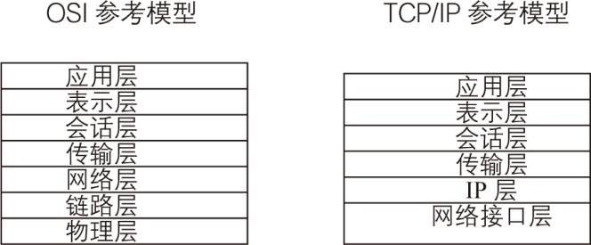

### 22.1　网络编程基础

**本节视频教学录像：9分钟**

网络编程的目的就是直接或间接地通过网络协议与其他计算机进行通信。网络编程中有两个主要的问题，一个是如何准确地定位网络上一台或多台主机，另一个就是找到主机后如何可靠高效地进行数据传输。

要想让处于网络中的主机互相通信，只是知道通信双方的地址还是不够的，还必须遵循一定的规则。有两套参考模型：OSI参考模型和TCP/IP参考模型(或TCP/IP协议)。由于OSI参考模型过于理想化，未能在因特网上进行广泛推广。这样，TCP/IP就成为事实上的国际标准。

TCP/IP以其两个主要协议：传输控制协议(TCP)和网络互联协议(IP)而得名，实际上是一组协议，包括多个具有不同功能且互为关联的协议。TCP/IP协议模型从更实用的角度出发，形成了高效的四层体系结构，即网络接口层、IP层、传输层和应用层。下图展示了TCP/IP的分层结构和与OSI参考模型的对应关系。

网络编程的关注重点是TCP/IP的运输层。TCP/IP的运输层中有两个非常重要的协议：TCP和UDP。

TCP是面向连接的运输层协议，即应用进程(或程序)在使用TCP之前，必须先建立TCP连接，在传输完毕后，释放已经建立的连接。利用TCP进行通信的两个应用进程，一个是服务器进程，另一个是客户进程。

UDP是面向无连接的运输层协议，即应用进程(或程序)在使用UDP之前，不必先建立连接。自然，发送数据结束时也没有连接需要释放。因此，减少了开销和发送数据之前的时延。

C#号称Internet上的语言，它从语言级上提供了对网络应用程序的支持，程序员能够很容易地开发常见的网络应用程序。.Net平台提供的网络类库可以轻松实现网络连接，连网的底层细节被隐藏在.Net平台的本机安装系统里，由CLR进行控制。

System.Net 和 System.Net.Sockets 是.Net Frame work SDK 为 C# 开发网络应用程序提供的两个主要的命名空间。System.Net 命名空间为当前网络上使用的多种协议提供了简单的编程接口，System. Net.Sockets 命名空间为网络程序开发人员提供了 Windows Sockets (Winsock) 接口的托管实现。

在.Net网络库里面最大的优点就是IP地址和端口被成对处理，相比于UNIX中用的方法是一个巨大的进步。.NET在System.Net命名空间下定义了两个类来处理关于IP地址的问题：IPAddress和IPEndPoint类。System.Net命名空间下还提供了两个与IP地址相关的类：Dns类和IPHostEntry类，Dns类提供了一系列静态的方法用于获取提供本地或远程域名等功能；IPHostEntry类的实例对象中包含了Internet主机的相关信息。

