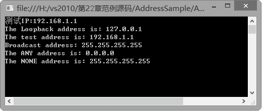

### 22.1.1　IPAddress类

IPAddress 类主要提供网际协议（IP）地址。构造 IP地址实例是通过 IPAddress 类来实现的。程序中构造 IP 地址实例时可以使用 IPAddress 类的构造函数。IPAddress 类的构造函数如下表所示。

| 构造函数名称 | 说明 |
| :-----  | :-----  | :-----  | :-----  |
| IPAddress(Byte[]) | 用指定为 Byte 数组的地址初始化 IPAddress 类的新实例 |
| IPAddress(Int64) | 用指定为 Int64 的地址初始化 IPAddress 类的新实例 |
| IPAddress(Byte[], Int64) | 用指定为 Byte 数组的地址和指定的范围标识符初始化 IPAddress 类的一个新实例 |

IPAddress 类构造函数中的参数是指 IP 地址的数值。例如，如果参数值为 256，由此构造函数得到的 IPAddress 实例就为“0.1.0.0”； 同样参数值为 65536，构造后的 IP 地址就为“0.0.1.0 ”，依次类推。由此可见，在程序中使用这个构造函数来构造 IPAddress 实例不仅烦琐而且很不直观。

一个IPAddress地址对象用来表示一个单一的IP地址，在构造 IP 地址实例时，通常不需要使用构造函数，因为在该类里面许多成员方法可以用来构造并操作IP地址对象。IPAddress 类的常用成员方法如下表所示。

| 方法名称 | 说明 |
| :-----  | :-----  | :-----  | :-----  |
| Parse | 将 IP 地址字符串转换为 IPAddress 实例 |
| TryParse | 确定字符串是否为有效的 IP 地址 |
| MapToIPv4 | 将 IPAddress 对象映射到 IPv4 地址 |
| IsLoopback | 指示指定的 IP 地址是否是环回地址 |
| GetAddressBytes | 以字节数组形式提供 IPAddress 的副本 |
| Equals | 比较两个 IP 地址 |

上述IPAddress类成员方法提供了对IP地址的转换、处理等功能。其中Parse方法可将IP地址字符串转换为IPAddress实例，如：

```c
IPAddress newaddress = IPAddress.Parse("192.168.1.1");
```

IPAddress类还提供了7个只读属性，如下表所示。

| 属性名称 | 说明 |
| :-----  | :-----  | :-----  | :-----  |
| Any | 表示本地系统可用的任何IP地址，指示服务器应侦听所有网络接口上的客户端活动 |
| Broadcast | 表示本地网络的IP广播地址 |
| IPv6Any | Socket.Bind方法用此字段指出本地系统可用的IP地址 |
| IPv6Loopback | 表示系统的回送地址 |
| IPv6None | 以字节数组形式提供 IPAddress 的副本 |
| Loopback | 表示系统的回送地址 |
| None | 表示系统上没有可用的网络接口 |

**【范例22-1】 IPAddress类的应用。**

在Visual Studio 2013中新建C#控制台程序，项目名为“AddressSample”，在Program的Main中添加以下测试代码（代码22-1-1.txt）。

```c
01  ////将地址字符串转换为IPAddress实例
02  IPAddress test1 = IPAddress.Parse("192.168.1.1");
03  Console.WriteLine("测试IP:{0}", test1);
04  IPAddress test2 = IPAddress.Loopback;
05  IPAddress test3 = IPAddress.Broadcast;
06  IPAddress test4 = IPAddress.Any; //提供一个IP地址，指示服务器侦听所有网络接口上的客户端活动
07  IPAddress test5 = IPAddress.None; //表示不指定系统的任何网络接口
08  if (IPAddress.IsLoopback(test2))
09  Console.WriteLine("The Loopback address is: {0}", test2.ToString());
10  else
11  Console.WriteLine("Error obtaining the loopback address");
12  Console.WriteLine("The loopback address is not the local address.\n");
13  Console.WriteLine("The test address is: {0}", test1.ToString());
14  Console.WriteLine("Broadcast address: {0}", test3.ToString());
15  Console.WriteLine("The ANY address is: {0}", test4.ToString());
16  Console.WriteLine("The NONE address is: {0}", test5.ToString());
17  Console.Read();
```

**【运行结果】**

单击工具栏中的
按钮，即可在控制台中输出如下图所示的运行结果。


**【代码详解】**

从输出结果知道，IPAddress实例的Any地址为0.0.0.0，None地址为255.255.255.255。当一个系统有多个网络接口而不想将一个套接字只绑定到其中的一个接口时，可以使用Any地址；当需要创建一个虚拟套接字而不希望将它绑定到任何一个接口时，使用None地址。

