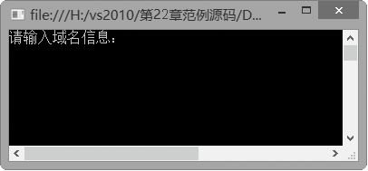
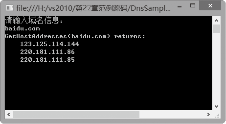

### 22.1.2　Dns类

IP地址虽然解决了网络上计算机的识别问题，但是它是由4个十进制的数字号码所组成的，而每一个号码的值介于0~255之间，不容易记，因此域名系统（DNS）被开发出来，它专门用于将IP地址转换成有意义的文字，以方便识别记忆。

Dns类在.net中的System.net命名空间下，主要的功能是从 Internet 域名系统 (DNS) 检索关于特定主机的信息。Dns 类是一个静态类，它提供了一系列静态的方法，用于获取提供本地或远程域名等功能。

Dns类的常用成员方法如下表所示。

| 方法名称 | 说明 |
| :-----  | :-----  | :-----  | :-----  |
| GetHostAddresses | 返回指定主机的 Internet 协议 (IP) 地址 |
| GetHostEntry(IPAddress) | 将 IP 地址解析为 IPHostEntry 实例 |
| GetHostEntry(String) | 将主机名或 IP 地址解析为 IPHostEntry 实例 |
| GetHostName | 获取本地计算机的主机名 |
| GetHostAddressesAsync | 返回指定主机的 Internet 协议 (IP) 地址以作为异步操作 |
| GetHostEntrysync (IPAddress) | 将 IP 地址解析为 IPHostEntry 实例以作为异步操作 |
| GetHostEntrysync (String) | 将主机名或 IP 地址解析为 IPHostEntry 实例以作为异步操作 |

**【范例22-2】 Dns类的应用。**

在Visual Studio 2013中新建C#控制台程序，项目名为“DnsSample”，在Program的Main中添加以下测试代码（代码22-2-1.txt）。

```c
01  IPAddress[] ips;
02  Console.WriteLine("请输入域名信息：");
03  string hostname =Console.ReadLine();
04  ips = Dns.GetHostAddresses(hostname);
05  Console.WriteLine("GetHostAddresses({0}) returns:", hostname);
06  foreach (IPAddress ip in ips)
07  {
08                 Console.WriteLine(" {0}", ip);
09  }
10  Console.Read();
```

**【运行结果】**

单击工具栏中的
按钮，即可在控制台中输出如下图所示的运行结果。


在上述运行结果窗口中输入域名“baidu.com”，得到如下图所示的运行结果。


**【代码详解】**

从输出结果知道，Dns类的GetHostAddresses方法将返回特定域名的IP地址列表。

