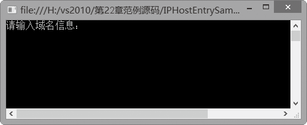
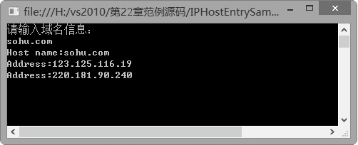

### 22.1.3　IPHostEntry类

IPHostEntry类的实例对象中包含了Internet主机的地址相关信息。此类型的所有公共静态成员对多线程操作而言都是安全的，但不保证任何实例成员是线程安全的。IPHostEntry类中的常用属性有AddressList属性、Aliases属性以及HostName属性。

AddressList属性和Aliases属性的作用分别是获取或设置与主机关联的IP地址列表以及获取或设置与主机关联的别名列表。其中AddressList属性值是一个IPAddress类型的数组，包含解析为Aliases属性中包含的主机名的IP地址；Aliases属性值是一组字符串，包含解析为AddressList 属性中的IP地址的DNS名。而HostName属性包含了服务器的主要主机名。如果服务器的DNS项定义了附加别名，则可在Aliases属性中使用这些别名。

IPHostEntry类将一个域名系统 主机与一组别名和一组匹配的IP地址关联，通常和DNS类一起使用。在Dns类中，有一个专门获取IPHostEntry对象的方法GetHostEntry，然后，通过IPHostEntry对象，可以获取本地或远程主机的相关IP地址。

**【范例22-3】 IPHostEntry类的应用。**

在Visual Studio 2013中新建C#控制台程序，项目名为“IPHostEntrySample”，在Program的Main中添加以下测试代码（代码22-3-1.txt）。

```c
01 Console.WriteLine("请输入域名信息：");
02  IPHostEntry results = Dns.GetHostEntry(Console.ReadLine());
03  Console.WriteLine("Host name:{0}", results.HostName);
04  foreach (string alias in results.Aliases)
05  {
06                  Console.WriteLine("Alias:{0}", alias);
07  }
08  foreach (IPAddress address in results.AddressList)
09  {
10                  Console.WriteLine("Address:{0}", address.ToString());
11  }
12  Console.Read();
```

**【运行结果】**

单击工具栏中的
按钮，即可在控制台中输出如下图所示的运行结果。


在上述运行结果窗口中输入域名“sohu.com”，得到如下图所示的运行结果。


**【代码详解】**

上例中的语句：

```c
IPHostEntry results = Dns.GetHostEntry(Console.ReadLine());
```

通过Dns类的静态方法GetHostEntry获取IPHostEntry对象results，上例中的语句：

```c
Console.WriteLine("Host name:{0}", results.HostName);
```

通过调用对象results的HostName属性，输出主机名。上例中的语句：

```c
foreach (string alias in results.Aliases)
```

通过调用对象results的Aliases属性，依次输出主机的别名。上例中的语句：

```c
foreach (IPAddress address in results.AddressList)
```

通过调用对象results的AddressList属性，依次输出主机的IP地址。

