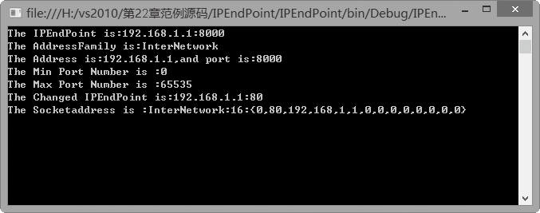

### 22.1.4　IPEndPoint类

在Internet中，TCP/IP使用一个网络地址和一个服务端口号来唯一标识设备。网络地址标识网络上的特定设备；端口号标识要连接到的该设备上的特定服务。网络地址和服务端口的组合称为终结点，在.NET框架中正是由EndPoint类表示这个终结点，它提供表示网络资源或服务的抽象，用以标志网络地址等信息。.Net同时也为每个受支持的地址族定义了EndPoint的子类；对于IP地址族，该类为IPEndPoint。IPEndPoint类包含应用程序连接到主机上的服务所需的主机和端口信息，通过组合服务的主机IP地址和端口号，IPEndPoint类形成到服务的连接点。

IPEndPoint 是与 IPAddress 概念相关的一个类，它在 IP地址的基础上还包含了端口的信息。通过组合服务的主机IP地址和端口号，IPEndPoint类形成到服务器的连接点。在IPEndPoint类中有两个常用的构造函数：

```c
public IPEndPoint(long, int);
```

和

```c
public IPEndPoint(IPAddress, int);
```

两个构造函数中的第一个参数均用来指定IP地址，第二个参数均用来指定端口号。通过调用IPEndPoint 类的构造函数，可以用指定的地址和端口号初始化 IPEndPoint 类的新实例。

IPEndPoint类中的常用属性有Address属性、AddressFamily属性以及Port属性。Address属性用来获取或设置终结点的 IP 地址；AddressFamily属性用来获取网际协议 (IP) 地址族；Port属性用来获取或设置终结点的端口号。

> 
> **提示**
> IPEndPoint类中还包括两个静态字段：MaxPort和MinPort。MaxPort指定可以分配给Port 属性的最大值，MaxPort 值设置为 0x0000FFFF，MinPort指定可以分配给 Port 属性的最小值。

**【范例22-4】 IPEndPoint类的应用。**

在Visual Studio 2013中新建C#控制台程序，项目名为“IPEndPointSample”，在Program的Main中添加以下测试代码（代码22-4-1.txt）。

```c
01  IPAddress NewAddress = IPAddress.Parse("192.168.1.1");
02  IPEndPoint Ex = new IPEndPoint(NewAddress, 8000);
03  Console.WriteLine("The IPEndPoint is:{0}", Ex.ToString());
04  Console.WriteLine("The AddressFamily is:{0}", Ex.AddressFamily);
05  Console.WriteLine("The Address is:{0},and port is:{1}", Ex.Address, Ex.Port);
06  Console.WriteLine("The Min Port Number is :{0} ", IPEndPoint.MinPort);
07  Console.WriteLine("The Max Port Number is :{0} ", IPEndPoint.MaxPort);
08  Ex.Port = 80;
09  Console.WriteLine("The Changed IPEndPoint is:{0}", Ex.ToString());
10  SocketAddress Sa = Ex.Serialize();
11  Console.WriteLine("The Socketaddress is :{0}", Sa.ToString());
12  Console.Read();
```

**【运行结果】**

单击工具栏中的
按钮，即可在控制台中输出如下图所示的运行结果。


**【代码详解】**

上例中的语句：

```c
IPEndPoint Ex = new IPEndPoint(NewAddress, 8000);
```

创建一个IPEndPoint对象Ex，端口号为8000。上例中的语句：

```c
Console.WriteLine("The AddressFamily is:{0}", Ex.AddressFamily);
```

通过调用对象Ex的AddressFamily属性，输出IP 地址族。上例中的语句：

```c
Console.WriteLine("The Address is:{0},and port is:{1}", Ex.Address, Ex.Port);
```

通过调用对象Ex的Address和Port属性，分别输出主机的IP 地址和端口号。上例中的语句：

```c
Ex.Port = 80;
```

修改对象Ex的Port属性值为80。

