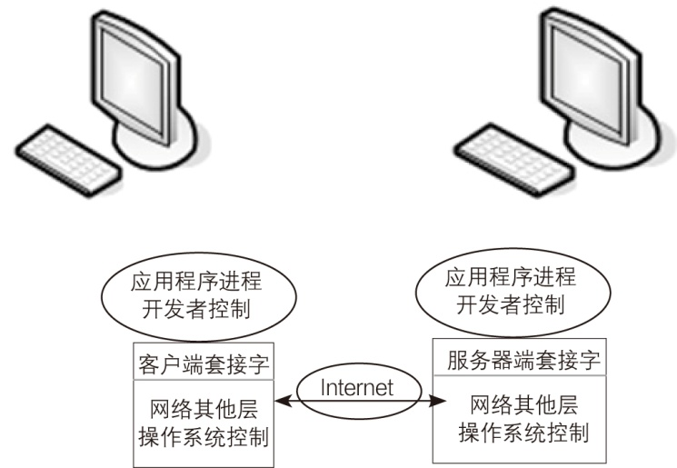

### 22.2.1　Socket简介

网络通信类似于发邮件。如果我们想写封邮件发给远方的朋友，那么如何写信、如何将信打包完全由我们做主，属于网络协议的应用层；而当我们将信投入邮筒时，邮筒的那个口就是套接字，在进入套接字之后，就是传输层、网络层等（邮局、公路交管或者航线等）其他网络协议层次的工作了。我们发邮件时，从来不会去关心信是如何从西安发往北京的，我们只知道写好了投入邮筒就可以了。因此，网络通信可以用下图来描述。

下图中，两个主机是对等的，但是按照约定，我们将发起请求的一方称为客户端，将另一端称为服务端。可以看出两个程序之间的对话是通过套接字（Socket）这个出入口来完成的，实际上套接字包含的最重要的也就是两个信息：连接至远程的本地端口信息(本机地址和端口号)，连接到的远程端口信息(远程地址和端口号)。

Socket用来标识网络通信主体。例如，一般来说，我们的计算机上运行着非常多的应用程序，它们可能都需要同远程主机打交道，所以远程主机就需要有一个ID来标识它想与本地机器上的哪个应用程序打交道，这里的ID就是端口。将端口分配给一个应用程序，那么来自这个端口的数据则总是针对这个应用程序的。有这样一个很好的例子：可以将主机地址想象为电话号码，而将端口号想象为分机号。

两个程序要进行网络通信时，其中一个程序将要传输的一段信息写入它所在主机的Socket中，该Socket通过与网络接口相连的传输介质将这段信息发往另外一台主机的Socket中，使这段信息能够被其他程序使用。

网络上的所有应用程序都是基于Socket进行开发的，无论是网路游戏还是网页，都是在Socket的接触上进行的再次开发。Socket屏蔽了网络模型和TCP/IP的复杂性，使得网络开发变得更加轻松。Socket在编程时对用户来说是可见的，两个程序之间的通信实质上就是它们各自所绑定的Socket之间的通信。

Windows Socket就是在Windows下编程用的Socket，Socket其实就是一套网络编程机制，封装了对网络数据流的一些控制。Socket最早本来是UNIX系统下的编程接口，在UNIX系统上被广泛使用，随着TCP/IP网络的流行以及后来TCP/IP模型成为标准模型，在美国政府和军方的推动下，Socket也成为UNIX上标准的网络编程接口。1991年微软把UNIX上面的Socket的原理引用到自己的Windows平台下，所以有了现在广泛使用的Windows Socket。因为网络模型已经非常稳定了，而且多年没有大的改变，所以在Socket的发展上也比较平缓，几乎没有大的改变。现在最常用的就是32位的Wsock.dll提供给我们在Windows中进行网络编程的Socket。

C#中有三种不同的Windows Socket。

（1）流式套接字(SOCK_STREAM)。提供了一种可靠的，面向连接的双向数据传输的服务，在这种套接字中，数据的传送没有差错，不会重复发送。如果使用TCP发送大量数据，则需要使用这种套接字。

（2）数据报套接字（SOCK_DGRAM）。提供无连接的，不可靠的双向数据传送。数据在传送的过程中可能会丢失，但是不负责丢失的数据，并且传送的数据以包为基本单位，包最大为1046字节的内容，接收到的包不保证按照发送顺序。UDP实现了数据报套接字。

（3）原始套接字(SOCK_RAW)。可以对较低层协议进行访问。

要通过互联网进行通信，至少需要一对套接字，其中一个运行于客户端，我们称之为ClientSocket，另一个运行于服务器端，我们称之为ServerSocket。

根据连接启动的方式以及本地套接字要连接的目标，套接字之间的连接过程可以分为三个步骤：服务器监听，客户端请求，连接确认。

（1）服务器监听。指服务器端套接字并不定位具体的客户端套接字，而是处于等待连接的状态，实时监控网络状态。

（2）客户端请求。指由客户端的套接字提出连接请求，要连接的目标是服务器端的套接字。为此，客户端的套接字必须首先描述它要连接的服务器的套接字，指出服务器端套接字的地址和端口号，然后再向服务器端套接字提出连接请求。

（3）连接确认。指当服务器端套接字监听到或者接收到客户端套接字的连接请求时，它就响应客户端套接字的请求，建立一个新的线程，把服务器端套接字的信息发给客户端，一旦客户端确认了此信息，连接即可建立。而服务器端套接字继续处于监听状态，继续接收其他客户端套接字的连接请求。

使用套接字处理数据有两种基本模式：同步套接字和异步套接字。

（1）同步套接字。

同步套接字的特点是在通过Socket进行连接、接收、发送操作时，客户机或服务器在接收到对方响应前会处于阻塞状态，即一直等到接收到对方请求时才继续执行下面的语句。可见，同步套接字适用于数据处理不太多的场合。当程序执行的任务很多时，长时间的等待可能会让用户无法忍受。

（2）异步套接字。

在通过Socket进行连接、接收、发送操作时，客户机或服务器不会处于阻塞方式，而是利用callback机制进行连接、接收和发送处理，这样就可以在调用发送或接收的方法后直接返回，并继续执行下面的程序。可见，异步套接字特别适用于进行大量数据处理的场合。

使用同步套接字进行编程相对比较简单，而异步套接字则比较复杂。C#中用的Socket是在Windows Socket的基础上进行封装的类库，可以更方便地使用。并且C#中还在Socket的基础上继续封装了TcpListener，TcpClient，UdpClient等类库来简化程序员的开发工作。

