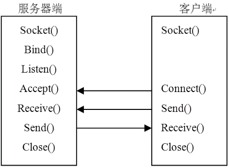

### 22.2.3　面向连接的套接字

IP连接领域有两种通信类型：面向连接的（connection oriented）和无连接的（connectionless）。在面向连接的套接字中，使用TCP来建立两个IP地址端点之间的会话。一旦建立了这种连接，就可以在设备之间可靠地传输数据。为了建立面向连接的套接字，服务器和客户端必须分别进行编程，面向连接套接字的编程示意图如下图所示。


同步模式的Socket编程的基本过程如下。

（1）创建一个Socket实例对象。

（2）将上述实例对象连接到一个具体的终结点（EndPoint对象）。

（3）连接完毕，客户端和服务器就可以使用Send()和Receive()方法进行通信了。

（4）通信完毕，用ShutDown()方法来禁用Socket。

（5）最后用Close()方法来关闭Socket。

对于服务器端程序，建立的套接字必须绑定到用于TCP通信的本地IP地址和端口上。Bind方法用于完成绑定工作，绑定地址为IPEndPoint的实例，该实例包括一个本地IP地址和一个端口号。在套接字绑定到本地之后，就用Listen方法等待客户机发出的连接尝试，Listen方法的参数指出系统等待用户程序服务排队的连接数，超过连接数的任何客户都不能与服务器进行通信。

在Listen方法执行之后，服务器已经做好了接收任何引进连接的准备，这是用Accept方法来完成的，当有新客户进行连接时，该方法就返回一个新的套接字描述符。下面是完成上述步骤的服务器端部分代码的例子。

```c
  IPHostEntry local = Dns.GetHostByName(Dns.GetHostName());
  IPEndPoint iep = new IPEndPoint(local.AddressList[0], 80);
  Socket localSocket=new Socket(AddressFamily.InterNetwork, SocketType.Stream, ProtocolType.Tcp);
  localSocket.Bind(iep);
  locatSocket.Listen(10);
  Socket clientSocket = localSocket.Accept();
```

程序执行到Accept方法时会处于阻塞状态，直到有客户机请求连接，一旦有客户机连接到服务器，clientSocket对象将包含该客户机的所有连接信息。而localSocket对象仍然绑定到原来的IPEndPoint对象，并可以通过增加循环语句继续用Accept方法接收新的客户端连接。如果没有继续调用Accept方法，服务器就不会再响应任何新的客户机连接。

在接受客户机连接之后，客户机和服务器就可以开始传递数据了。

对于客户端程序，客户机也必须把一个地址绑定到创建的Socket对象，不过它不使用Bind方法，而是使用Connect方法。

```c
  IPAddress remoteHost = IPAddress.Parse("192.168.0.1");
  IPEndPoint iep = new IPEndPoint(remoteHost, 80);
  Socket localSocket=new Socket(AddressFamily.InterNetwork, SocketType.Stream, ProtocolType.Tcp);
  localSocket. Connect (iep);
```

进行连接后，我们可以运用套接字的Connected属性来验证连接是否成功。如果返回的值为true，则表示连接成功，否则就是失败。程序运行后，客户端在与服务器建立连接之前，系统不会执行Connect方法下面的语句，而是处于阻塞方式。一旦客户端与服务器建立连接，客户机就可以像服务器收/发数据使用的方法一样，使用Send和Receive方法进行通信。注意通信完成后，必须先用Shutdown方法停止会话，然后关闭Socket实例。下表说明了Socket.Shutdown方法中参数SocketShutDown可以使用的值。

| SocketShutDown枚举值 | 说明 |
| :-----  | :-----  | :-----  | :-----  |
| SocketShutdown.Receive | 防止在套接字上接收数据，如果收到额外的数据，将发出一个RST信号 |
| SocketShutdown.Send | 防止在套接字上发送数据，在所有存留在缓冲器中的数据发送出去之后，发出一个FIN信号 |
| SocketShutdown.Both | 在套接字上既停止发送也停止接收 |

下面是关闭连接的典型用法。

```c
  sock.Shutdown(SocketShutdown.Both);
  sock.Close();
```

应该注意的是在调用Close()方法以前必须调用ShutDown()方法，以确保在Socket关闭之前已发送或接收所有挂起的数据。Socket.Shutdown方法允许Socket对象一直等待，直到将内部缓冲区的数据发送完为止。

