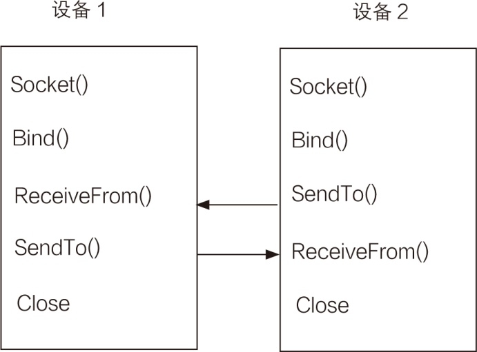

### 22.2.4　无连接的套接字

UDP使用无连接的套接字，无连接的套接字不需要在网络设备之间发送连接信息。因此，很难确定谁是服务器，谁是客户机。如果一个设备最初是在等待远程设备的信息，则套接字就必须用Bind方法绑定到一个本地地址/端口对上。完成绑定之后，该设备就可以利用套接字接收数据了。由于发送设备没有建立到接收设备地址的连接，所以收/发数据均不需要Connect方法。无连接套接字编程示意图如下图所示。

由于不存在固定的连接，所以可以直接使用SendTo方法和ReceiveFrom方法发送和接收数据，在两个设备之间的通信结束之后，可以像TCP中使用的方法一样，对套接字使用Shutdown和Close方法。

需要注意的是，接收数据时，必须使用Bind方法将套接字绑定到一个本地地址/端口对上之后才能使用ReceiveFrom方法接收数据，如果只发送而不接收，则不需要使用Bind方法。

实际上，为了简化复杂的网络编程，.NET Framework除了提供可以灵活控制的套接字类以外，还在此基础上提供了对套接字封装后的基于不同协议的更易于使用的类，我们将在后续章节介绍。

