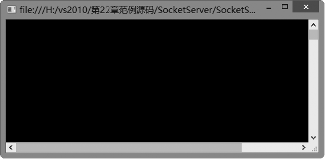
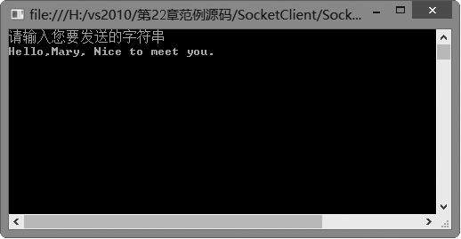

### 22.2.5　NetworkStream类

其实，Socket可以像流（Stream）一样被视为一个数据通道，这个通道架设在应用程序端（客户端）和远程服务器端之间，而后，数据的读取（接收）和写入（发送）均针对这个通道来进行。

流（stream）是对串行传输的数据的一种抽象表示，底层的设备可以是文件、外部设备、主存、网络套接字等。

流有三种基本的操作：写入、读取和查找。如果数据从内存缓冲区传输到外部源，这样的流叫做“写入流”。如果数据从外部源传输到内存缓冲区，这样的流叫做“读取流”。

在网络上传输数据时，使用的是网络流（Network Stream）。网络流的意思是数据在网络的各个位置之间是以连续的形式传输的。为了处理这种流，C#在System.Net.Sockets命名空间中提供了一个专门的NetworkStream类，用于通过网络套接字发送和接收数据。

NetworkStream类支持对网络数据的同步或异步访问，它可以被视为在数据来源端和接收端之间架设了一个数据通道，这样我们读取和写入数据就可以针对这个通道来进行。

对于NetworkStream流，写入操作是指从来源端内存缓冲区到网络上的数据传输；读取操作是从网络上到接收端内存缓冲区（如字节数组）的数据传输，如下图所示。


构造NetworkStream对象的常用形式为：

```c
Socket socket=new Socket(AddressFamily.InterNetwork,SocketType.Stream,ProtocolType.Tcp);
NetWorkStream networkStream=new NetworkStream(socket);
```

一旦构造了一个NetworkStream对象，就不需要使用Socket对象了。也就是说，在关闭网络连接之前就一直使用NetworkStream对象发送和接收网络数据。下表列出了NetworkStream类提供的常用属性。

| 属性 | 说明 |
| :-----  | :-----  | :-----  | :-----  |
| CanRead | 指示NetworkStream是否支持读操作，默认值为True |
| CanWrite | 指示NetworkStream是否支持写操作，默认值为True |
| CanSeek | 指示NetworkStream流是否支持查找，该属性总是返回False |
| DataAvailable | 指示NetworkStream上是否有可用的数据，有则为真 |
| Position | 获取或设置流中的当前位置，此属性始终引发NotSupportedException |
| Readable | 指示NetworkStream流是否可读，为真时可读，假时不可读 |
| Writeable | 指示NetworkStream流是否可写，为真时可写，假时不可写 |

比较常用的NetworkStream对象属性是DataAvailable，通过这个属性，可以迅速查看在缓冲区中是否有数据等待读出。

需要注意的是，网络流没有当前位置的概念，因此不支持查找和对数据流的随机访问，相应属性CanSeek始终返回false，而读取Position属性和调用Seek方法时，都将引发NotSupportedException异常。下表列出了NetworkStream类提供的常用方法。

| 方法名称 | 说明 |
| :-----  | :-----  | :-----  | :-----  |
| BeginRead方法 | 从NetworkStream流开始异步读取 |
| BeginWrite方法 | 开始向NetworkStream流异步写入 |
| EndRead方法 | 结束对一个NetworkStream流的异步读取 |
| EndWrite方法 | 结束向一个NetworkStream流的异步写入 |
| Read方法 | 从NetworkStream流中读取数据 |
| Write方法 | 向NetworkStream流中写入数据 |
| ReadByte方法 | 从NetworkStream流中读取一个字节的数据 |
| WriteByte方法 | 向NetworkStream流中写入一个字节的数据 |
| Flush方法 | 从NetworkStream流中取走所有数据 |
| Close方法 | 关闭NetworkStream对象 |
| Dispose方法 | 释放NetworkStream占用的资源 |
| Seek方法 | 查找NetworkStream流的当前位置，此方法将引发NotSupportedException |

网络数据传输完成后，不要忘记用Close方法关闭NetworkStream对象。

**【范例22-5】 利用套接字和NetworkStream类实现简单的网络通信。**

（1）在Visual Studio 2013中新建C#控制台程序，项目名为“SocketClient”，在Program的Main方法中添加以下测试代码（代码22-5-1.txt）。

```c
01  //保存输入要发送的字符串
02  string input;
03  //要连接的远程IP
04  IPAddress remoteHost = IPAddress.Parse("127.0.0.1");
05  //IP地址跟端口的组合
06  IPEndPoint iep = new IPEndPoint(remoteHost, 6080);
07  //把地址绑定到Socket
08 Socket clientSocket = new Socket(AddressFamily.InterNetwork, SocketType.Stream, ProtocolType.Tcp);
09  //连接远程服务器
10  try
11  {
12          clientSocket.Connect(iep);
13          Console.WriteLine("请输入您要发送的字符串");
14          //保存输入的字符串
15          input = Console.ReadLine();
16          //用字节数组保存要发送的字符串
17          byte[] message = System.Text.Encoding.Unicode.GetBytes(input);
18          //新建一个NetworkStream对象发送数据
19          NetworkStream netstream = new NetworkStream(clientSocket);
20          //向服务器端发送message内容
21          netstream.Write(message, 0, message.Length);
22          clientSocket.Shutdown(SocketShutdown.Both);
23          netstream.Close();
24          clientSocket.Close();
25  }
26  catch (System.Exception ex)
27  {
28          Console.WriteLine("服务器端连接失败");
29  }
30  Console.Read();
```

（2）在Visual Studio 2013中新建C#控制台程序，项目名为“SocketServer”，在Program的Main中添加以下测试代码（代码22-5-2.txt）。

```c
01  //本机IP
02  IPAddress ip = IPAddress.Parse("127.0.0.1");
03  //IP地址跟端口的组合
04  IPEndPoint iep = new IPEndPoint(ip, 6080);
05  //创建Socket
06  Socket socket = new Socket(AddressFamily.InterNetwork, SocketType.Stream, ProtocolType.Tcp);
07  //绑定Socket
08  socket.Bind(iep);
09  //服务器已经做好接收任何连接的准备
10  socket.Listen(10);
11  while (true)
12  {
13          //执行accept方法
14           Socket Client = socket.Accept();
15          byte[] message = new byte[1024];
16          NetworkStream networkStream = new NetworkStream(Client);
17          int len = networkStream.Read(message, 0, message.Length);
18          //byte数组转换成string
19          string output = System.Text.Encoding.Unicode.GetString(message);
20          networkStream.Close();
21          Console.WriteLine("一共从客户端接收了" + len.ToString() + "字节。接收字符串为：" + output);
22  }
23  Console.Read();
```

**【运行结果】**

单击工具栏中的
按钮，运行SocketServer项目，即可在控制台中输出如下图所示的服务器端窗口。


单击工具栏中的
按钮，运行SocketClient项目，即可在控制台中输出如下图所示的客户端窗口。


在客户端窗口中输入字符串：“Hello,Mary,Nice to meet you.”，如下图所示。


服务器端窗口将显示如下图所示的结果。


**【代码详解】**

客户端程序中的下面这两条语句：

```c
Socket clientSocket = new Socket(AddressFamily.InterNetwork, SocketType.Stream, ProtocolType.Tcp);
NetworkStream netstream = new NetworkStream(clientSocket);
```

创建关于客户端套接字对象clientSocket的NetworkStream对象netstream，接着使用下面这几条语句：

```c
input = Console.ReadLine();
byte[] message = System.Text.Encoding.Unicode.GetBytes(input);
netstream.Write(message, 0, message.Length);
```

把用户在客户端的输入字符串转换成字节数组对象message，接着调用NetworkStream对象netstream的Write方法把消息传递给服务器端。

服务器端程序中的下面这两条语句：

```c
Socket Client = socket.Accept();
NetworkStream networkStream = new NetworkStream(Client);
```

监听客户端套接字，并创建关于客户端套接字对象Client的NetworkStream对象networkStream，接着，使用下面这几条语句：

```c
int len = networkStream.Read(message, 0, message.Length);
string output = System.Text.Encoding.Unicode.GetString(message);
Console.WriteLine("一共从客户端接收了" + len.ToString() + "字节。接收字符串为：" + output);
```

调用NetworkStream对象networkStream的Read方法接收从客户端传递过来的字节流，并转换为字符串格式输出到控制台。

> 
> **技巧**
> 为了实现上面的例子，必须在using区添加System.Net.Sockets命名空间。

