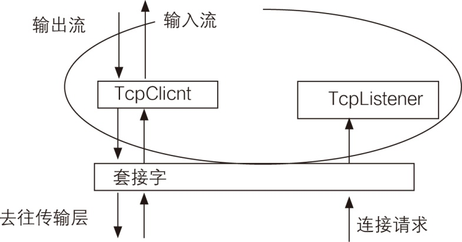
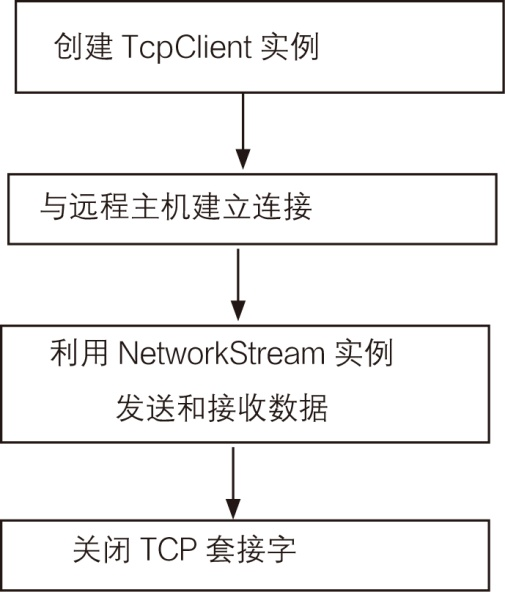
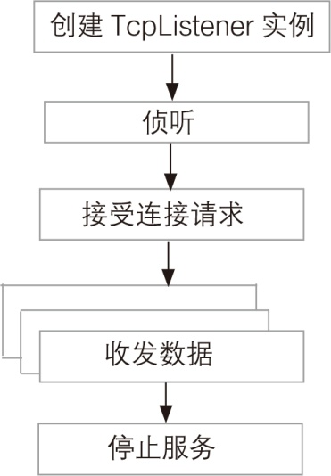

### 22.3.1　TcpClient和TcpListener类

在.NET中，尽管我们可以直接对套接字编程，但是.NET提供了两个类将对套接字的编程进行了一个封装，使我们的使用能够更加方便，这两个类是TcpClient和TcpListener，它与套接字的关系如下图所示。


从上面图中可以看出，TcpClient和TcpListener类对套接字进行了封装。从中也可以看出，TcpListener用于接受连接请求，而TcpClient则用于接收和发送流数据。这幅图的意思是TcpListener持续地保持对端口的侦听，一旦收到一个连接请求后，就可以获得一个TcpClient对象，而对于数据的发送和接收都由TcpClient去完成。此时，TcpListener并没有停止工作，它始终持续地保持对端口的侦听状态。

我们考虑这样一种情况：两台主机，主机A和主机B，起初它们谁也不知道谁在哪儿，当它们想要进行对话时，总是需要有一方发起连接，而另一方则需要对本机的某一端口进行侦听。而在侦听方收到连接请求并建立起连接以后，它们之间进行收/发数据时，发起连接的一方并不需要再进行侦听。因为连接是全双工的，它可以使用现有的连接进行收/发数据。而我们前面已经做了定义：将发起连接的一方称为客户端，另一段称为服务端，则现在可以得出：总是服务端在使用TcpListener类，因为它需要建立起一个初始的连接。

#### 1．TcpClient类

TcpClient类为TCP网络服务提供客户端连接，它构建于Socket类之上，以提供较高级别的TCP服务，即提供了通过网络连接、发送和接收数据的简单方法，用于在同步阻止模式下通过网络来连接、发送和接收流数据。另外，通过与NetworkStream对象的关联，使得用户可以通过流操作方式实现对网络连接状态下数据的发送和接收。通过TcpClient类实现与TCP主机的通信流程如下图所示。


TcpClient类有4种构造函数的重载形式，分别对应4种创建实例的方法。

+ TcpClient( )。这种不带任何参数的构造函数将使用本机默认的IP地址，并将使用默认的通信端口号0。当然，如果本机不止一个IP地址时将无法选择使用。
+ TcpClient（AddressFamily）。使用指定的地址族初始化TcpClient类的新实例。
+ TcpClient（IPEndPoint）。即使用本机IPEndPoint创建TcpClient的实例。其中IPEndPoint将网络端点表示为IP地址和端口号，用于指定在建立远程主机连接时所使用的本地网络接口IP地址和端口号。
+ TcpClient （String, Int32）。初始化 TcpClient 类的新实例并连接到指定主机上的指定端口。

因此，在TcpClient的构造函数中，如果没有指定远程主机名和端口号，它只是用来实例化TcpClient，同时实现与本地IP地址和Port端口的绑定。

如果在TcpClient的实例化过程中没有实现与远程主机的连接，则可以通过Connect方法来实现与指定远程主机的连接。Connect方法使用指定的主机名和端口号将客户端连接到远程主机，其使用方法如下。

+ Connect（IPEndPoint），使用指定的远程网络终结点将客户端连接到远程TCP主机。
+ Connect（IPAddress），使用指定的IP地址和端口号将客户端连接到远程TCP主机。
+ Connect （IPAddress[]，Int32），使用指定的IP地址和端口号将客户端连接到远程TCP主机。
+ Connect（String, Int32），使用指定的主机名和端口号将客户端连接到指定主机上的指定端口。

如下代码段描述了TcpClient实例的创建以及与指定远程主机的连接过程。

```c
TcpClient  m_client = new TcpClient( );
m_client.Connect(m_servername, m_port);
```

TcpClient类创建在Socket之上，提供了更高层次的TCP服务抽象，特别是在网络数据的发送和接收方面，TcpClient使用标准的Stream流处理技术，通过使用NetworkStream实例的读/写操作来实现网络数据的接收和发送，因此更加方便直观。

TcpClient类利用NetworkStream实例发送和接收数据时需首先通过TcpClient.GetStream来返回NetworkStream实例，进而利用所获取的NetworkStream实例的读/写方法Write和Read来发送和接收数据，其实现代码如下所示。

```c
TcpClient  m_client = new TcpClient( );
m_client.Connect(m_servername, m_port);
NetworkStream ws = m_client.GetStream( ); //获取发送数据的网络流实例
ws.Write(data, 0, data.Length); //向网络发送数据
```

在与服务器完成通信后，应该调用TcpClient 实例对象的Close( )方法释放资源，代码如下。

```c
m_client.Close( );
```

TcpClient类的常用属性如下表所示。

| 属性名称 | 说明 |
| :-----  | :-----  | :-----  | :-----  |
| Client | 获取或设置基础套接字 |
| LingerState | 获取或设置套接字保持连接的时间 |
| NoDelay | 获取或设置一个值，该值在发送或接收缓冲区未满时禁用延迟 |
| ReceiveBufferSize | 获取或设置Tcp接收缓冲区的大小 |
| ReceiveTimeout | 获取或设置套接字接收数据的超时时间 |
| SendBufferSize | 获取或设置Tcp发送缓冲区的大小 |
| SendTimeout | 获取或设置套接字发送数据的超时时间 |

TcpClient类的常用方法如下表所示。

| 方法名称 | 说明 |
| :-----  | :-----  | :-----  | :-----  |
| Close | 释放TcpClient实例，而不关闭基础连接 |
| Connect | 用指定的主机名和端口号将客户端连接到TCP主机 |
| BeginConnect | 开始一个对远程主机连接的异步请求 |
| EndConnect | 异步接受传入的连接尝试 |
| GetStream | 获取能够发送和接收数据的NetworkStream对象 |

#### 2．TcpListener类

TcpClient类实现了客户端编程抽象，因此构建客户端网络应用程序便可以直接使用TcpClient取代Socket，更加方便易用。同样，对于服务器端应用程序的构建，C#提供了TcpListener类。该类也是构建于Socket之上，提供了更高抽象级别的TCP服务，使得程序员能更方便地编写服务器端应用程序。

通常情况下，服务器端应用程序在启动时将首先绑定本地网络接口的IP地址和端口号，然后进入侦听客户请求的状态，以便于客户端应用程序提出显式请求。一旦侦听到有客户端应用程序请求连接侦听端口，服务器端应用将接受请求，并建立一个负责与客户端应用程序通信的信道，即通过创建连接套接字与客户端应用程序建立连接，由连接套接字完成与客户端应用程序的数据传送操作，服务器端应用程序继续侦听更多的客户端连接请求。

TcpListener通过实例创建过程完成与本地网络接口的绑定，并由所创建的实例调用Start方法启动侦听；当侦听到客户端应用程序的连接请求后，根据客户端应用程序的不同请求方式，可以通过AcceptTcpClient方法接受传入的连接请求并创建TcpClient实例以处理请求，或者通过AcceptSocket方法接受传入的连接请求并创建Socket实例以处理请求，并由所创建的TcpClient实例或Socket实例完成与客户端应用程序的网络数据传输。最后，需要使用Stop关闭用于侦听传入连接的Socket，同时也必须关闭从AcceptSocket或AcceptTcpClient返回的任何实例，以释放相关资源。其实现流程如下图所示。


TcpListener类提供了3种构造函数的重载形式来创建TcpListener实例。

```c
TcpListener(port); //指定本机端口 
public TcpListener(IPEndPoint) //指定本机终结点 
public TcpListener(IPAddress,port) //指定本机IP地址及端口
```

TcpListener类分别根据指定的侦听端口、IPEndPoint对象（包含了IP地址和端口号）、IPAddress对象和端口号来创建TcpListener实例，并且实现与默认端口或指定IP地址和端口的绑定，如：

```c
IPAddress  m_host = IPAddress.Parse(m_serverIP)
TcpListener  m_Listener = new TcpListener(m_host, m_port);
```

创建TcpListener实例后，便可以调用Start方法启动侦听，即该方法将调用TcpListener实例的基础Socket上的Listen方法，开始侦听客户的连接请求，如：

```c
m_Listener.Start( );
```

当侦听到有客户连接请求时，可以使用AcceptSocket或AcceptTcpClient接收任何当前在队列中挂起的连接请求。这两种方法分别返回一个Socket或TcpClient实例以接受客户的连接请求，如：

```c
TcpClient m_client = m_Listener.AcceptTcpClient( );
```

通过返回的Socket或TcpClient实例来实现与提出连接请求的客户的单独网络数据传输。

如果接收连接请求时返回的是Socket实例，则可以用其Send和Receive方法实现与客户的通信。如果返回的是TcpClient实例，则可以通过对NetworkStream的读/写来实现与客户的数据通信。由于服务器可以同时与多个客户建立连接并进行数据通信，因此往往会引入多线程技术，为每个客户的连接建立一个线程，在该线程中实现与客户的数据通信，代码如下所示。

```c
01  //为每个客户连接创建并启动一个线程
02  TcpClient m_client = m_Listener.AcceptTcpClient( );
03  ClientHandle m_handle = new ClientHandle( );
04  m_handle.ClientSocket = m_client;
05  Thread m_clientthread = new Thread(new ThreadStart(m_handle.ResponseClient));
06  m_clientthread.Start( );
07  //线程处理代码
08  public void ResponseClient( )
09  {
10          if (m_clientsocket != null)
11          {
12                  StreamReader rs = new StreamReader(m_clientsocket.GetStream( ));
13                  NetworkStream ws = m_clientsocket.GetStream( );
14                  ……
15                  while (true)
16                  {
17                          //接收信息
18                          m_returnData = rs.ReadLine( );
19                          ……
20                          //回送信息
21                          ws.Write(data, 0, data.Length);
22                          ……
23                  }
24                   m_clientsocket.Close( );
25          }
26  }
```

与客户程序通信完成之后，最后一步是停止侦听套接字，此时可以调用TcpListener的Stop方法来实现。

