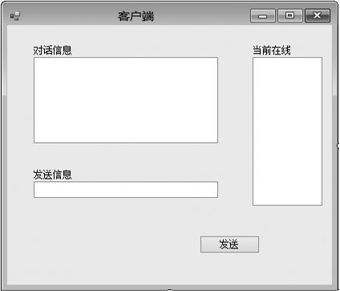
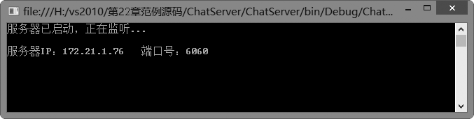
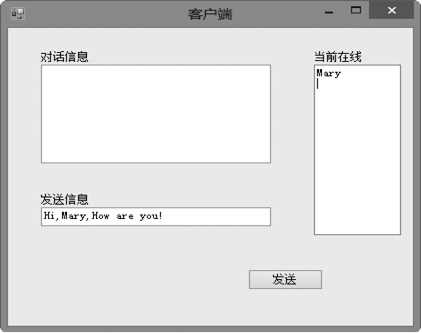
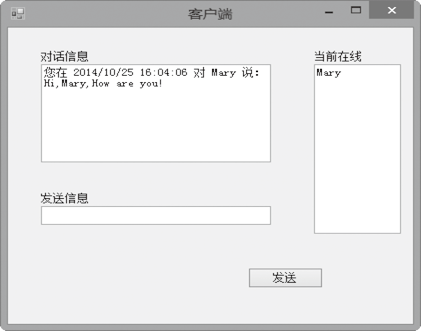
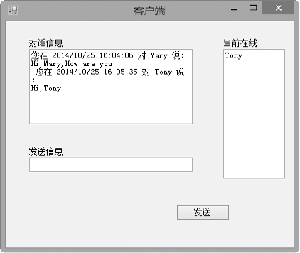
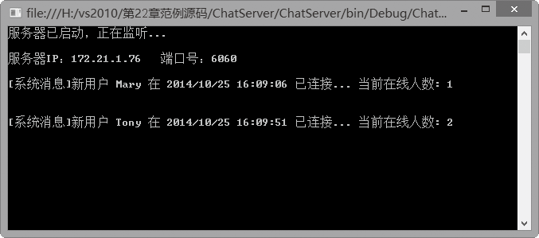

### 22.3.2　TCP同步编程

不论是多么复杂的TCP应用程序，双方通信的最基本前提就是客户端要先和服务器端进行TCP连接，然后才可以在此基础上相互收发数据。由于服务器需要对多个客户端同时服务，因此程序相对复杂一些。在服务器端，程序员需要编写程序不断地监听客户端是否有连接请求，并通过套接字区分是哪个客户；而客户端与服务器连接则比较简单，只需要指定连接的是哪个服务器即可。一旦双方建立了连接并创建了对应的套接字，就可以相互收发数据了。在程序中，发送和接收数据的方法都是一样的，区别仅是方向不同。

在同步TCP应用编程中，发送、接收和监听语句均采用阻塞方式工作。使用同步TCP编写服务器端程序的一般步骤如下。

（1）创建一个包含采用的网络类型、数据传输类型和协议类型的本地套接字对象，并将其与服务器的IP地址和端口号绑定。这个过程可以通过Socket类或者TcpListener类完成。

（2）在指定的端口进行监听，以便接受客户端连接请求。

（3）一旦接受了客户端的连接请求，就根据客户端发送的连接信息创建与该客户端对应的Socket对象或者TcpClient对象。

（4）根据创建的Socket对象或者TcpClient对象，分别与每个连接的客户进行数据传输。

（5）根据传送信息情况确定是否关闭与对方的连接。

使用同步TCP编写客户端程序的一般步骤如下。

（1）创建一个包含传输过程中采用的网络类型、数据传输类型和协议类型的Socket对象或者TcpClient对象。

（2）使用Connect方法与远程服务器建立连接。

（3）与服务器进行数据传输。

（4）完成工作后，向服务器发送关闭信息，并关闭与服务器的连接。

**【范例22-6】 同步TCP应用编程。**

（1）在Visual Studio 2013中新建C#控制台程序，项目名为“ChatServer”，在Program的Main方法中添加以下测试代码（代码22-6-1.txt）。

```c
01  //客户端表
02  Hashtable clientTable = new Hashtable();
03  IPAddress[] ips = Dns.GetHostAddresses("172.21.1.76");
04  IPAddress ip = ips[0];
05  TcpListener listener = new TcpListener(ip, 6060);
06  IPEndPoint iep = new IPEndPoint(remoteHost, 6080);
07  listener.Start();
08  Console.WriteLine("服务器已启动，正在监听...\n");
09  Console.WriteLine(string.Format("服务器IP：{0}\t端口号：{1}\n", ip, 6060));
10  while (true)
11  {
12          byte[] packetBuff = new byte[100];
13          Socket newClient = listener.AcceptSocket();
14          newClient.Receive(packetBuff);
15          string userName = Encoding.Unicode.GetString(packetBuff).TrimEnd('\0');
16          if (clientTable.Count != 0 && clientTable.ContainsKey(userName))   {
17                  newClient.Send(Encoding.Unicode.GetBytes("Failed"));
18                  continue;    }
19          else  {
20                  newClient.Send(Encoding.Unicode.GetBytes("Successful"));  }
21          clientTable.Add(userName, newClient);
22          string strlog = string.Format("[系统消息]新用户 {0:8} 在 {1} 已连接... 当前在线人数: {2}\r\n\r\n", userName, DateTime.Now, clientTable.Count);
23          Console.WriteLine(strlog);
24          Thread ThreadOne = new Thread(new ParameterizedThreadStart(MethodsOne));
25          ThreadOne.Start(userName);
26          foreach (DictionaryEntry de in clientTable)    {
27                  string clientName = de.Key as string;
28                  Socket clientSkt = de.Value as Socket;
29                  if (!clientName.Equals(userName))  {
30                          clientSkt.Send(Encoding.Unicode.GetBytes(strlog)); }
31          }
32  }
```

（2）在项目名为“ChatServer”的Program类中添加以下测试代码（代码22-6-2.txt）。

```c
01  //线程方法
02  private static void MethodsOne(object obj)
03  {
04        //方法体
05  }
```

（3）在Visual Studio 2013中新建Windows窗体程序，项目名为“ChatClient”，设计窗体界面如下图所示。


（4）在项目“ChatClient”中窗体的按钮单击事件中添加以下测试代码（代码22-6-3.txt）。

```c
01  //本机IP
02  IPAddress ip = IPAddress.Parse("127.0.0.1");
03  //IP地址跟端口的组合
04  IPEndPoint iep = new IPEndPoint(ip, 6080);
05  //创建Socket
06  Socket socket = new Socket(AddressFamily.InterNetwork, SocketType.Stream, ProtocolType.Tcp);
07  //绑定Socket
08  socket.Bind(iep);
09  //服务器已经做好接收任何连接的准备
10  socket.Listen(10);
11  while (true)
12  {
13          //执行accept方法
14          Socket Client = socket.Accept();
15          byte[] message = new byte[1024];
16          etworkStream networkStream = new NetworkStream(Client);
17          int len = networkStream.Read(message, 0, message.Length);
18          //byte数组转换成string
19          string output = System.Text.Encoding.Unicode.GetString(message);
20          Console.WriteLine("一共从客户端接收了" + len.ToString() + "字节。接收字符串为：" + output);
21  }
22  Console.Read();
23  string msg = txtMsg.Text.Trim();
24  string strSend = null;
25  string strLocal = null;
26  string strReceiver = txtReceiver.Text;
27  if (strReceiver == string.Empty
28  {
29          MessageBox.Show("请选择一个接收者！\n如果没有接受者可选，表明当前只有您一个人在线\t", "发送消息", MessageBoxButtons.OK, MessageBoxIcon.Information);
30          return;
31  }
32  strLocal = string.Format("您在 {0} 对 {1} 说：\r\n{2}\r\n ", DateTime.Now, strReceiver, msg);
33  strSend = string.Format("{0} 在 {1} 对您说：\r\n{2}\r\n ", strReceiver, DateTime.Now, msg);
34  IPAddress ip = Dns.GetHostAddresses("172.21.1.76")[0];
35  TcpClient client = new TcpClient(ip.ToString(), 6060);
36  //发送接受者用户名
37  NetworkStream netstream = client.GetStream();
38  netstream.Write(Encoding.Unicode.GetBytes(strReceiver),
    Encoding.Unicode.GetBytes(strReceiver).Length);
39  rtbChat.AppendText(strLocal);
40  txtMsg.Clear();
```

**【运行结果】**

单击工具栏中的
按钮，运行SocketServer项目，即可在控制台中输出如下图所示的服务器端窗口。


单击工具栏中的
按钮，运行SocketClient项目，即显示如下图所示的客户端窗口。


在客户端窗口中的“发送信息”文本框中输入字符串：“Hi,Mary,How are you!”，并单击按钮“发送”，客户端窗口将显示对话信息如下。


服务器端窗口此时将显示如下图所示的结果。


继续在客户端窗口中的“发送信息”文本框中输入字符串：“Hi,Tony!”，并单击按钮“发送”，客户端窗口将显示对话信息如下。


服务器端窗口此时将显示如下图所示的结果。


**【范例分析】**

在网络中，数据是以字节流的形式进行传输的。服务器与客户端双方建立连接后，程序中需要先将要发送的数据转换为字节数组，然后使用Socket对象的Send方法发送数据，或者使用Receive方法接收数据。注意，要发送的字节数组并不是直接发送到了远程主机，而是发送到了本机的TCP发送缓冲区中；同样道理，接收数据也是如此，即程序是从TCP接收缓冲区接收数据。可以使用Socket类的SendBufferSize属性获取或者设置发送缓冲区的大小，使用ReceiveBufferSize属性获取或者设置接收缓冲区的大小，也可以使用其默认大小。

由于TCP是面向连接的，因此在发送数据前，程序首先应该将套接字与本机IP地址和端口号绑定，并使之处于监听状态，然后通过Accept方法监听是否有客户端连接请求。使用套接字是为了指明使用哪种协议；和本机绑定是为了在指定的端口进行监听，以便识别客户端连接信息；调用Accept方法的目的是得到对方的IP地址、端口号等套接字需要的信息。因为只有得到对方的IP地址和端口号等相关信息后，才能与对方进行通信。当程序执行到Accept方法时，会处于阻塞状态，直到接收到客户端到服务器端的连接请求才继续执行下一条语句。服务器一旦接受了该客户端的连接，Accept方法就返回一个与该客户端通信的新的套接字，套接字中包含了对方的IP地址和端口号，然后就可以用返回的套接字和该客户进行通信了。

Send方法的整型返回值表示成功发送的字节数。正如本节开始所说的那样，该方法并不是把要发送的数据立即传送到网络上，而是传送到了TCP发送缓冲区中。但是，在阻塞方式下，如果由于网络原因导致原来TCP发送缓冲区中的数据还没有来得及发送到网络上，接收方就无法继续接收发送给它的所有字节数，因此该方法返回的实际上是成功向TCP发送缓冲区发送了多少字节。

即使不是网络原因，也不能保证数据一定能一次性全部传送到了TCP发送缓冲区。这是因为TCP发送缓冲区一次能接收的数据取决于其自身的大小，也就是说，Send方法要发送的数据如果超过了TCP发送缓冲区的有效值，那么调用一次Send方法就不能将数据全部成功发送到缓存中。所以，实际编写程序时，程序中应该通过一个循环进行发送，并检测成功发送的字节数，直到数据全部成功发送完毕为止。当然，如果Send方法中发送的数据小于TCP发送缓冲区的有效值，调用一次Send方法就可能全部发送成功。

与发送相反，Receive方法则是从TCP接收缓冲区接收数据，Receive方法的整型返回值表示实际接收到的字节数，但是如果远程客户端关闭了套接字连接，而且此时有效数据已经被完全接收，那么Receive方法的返回值将会是0字节。

但有一点需要注意，如果TCP接收缓冲区内没有有效的数据可读时，在阻塞模式下，Receive方法将会被阻塞；但是在非阻塞模式下，Receive方法将会立即结束并抛出套接字异常。要避免这种情况，我们可以使用Available属性来预先检测数据是否有效，如果Available属性值不为0，那么就可以重新尝试接收操作。

