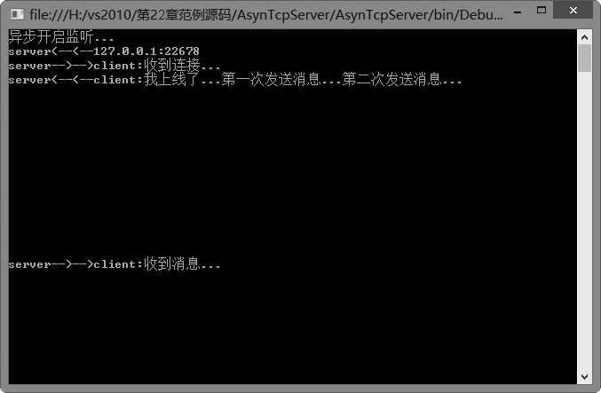
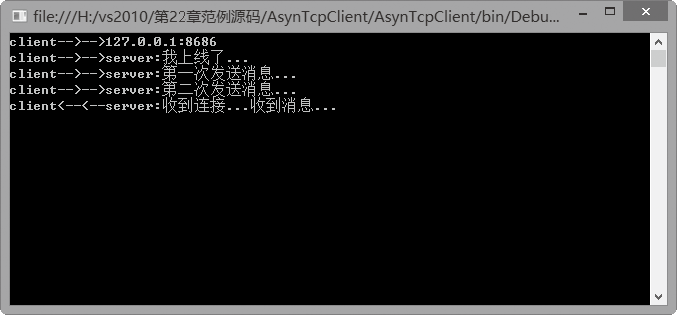

### 22.3.3　TCP异步通信

利用TcpListener和TcpClient类在同步方式下接收、发送数据以及监听客户端连接时，在操作完成之前一直处于阻塞状态，这对于接收、发送数据量不大的情况或者操作用时较短的情况下是比较方便的。但是，对于执行完成时间可能较长的任务，如传送大文件等，使用同步操作可能就不太合适了，这种情况下，最好的办法是使用异步操作。

所谓异步操作方式，就是我们希望让某个工作开始以后，能在这个工作尚未完成的时候继续处理其他工作。就像我们（主线程）安排A（子线程A）负责处理客人来访时办理一系列登记手续。在同步工作方式下，如果没有人来访，A就只能一直在某个房间等待，而不能同时做其他工作，显然这种方式不利于并行处理。我们希望的是，没有人来访时，A不一定一直在这个房间等待，也可以到别处继续做其他事，而把这个工作交给总控室人员完成，这里的总控室就是Windows操作系统本身。总控室如何及时通知A呢？可以让A先告诉总控室一个手机号F（callback需要的方法名F），以便有人来访时总控室可以立即电话通知A（callback）。这样一来，一旦有客人来访，总控室人员（委托）就会立即给A打电话（通过委托自动运行方法F），A接到通知后，再处理客人来访时需要的登记手续（在方法F中完成需要的工作）。

异步操作的最大优点是可以在一个操作完成之前同时进行其他的操作。.NET框架提供了一种称为AsyncCallback（异步回调）的委托，该委托允许启动异步的功能，并在条件具备时调用提供的回调方法（是一种在操作或活动完成时由委托自动调用的方法），然后在这个方法中完成并结束未完成的工作。

使用异步TCP应用编程时，除了套接字有对应的异步操作方式外，TcpListener和TcpClient类也提供了异步操作的方法。

异步操作方式下，每个Begin方法都有一个匹配的End方法。在程序中利用Begin方法开始执行异步操作，然后由委托在条件具备时调用End方法完成并结束异步操作。

下表列出了TcpListener、TcpClient以及套接字提供的部分异步操作方法。

| 类名称 | 方法名称 | 说明 |
| :-----  | :-----  | :-----  | :-----  | :-----  |
| TcpListener | BeginAcceptTcpClient | 开始一个异步操作，接受一个传入的连接尝试 |
| EndAcceptTcpClient | 异步接受传入的连接尝试，并创建新的TcpClient处理远程主机通信 |
| TcpClient | BeginConnect | 开始一个对远程主机连接的异步请求 |
| EndConnect | 异步接受传入的连接尝试 |
| Socket | BeginReceive | 开始从连接的Socket中异步接收数据 |
| EndReceive | 结束挂起的异步读取 |
| BeginSend | 将数据异步发送到连接的Socket |
| EndSend | 结束挂起的异步发送 |

**【范例22-7】 异步TCP应用编程。**

（1）在Visual Studio 2013中新建C#控制台程序，项目名为“AsynTcpServer”，添加TcpServer类，TcpServer类代码如下（代码22-7-1.txt）。

```c
01  public void StartListening()/// Tcp协议异步监听
02  {
03          //主机IP
04          IPEndPoint serverIp = new IPEndPoint(IPAddress.Parse("127.0.0.1"), 8686);
05          Socket tcpServer = new Socket(AddressFamily.InterNetwork, SocketType.Stream, ProtocolType.Tcp);
06          tcpServer.Bind(serverIp);
07          tcpServer.Listen(100);
08          Console.WriteLine("异步开启监听...");
09          AsynAccept(tcpServer);
10  }
11  public void AsynAccept(Socket tcpServer) /// 异步连接客户端
12  {
13          tcpServer.BeginAccept(asyncResult =>
14          {
15                  Socket tcpClient = tcpServer.EndAccept(asyncResult);
16                  Console.WriteLine("server<--<--{0}", tcpClient.RemoteEndPoint.ToString());
17                  AsynSend(tcpClient, "收到连接...");//发送消息
18                  AsynAccept(tcpServer);
19                  AsynRecive(tcpClient);
20          }, null);
21  }
22  public void AsynRecive(Socket tcpClient) /// 异步接受客户端消息
23  {
24          byte[] data = new byte[1024];
25          try
26          {
27                  tcpClient.BeginReceive(data, 0, data.Length, SocketFlags.None,
28                  asyncResult =>
29                  {
30                          int length = tcpClient.EndReceive(asyncResult);
31                          Console.WriteLine("server<--<--client:{0}", Encoding.UTF8.GetString(data));
32                          AsynSend(tcpClient, "收到消息...");
33                          AsynRecive(tcpClient);
34                  }, null);
35          }
36          catch (Exception ex)
37          {
38                  Console.WriteLine("异常信息：", ex.Message);
39          }
40  }
41  public void AsynSend(Socket tcpClient, string message) /// 异步发送消息
42  {
43          byte[] data = Encoding.UTF8.GetBytes(message);
44          try
45          {
46                  tcpClient.BeginSend(data, 0, data.Length, SocketFlags.None, asyncResult =>
47                  {
48                          //完成发送消息
49                          int length = tcpClient.EndSend(asyncResult);
50                          Console.WriteLine("server-->-->client:{0}", message);
51                  }, null);
52          }
53          catch (Exception ex)
54          {
55                  Console.WriteLine("异常信息：{0}", ex.Message);
56          }
57  }
```

（2）在项目 “AsynTcpServer”的Program类中的Main方法中添加以下测试代码（代码22-7-2.txt）。

```c
01  TcpServer ts = new TcpServer();
02  ts.StartListening();
03  Console.Read();
```

（3）在Visual Studio 2013中新建C#控制台程序，项目名为“AsynTcpClient”，添加AsynTcpClient类，AsynTcpClient类代码如下（代码22-7-3.txt）。

```c
01  public void AsynConnect()/// Tcp协议异步连接服务器
02  {
03          //主机IP
04          IPEndPoint serverIp = new IPEndPoint(IPAddress.Parse("127.0.0.1"), 8686);
05          Socket tcpServer = new Socket(AddressFamily.InterNetwork, SocketType.Stream, ProtocolType.Tcp);
06          tcpClient.BeginConnect(serverIp, asyncResult =>
07          {
08                  tcpClient.EndConnect(asyncResult);
09                  Console.WriteLine("client-->-->{0}", serverIp.ToString());
10                  AsynSend(tcpClient, "我上线了...");
11                  AsynSend(tcpClient, "第一次发送消息...");
12                  AsynSend(tcpClient, "第二次发送消息...");
13                  AsynRecive(tcpClient);
14          }, null);   
15  }
16  public void AsynRecive(Socket tcpClient) /// 异步连接客户端回调函数
17  {
18          byte[] data = new byte[1024];
19          tcpClient.BeginReceive(data, 0, data.Length, SocketFlags.None, asyncResult =>
20          {
21                  int length = tcpClient.EndReceive(asyncResult);
22                  Console.WriteLine("client<--<--server:{0}", Encoding.UTF8.GetString(data));
23                  AsynRecive(tcpClient);
24          }, null);
25  }
26  public void AsynSend(Socket tcpClient, string message) /// 异步发送消息
27  {
28          byte[] data = Encoding.UTF8.GetBytes(message);
29          tcpClient.BeginSend(data, 0, data.Length, SocketFlags.None, asyncResult =>
30          {
31                  //完成发送消息
32                  int length = tcpClient.EndSend(asyncResult);
33                  Console.WriteLine("client-->-->server:{0}", message);
34          }, null);
35  }
36  public void AsynSend(Socket tcpClient, string message) // 异步发送消息
37  {
38          byte[] data = Encoding.UTF8.GetBytes(message);
39          tcpClient.BeginSend(data, 0, data.Length, SocketFlags.None, asyncResult =>
40                 {
41                  //完成发送消息
42                  int length = tcpClient.EndSend(asyncResult);
43                  Console.WriteLine("client-->-->server:{0}", message);
44          }, null);
45  }
```

（4）在项目 “AsynTcpClient”的Program类中的Main方法中添加以下测试代码（代码22-7-4.txt）。

```c
01  AsynTcpClient tc = new AsynTcpClient();
02  tc.AsynConnect();
03  Console.Read();
```

**【运行结果】**

单击工具栏中的
按钮，运行AsynTcpServer项目，即可在控制台中输出如下图所示的服务器端窗口。


单击工具栏中的
按钮，运行AsynTcpClient项目，即显示如下图所示的客户端窗口。


