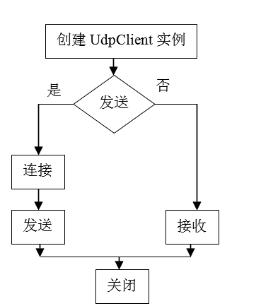
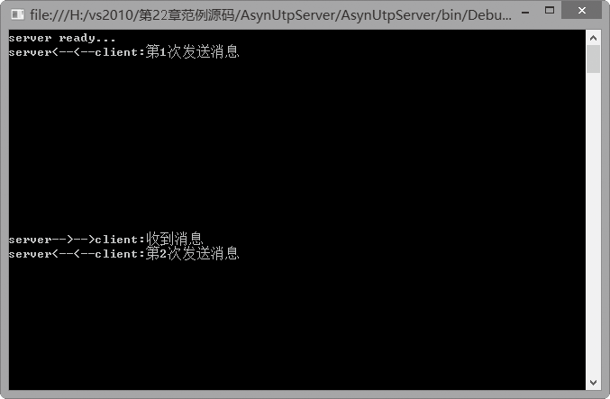
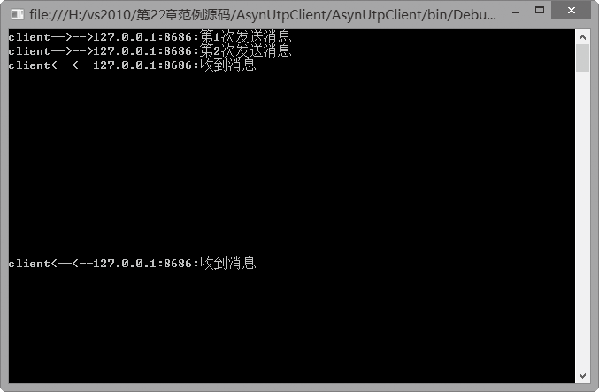

### 22.4　UDP应用编程


**本节视频教学录像：1分钟**

UDP是一个简单的、面向数据报的无连接协议，它提供了快速但不一定可靠的传输服务。与TCP一样，UDP也是构建于底层IP之上的传输层协议。所谓“无连接”是指在正式通信前不必与对方先建立连接，不管对方状态如何就直接发送过去。这与发手机短信非常相似，只要输入对方的手机号码就可以了，不用考虑对方手机处于什么状态。

利用UDP可以使用广播的方式同时向子网上的所有设备发送信息，也可以使用组播的方式同时向网络上的多个设备发送信息。比如可以使用UDP向某网络发送广告，也可以使用UDP向指定的客户发送订阅的新闻或通知。

与TCP相比，UDP有如下一些特点。首先，UDP是基于无连接的协议，它能够消除生成连接的系统延迟，所以速度比TCP更快。对于强调传输性能而不是传输完整性的应用（例如，音频和多媒体应用），UDP是最好的选择；其次，UDP不但支持一对一连接，而且也支持一对多连接，可以使用广播的方式多地址发送，而TCP仅支持一对一的通信；第三，UDP与TCP的报头比是8:20，这使得UDP消耗的网络带宽更少。最后，UDP传输的数据有消息边界，而TCP没有消息边界。

由于UDP是一种无连接的协议，缺乏双方的握手信号，因此发送方无法了解数据报是否已经到达目标主机。如果在从发送方到接收方的传递过程中出现了数据报的丢失，协议本身并不能做出任何检测或提示，因此可靠性不如TCP。

UDP没有任何对双方会话的支持，当接收多个数据报时，不能保证各数据包到达的顺序与发出的顺序相同。当然，UDP的这种乱序性基本上很少出现，通常只会在网络非常拥挤的情况下才可能发生。

编写UDP应用程序时有两种技术，一种是直接使用Socket类，另一种是使用UdpClient类。UdpClient类对基础Socket进行了封装，发送和接收数据时不必考虑底层套接字收发时必须处理的一些细节问题，从而简化了UDP应用编程的难度，提高了编程效率。

与TcpClient和TcpListener类似，System.Net.Sockets名称空间下的UdpClient类也是构建于Socket类之上，提供了更高层次的UDP服务抽象，用于在阻止同步模式下发送和接收无连接 UDP 数据报，使用简单直观。

基于UdpClient的网络应用编程首先需要创建一个UdpClient类实例，接着通过调用其Connect方法连接到远程主机。当然，这两步也可以直接由指定远程主机名和端口号的UdpClient类构造函数完成。然后便可以利用Send和Receive方法来发送和接收数据。最后调用Close方法关闭UDP连接，并释放相关资源。其实现流程如下图所示。


UdpClient类提供了以下几种常用格式的构造函数。

（1）UdpClient()。

创建一个新的UdpClient对象，并自动分配合适的本地IPv4地址和端口号。例如，

```c
UdpClient udpClient = new UdpClient();
udpClient.Connect("www.contoso.com", 51666); //指定默认远程主机和端口号
Byte[] sendBytes = System.Text.Encoding.Unicode.GetBytes("你好!");
udpClient.Send(sendBytes, sendBytes.Length); //发送给默认远程主机
```

（2）UdpClient(int port)。

创建一个与指定的端口绑定的新的UdpClient实例，并自动分配合适的本地IPv4地址。例如，

```c
UdpClient udpClient = new UdpClient(51666);
```

（3）UdpClient(IPEndPoint localEp)。

创建一个新的UdpClient实例，该实例与包含本地IP地址和端口号的IPEndPoint实例绑定。例如，

```c
IPAddress address = IPAddress. Parse("127.0.0.1");
IPEndPoint iep = new IPEndPoint(address, 51666);
UdpClient udpClient =new UdpClient(iep);
```

（4）UdpClient(string remoteHost,int port)。

创建一个新的UdpClient实例，自动分配合适的本地IP地址和端口号，并将它与指定的远程主机和端口号联合。使用这种构造函数，一般不必再调用Connect方法。例如，

```c
UdpClient udpClient =new UdpClient("www.contoso.com",8080);
```

UdpClient类的常用属性如下表所示。

| 属性名称 | 说明 |
| :-----  | :-----  | :-----  | :-----  |
| Active | 获取或设置一个值，指示是否已建立默认远程主机 |
| Available | 获取或设置缓冲器中可用数据报的数量 |
| Client | 获取或设置基础网络套接字 |
| EnableBroadcast | 是否接收或发送广播包 |
| ExclusiveAddressUse | 是否仅允许一个客户端使用指定端口 |

UdpClient类的常用方法如下表所示。

| 方法名称 | 说明 |
| :-----  | :-----  | :-----  | :-----  |
| Send() | 发送数据报 |
| Receive() | 接收数据报 |
| BeginSend() | 开始从连接的socket中异步发送数据报 |
| BeginReceive() | 开始从连接的socket中异步接收数据报 |
| EndSend() | 结束挂起的异步发送数据报 |
| EndReceive() | 结束挂起的异步接收数据报 |
| JoinMulticastGroup() | 添加多地址发送,用于连接一个多组播 |
| DropMulticastGroup() | 除去多地址发送，用于断开UdpClient与一个多组播的连接 |
| Close() | 关闭 |
| Dispose() | 释放资源 |

编写基于UDP的应用程序时，关键在于如何实现数据的发送和接收。由于UDP不需要建立连接，因此可以在任何时候直接向网络中的任意主机发送UDP数据。在同步阻塞方式下，可以使用UdpClient对象的Send方法和Receive方法。

Send方法有几种不同的重载形式，使用哪种方式取决于以下两点，一是UdpClient是如何连接到远程端口的，二是UdpClient实例是如何创建的。如果在调用Send方法以前没有指定任何远程主机的信息，则需要在调用中包括该信息。

（1）Send(byte[] data, int length, IPEndPoint iep)。

这种重载形式用于知道了远程主机IP地址和端口的情况下，它有三个参数，即数据、数据长度、远程IPEndPoint对象。例如，

```c
UdpClient  udpClient =new UdpClient();
IPAddress remoteIPAdress = IPAddress.Parse("127.0.0.1");//实际使用时应将127.0.0.1改为远程IP
IPEndPoint remoteIPEndPoint = new IPEndPoint(remoteIPAdress,51666);
byte[] sendBytes=System.Text.Encoding.Unicode.GetBytes("你好! ");
udpClient.Send(sendBytes , sendBytes.Length, remoteIPEndPoint);
```

（2）Send(byte[] data, int length, string remoteHostName, int port)。

这种重载形式用于知道了远程主机名和端口号的情况下，利用Send方法直接把UDP数据报发送到远程主机。例如，

```c
UdpClient  udpClient =new UdpClient();
byte[] sendBytes= System.Text.Encoding.Unicode.GetBytes("你好!");
udpClient.Send(sendBytes , sendBytes.Length, "Host", 51666);
```

（3）Send(byte[] data, int length)。

这种重载形式假定UDP客户端已经通过Connect方法指定了默认的远程主机，因此，只要用Send方法指定发送的数据和数据长度即可。例如，

```c
UdpClient  udpClient =new UdpClient("remoteHost", 51666);
byte[] sendByte= System.Text.Encoding.Unicode.GetBytes("你好!") ;
udpClient.Send(sendBytes ,sendBytes.Length);
```

UdpClient对象的Receive方法能够在指定的本地IP地址和端口上接收数据，该方法带一个引用类型的IPEndPoint实例，并将接收到的数据作为byte数组返回。例如，

```c
IPEndPoint remoteIpEndPoint = new IPEndPoint(IPAddress.Any, 51666);
UdpClient udpClient = new UdpClient(remoteIpEndPoint);
IPEndPoint iep=new IPEndPoint(IPAddress.Any,0);
Byte[] receiveBytes = udpClient.Receive(ref  iep);
string receiveData = System.Text.Encoding.Unicode.GetString(receiveBytes);
Console.WriteLine("接收到信息："+receiveData);
```

使用UdpClient对象的Receive方法的优点是当本机接收的数据报容量超过分配给它的缓冲区大小时，该方法能够自动调整缓冲区大小。而使用Socket对象遇到这种情况时，将会产生SocketException异常。可见，使用UdpClient的Receive方法轻而易举地解决了大量程序设计上的麻烦，提高了编程效率。

**【范例22-8】 UDP应用编程。**

（1）在Visual Studio 2013中新建C#控制台程序，项目名为“AsynUdpServer”，添加AsynUdpServer类，AsynUdpServer类代码如下（代码22-8-1.txt）。

```c
01  public class StateObject
02  {
03          public Socket udpServer = null;// 服务器端
04          public byte[] buffer = new byte[1024]; //接受数据缓冲区
05          public EndPoint remoteEP; //远程终端
06  }
07  public void ServerBind()//服务器绑定终端节点
08  {
09          IPEndPoint serverIp = new IPEndPoint(IPAddress.Parse("127.0.0.1"), 8686);
10          Socket udpServer = new Socket(AddressFamily.InterNetwork, SocketType.Dgram, ProtocolType.Udp);
11          udpServer.Bind(serverIp);
12          Console.WriteLine("server ready...");
13          IPEndPoint clientIp = new IPEndPoint(IPAddress.Any, 0);
14          state = new StateObject();
15          state.udpServer = udpServer;
16          state.remoteEP = (EndPoint)clientIp;
17          AsynRecive();
18  }
19  public void AsynRecive()//异步接受消息
20  {
21          state.udpServer.BeginReceiveFrom(state.buffer, 0, state.buffer.Length, SocketFlags.None, ref state.remoteEP, new AsyncCallback(ReciveCallback), null);
22  }
23  public void ReciveCallback(IAsyncResult asyncResult)// 异步接受消息回调函数
24  {
25          if (asyncResult.IsCompleted)
26          {
27                  IPEndPoint ipep = new IPEndPoint(IPAddress.Any, 0);
28                  EndPoint remoteEP = (EndPoint)ipep;
29                  state.udpServer.EndReceiveFrom(asyncResult, ref remoteEP);
30                  Console.WriteLine("server<--<--client:{0}", Encoding.UTF8.GetString(state.buffer));
31                  state.remoteEP = remoteEP;
32                  AsynSend("收到消息");
33                  AsynRecive();
34          }
35  }
36  public void AsynSend(string message)// 异步发送消息
37  {
38          Console.WriteLine("server-->-->client:{0}", message);
39          byte[] buffer = Encoding.UTF8.GetBytes(message);
40          state.udpServer.BeginSendTo(buffer, 0, buffer.Length, SocketFlags.None, state.remoteEP,        new AsyncCallback(SendCallback), null);
41  }
42  public void SendCallback(IAsyncResult asyncResult)// 异步发送消息回调函数
43  {
44          if (asyncResult.IsCompleted)
45          {
46                  state.udpServer.EndSendTo(asyncResult);
47          }
48  }
```

（2）在项目“AsynUdpServer”的Program类中的Main方法中添加以下测试代码（代码22-8-2.txt）。

```c
01  AsynUdpServer ts = new AsynUdpServer();
02  ts.ServerBind();
03  Console.Read();
```

（3）在Visual Studio 2013中新建C#控制台程序，项目名为“AsynUdpClient”，添加AsynUdpClient类，AsynUdpClient类代码如下（代码22-8-3.txt）。

```c
01  public class StateObject
02  {
03          public Socket udpClient= null;// //客户端套接字
04          public byte[] buffer = new byte[1024]; ///接收信息缓冲区
05          public IPEndPoint serverIp; ////服务器端终节点
06          public EndPoint remoteEP; // //远程终端节点
07  }
08  public StateObject state;
09  public void InitClient()
10  {
11          state = new StateObject();
12          state.udpClient = new Socket(AddressFamily.InterNetwork,
            SocketType.Dgram, ProtocolType.Udp);
13          state.serverIp = new IPEndPoint(IPAddress.Parse("127.0.0.1"), 8686);
14          state.remoteEP = (EndPoint)(new IPEndPoint(IPAddress.Any, 0));
15          AsynSend("第1次发送消息");
16          AsynSend("第2次发送消息");
17          AsynRecive();
18  }
19  public void AsynRecive()
20  {
21          state.udpClient.BeginReceiveFrom(state.buffer, 0, state.buffer.Length, SocketFlags.None, ref state.remoteEP, new AsyncCallback(ReciveCallback), null);
22  }
23  public void ReciveCallback(IAsyncResult asyncResult)
24  {
25          if (asyncResult.IsCompleted)
26          {
27                  state.udpClient.EndReceiveFrom(asyncResult, ref state.remoteEP);
28                  Console.WriteLine("client<--<--{0}:{1}",state.remoteEP.ToString(),
Encoding.UTF8.GetString(state.buffer));
29                  AsynRecive();
30          }
31  }
32  public void AsynSend(string message)
33  {
34          Console.WriteLine("client-->-->{0}:{1}", state.serverIp.ToString(), message);
35          byte[] buffer = Encoding.UTF8.GetBytes(message);
36          state.udpClient.BeginSendTo(buffer, 0, buffer.Length, SocketFlags.None, state.serverIp,
    new AsyncCallback(SendCallback), null);
37  }
38  public void SendCallback(IAsyncResult asyncResult)
39  {
40          if (asyncResult.IsCompleted)
41          {
42                  state.udpClient.EndSendTo(asyncResult);
43          }
44  }
```

（4）在项目 “AsynUdpClient”的Program类中的Main方法中添加以下测试代码（代码22-7-4.txt）。

```c
01  AsynUdpClient tc = new AsynUdpClient();
02  tc.InitClient();
03  Console.Read();
```

**【运行结果】**

单击工具栏中的
按钮，运行AsynUdpServer项目，即可在控制台中输出如下图所示的服务器端窗口。


单击工具栏中的
按钮，运行AsynUdpClient项目，即显示如下图所示的客户端窗口。


