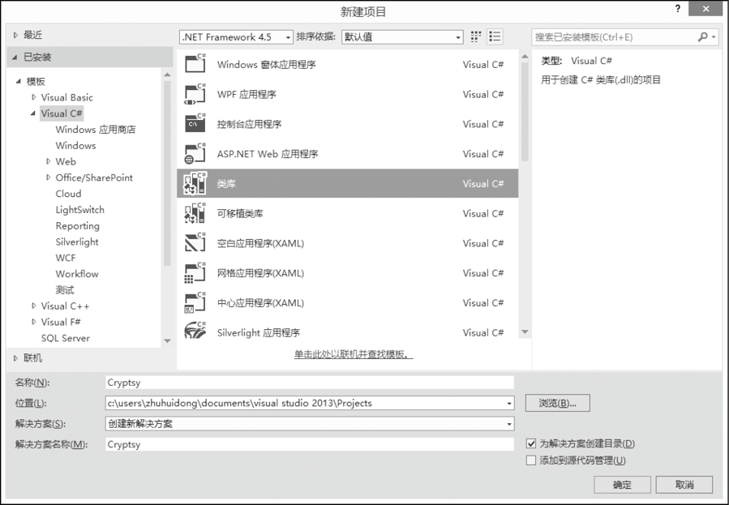

### 23.2.1　创建自定义类库

自定义类库的开发通常包括以下几个步骤。

（1）创建基于类库模板的项目，开发环境自动产生包含对命名空间定义的代码。

（2）在项目中添加类或结构等的定义。

（3）添加类或结构的方法、属性、事件和字段等。

（4）编译类库，一般生成DLL文件。

下面以一个加密解密的程序实例来说明类库的创建过程，该类库提供了基于MD5算法的加密解密方法和基于DES算法的加密和解密方法。

第一步，新建项目，选中项目类型为“类库”，在项目名称中输入Zzuli.Cryptsy，如下图所示。


第二步，在打开的代码编辑窗口中把命名空间改为Zzuli.Cryptsy，把类名和对应的文件名改为“EncodeDecode”，然后输入如下的程序代码。

```c
01  /// <summary>
02  /// 使用给定密钥加密
03  /// </summary>
04  /// <param name="original">原始文字</param>
05  /// <param name="key">密钥</param>
06  /// <param name="encoding">字符编码方案</param>
07  /// <returns>密文</returns>
08  public static string Encrypt(string original, string key)
09  {
10           byte[] buff = System.Text.Encoding.UTF8GetBytes(original);
11           byte[] kb = System.Text.Encoding.UTF8GetBytes(key);
12           return Convert.ToBase64String(Encrypt(buff, kb));
13  }
14  /// <summary>
15  /// 使用给定密钥解密
16  /// </summary>
17  /// <param name="encrypted">密文</param>
18  /// <param name="key">密钥</param>
19  /// <param name="encoding">字符编码方案</param>
20  /// <returns>明文</returns>
21  public static string Decrypt(string encrypted, string key)
22  {
23           byte[] buff = Convert.FromBase64String(encrypted);
24           byte[] kb = System.TextEncoding.UTF8GetBytes(key);
25           return Encoding.UTF8.GetString(Decrypt(buff, kb));
26  }
27  /// <summary>
28  /// 生成MD5摘要
29  /// </summary>
30  /// <param name="original">数据源</param>
31  /// <returns>摘要</returns>
32  public static byte[] MakeMD5(byte[] original)
33  {
34           MD5CryptoServiceProvider hashmd5 = new MD5CryptoServiceProvider();
35           byte[] keyhash = hashmd5.ComputeHash(original);
36           hashmd5 = null;
37           return keyhash;
38  }
39  /// <summary>
40  /// 使用给定密钥加密
41  /// </summary>
42  /// <param name="original">明文</param>
43  /// <param name="key">密钥</param>
44  /// <returns>密文</returns>
45  public static byte[] Encrypt(byte[] original, byte[] key)
46  {
47           TripleDESCryptoServiceProvider des = new TripleDESCryptoServiceProvider();
48           desKey = MakeMD5(key);
49           desMode = CipherModeECB;
50           return des.CreateEncryptor().TransformFinalBlock(original, 0, original.Length);
51  }
52  /// <summary>
53  /// 使用给定密钥解密数据
54  /// </summary>
55  /// <param name="encrypted">密文</param>
56  /// <param name="key">密钥</param>
57  /// <returns>明文</returns>
58  public static byte[] Decrypt(byte[] encrypted, byte[] key)
59  {
60          TripleDESCryptoServiceProvider des = new TripleDESCryptoServiceProvider();
61          desKey = MakeMD5(key);
62          desMode = CipherModeECB;
63          return des.CreateDecryptor().TransformFinalBlock(encrypted, 0, encryptedLength);
64  }
65  //默认密钥向量
66  private static byte[] Keys = { 0x17, 0x34, 0x59, 0x78, 0x90, 0xAB, 0xCD, 0xEF };
67  
68  /// <summary>
69  /// 对称加密法加密函数
70  /// </summary>
71  /// <param name="encryptString">待加密的字符串</param>
72  /// <param name="encryptKey">加密密钥,要求为8位</param>
73  /// <returns>加密成功返回加密后的字符串，失败返回源串</returns>
74  
75  public static string SymmetryEncrypt(string encryptString, string encryptKey)
76  {
77          try
78          {
79          byte[] rgbKey = Encoding.UTF8.GetBytes(encryptKey.Substring(0, 8));
80          byte[] rgbIV = Keys;
81          byte[] inputByteArray = EncodingUTF8GetBytes(encryptString);
82          DESCryptoServiceProvider dCSP = new DESCryptoServiceProvider();
83          MemoryStream mStream = new MemoryStream();
84          CryptoStream cStream = new CryptoStream(mStream, dCSP.CreateEncryptor(rgbKey, rgbIV), CryptoStreamMode.Write);
85          cStream.Write(inputByteArray, 0, inputByteArrayLength);
86          cStream.FlushFinalBlock();
87          return Convert.ToBase64String(mStream.ToArray());
88          }
89          catch
90                  {
91                  return encryptString;
92                  }
93          }
94  
95  /// <summary>
96  /// 对称加密法解密函数
97  /// </summary>
98  /// <param name="decryptString">待解密的字符串</param>
99  /// <param name="decryptKey">解密密钥,要求为8位,和加密密钥相同</param>
100  /// <returns>解密成功返回解密后的字符串，失败返源串</returns>
101  
102  public static string SymmetryDecrypt(string decryptString, string decryptKey)
103  {
104          try
105          {
106          byte[] rgbKey = Encoding.UTF8GetBytes(decryptKey);
107          byte[] rgbIV = Keys;
108          byte[] inputByteArray = Convert.FromBase64String(decryptString);
109          DESCryptoServiceProvider DCSP = new DESCryptoServiceProvider();
110          MemoryStream mStream = new MemoryStream();
111          CryptoStream cStream = new CryptoStream(mStream, DCSP.CreateDecryptor(rgbKey, rgbIV), CryptoStreamMode.Write);
112          cStream.Write(inputByteArray, 0, inputByteArrayLength);
113          cStream.FlushFinalBlock();
114          return Encoding.UTF8.GetString(mStream.ToArray());
115          }
116          catch
117  {
118          return decryptString;
119          }
120  }
```

第三步，因为我们创建的是类库，它不能单独运行，要生成*DLL文件，我们只需要选择“生成”菜单下的“生成Cryptsy”，此时，在项目的输出目录下已经生成了“Cryptsydll”文件。

