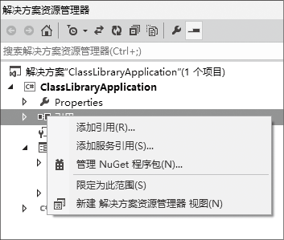
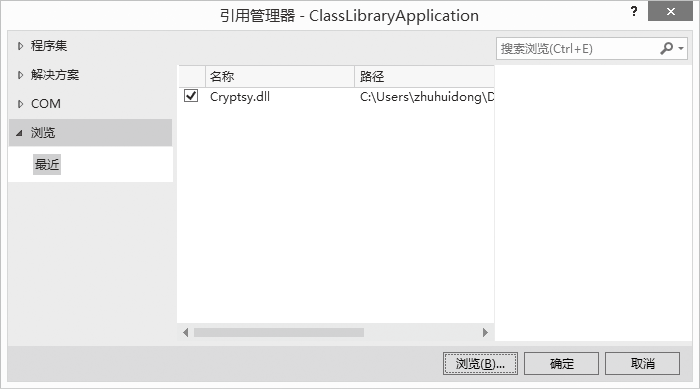
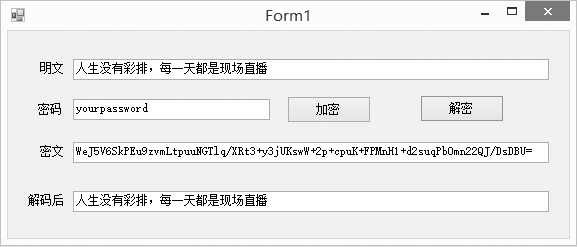

### 23.2.2　自定义类库的引用

对于自定义类库的使用与其他第三方类库的使用方法是一样的，首先应该把类库文件复制到项目中，然后，还需要在项目中添加对库文件的引用，在程序中就可以添加库文件所对应的命名空间的引用，这样，我们就可以在程序中使用类库中声明的类和方法了。

下面以前面生成的加密解密类库为例，介绍自定义类库的使用方法。首先添加对“Cryptsydll”的引用。

第一步，新建一个Windows窗体应用程序，右键单击解决方案资源管理器里的引用，选择“添加引用”，如下图所示。


第二步，在打开的窗口中单击“浏览”按钮，选择“Cryptsydll”所在的位置，把库文件引入到项目中，如下图所示。


第三步，在程序中引用“Cryptsydll”中的命名空间“ZzuliCryptsy，编写程序类库中的方法，因为类库中的方法都是静态方法，直接通过类名就可以访问。程序运行效果如下图所示。


程序源代码如下。

```c
01  private void btnEncrypt_Click(object sender, EventArgs e)
02  {
03          String strSource = textSource.Text;
04          String strEnKey = textEnKey.Text;
05          textCipher.Text = EncodeDecode.Encrypt(strSource, strEnKey);
06          
07  }
08  
09  private void btnDecrypt_Click(object sender, EventArgs e)
10  {
11          String strCipher = textCipher.Text;
12          String strEnKey = textEnKey.Text;
13          textDecode.Text = EncodeDecode.Decrypt(strCipher, strEnKey);
14  }
15
```

