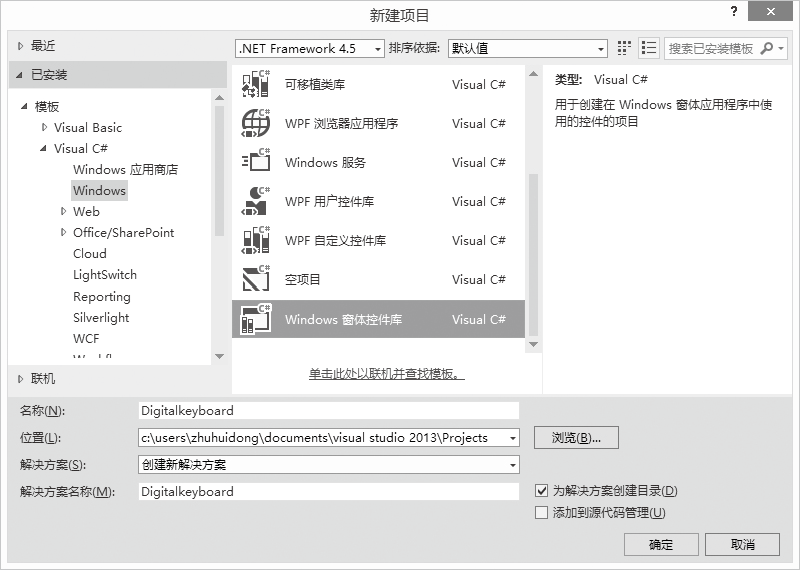
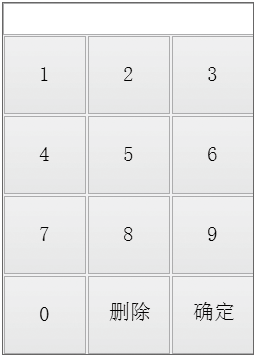
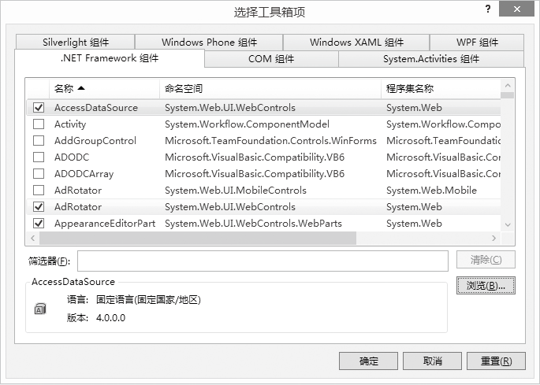
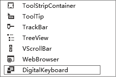
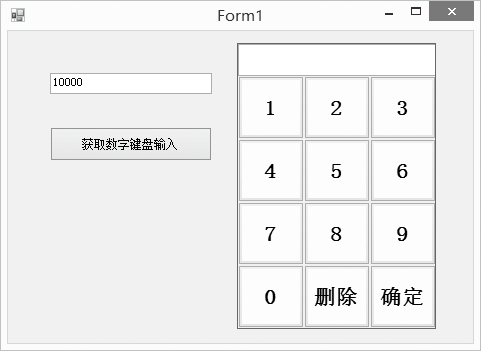

### 23.3.1　复合控件

复合控件实际上是控件的集合，类似于堆积木。因此，可以按照用户的需求，把VS 2013工具箱中的控件任意组合起来，形成一个复合控件。在以后使用中，将生成的这个复合控件作为一个控件来对待。复合控件一般都是从UserControl类派生而来的。

#### 1．复合控件的创建

下面以自定义一个数字键盘为例来介绍复合控件的制作过程，该复合控件由一个文本框和14个按钮组成，文本框用于显示输入的数字，删除键可以一个一个删除刚输入的数字，按【确定】返回输入的数值。

第一步，新建一个Windows窗体控件库项目，并命名为DigitalKeyboard，单击“确定”完成项目创建工作，如下图所示。


第二步，复合控件的外观设计。控件中包含1个文本框和12个按钮控件，为了便于控制和处理，这一步的设计通过程序代码完成，外观效果如下图所示。


添加的程序源代码如下。

```c
01  #region//字段
02  /// <summary>
03  /// 输入文本框
04  /// </summary>
05  private TextBox textInput = new TextBox();
06  
07  private String inputNumber;
08  /// <summary>
09  /// 定义按钮数组
10  /// </summary>
11  private SystemWindows.FormsButton[] buttons = new Button[12];
12  
13  /// <summary>
14  /// 设置面板上button的统一颜色
15  /// </summary>
16  private Color btnBackColor;  
17  
18  #endregion
19  
20  #region//属性 
21   
22  /// <summary>
23  /// 设置textBox的font
24  /// </summary>
25  [Description("设置textBox的font"), Category("自定义")]
26  public Font TextInputFont
27  {
28          get { return thistextInput.Font; }
29          set
30          {
31          this.textInput.Font = value;
32          }
33  }
34  
35  /// <summary>
36  /// 设置button的font
37  /// </summary>
38  [Description("设置button的font"), Category("自定义")]
39  public Font ButtonFont
40  {
41          get { return this.buttons[0].Font; }
42          set
43          {
44          for (int i = 0; i < buttons.Length; i++)
45          this.buttons[i].Font = value;
46  
47  
48          }
49  }
50  
51  /// <summary>
52  /// 设置面板上button的统一颜色
53  /// </summary>
54  [Description("设置面板上button的统一颜色"), Category("自定义")]
55  public Color BtnBackColor
56  {
57          get { return btnBackColor; }
58          set
59          {
60  
61          btnBackColor = value;
62          for (int i = 0; i < buttons.Length; i++)
63                  {
64                  this.buttons[i].BackColor = value;
65                  }
66  
67  
68          }
69  }
70  
71  /// <summary>
72  /// 获取数字控件Number的输入值
73  /// </summary>
74  [Description("获取数字控件Number的输入值"), Category("自定义")]
75  public string InputNumber
76  {
77          get { return inputNumber; }
78          set 
79           {
80                  double number;
81                  if (DoubleTryParse(value, out number))
82                          {
83                                  inputNumber = value;
84                          }
85           }
86  } 
87  
88  #endregion
89  
90  #region//方法
91  /// <summary>
92  /// 初始化面板上的按钮
93  /// </summary>
94  private void IniButtons()
95  {
96  
97           for (int i = 0; i < buttonsLength; i++)
98           {
99                     buttons[i] = new Button();
100                    buttons[i].Text = (i + 1)ToString();
101                    buttons[i].Font = new System.Drawing.Font("宋体", 125F, System.Drawing.FontStyle.Regular, System.Drawing.GraphicsUnit.Point, ((byte)(134)));
102                    //给每个button的tag做标记
103                    this.buttons[i].Tag = iToString();
104                    this.buttons[i].Margin = new Padding(0, 0, 0, 0);
105                    //给buttons[i]注册事件BtnClick
106                    this.buttons[i].Click += new EventHandler(Buttons_Click);
107                    //将buttons[i]加入控件
108                    this.Controls.Add(buttons[i]);
109                
110            buttons[9].Text = "0";
111            buttons[10].Text = "删除";
112            buttons[11].Text = "确定";
113            this.textInput.Location = new Point(0, 0);
114            this.textInpu.tMargin = new Padding(0, 0, 0, 0);
115            this.textInput.SizeChanged += new EventHandler(txtInput_SizeChanged);
116            this.Controls.Add(textInput);
117            SetSize();
118            }
119        
120           /// <summary>
121           /// 设置面板上控件的位置和大小
122           /// </summary>
123          private void SetSize()
124          {
125            //改变坐标
126            for (int r = 0; r < 4; r++)
127            {
128            
129            for (int c = 0; c < 3; c++)
130                    {
131                    this.buttons[3*r+c].Location = new System.Drawing.Point(c * (thisWidth / 3), r * ((thisHeight - textInput.Height) / 4) + textInput.Height);
132                    }
133            }
134            //改变大小
135            for (int i = 0; i < buttonsLength; i++)
136            {
137            this.buttons[i].Size = new Size(this.Width / 3, (this.Height - textInput.Height) / 4);
138            }
139            this.textInput.Size = new Size(this.Width, this.textInput.Size.Height);
140            }
141        
142  #endregion
143        
144  #region//事件
145        
146  /// <summary>
147  /// Number控件大小改变事件
148  /// </summary>
149  /// <param name="sender"></param>
150  /// <param name="e"></param>
151  private void DigitalKeyboard_SizeChanged(object sender, EventArgs e)
152  {
153            SetSize();
154  }
155  /// <summary>
156  /// 数字按钮点击事件
157  /// </summary>
158  /// <param name="sender"></param>
159  /// <param name="e"></param>
160  private void Buttons_Click(Object sender, EventArgs e)
161  {
162        
163            Button btn = (Button)sender;
164            switch (btn.Text)
165            {
166                    case "1": this.textInput.Text += "1"; break;
167                    case "2": this.textInput.Text += "2"; break;
168                    case "3": this.textInput.Text += "3"; break;
169                    case "4": this.textInput.Text += "4"; break;
170                    case "5": this.textInput.Text += "5"; break;
171                    case "6": this.textInput.Text += "6"; break;
172                    case "7": this.textInput.Text += "7"; break;
173                    case "8": this.textInput.Text += "8"; break;
174                    case "9": this.textInput.Text += "9"; break;
175                    case "0": this.textInput.Text += "0"; break;
176                    case ".": this.textInput.Text += "."; break;
177                    case "删除":
178                     if (this.textInput.Text != "")
179                    {
180                            this.textInput.Text = this.textInput.TextSubstring(0, this.textInput.TextLength - 1); 
181                    }
182            break;
183            case "确定": InputNumber = textInput.Text;
184            textInput.Text = ""; break;  
185            }
186  }
187  /// <summary>
188  /// 数组改变大小时引发的事件
189  /// </summary>
190  /// <param name="sender"></param>
191  /// <param name="e"></param>
192  private void txtInput_SizeChanged(Object sender, EventArgs e)
193  {
194            SetSize();
195  }
196  #endregion
```

第三步，生成复合控件，单击“生成”菜单，选择其中的“生成解决方案”菜单项，或单击“生成DigitalKeyboard”就可以生成复合控件。生成的复合控件是以dll文件的形式存在的。

#### 2．复合控件的使用

要使用已创建的复合控件，首先应该把编译好的控件添加到【工具箱】中，然后就可以像使用系统提供的标准控件一样来使用自定义控件了，我们可以把它从工具箱中拖放到窗口中，在属性窗口设置它的属性。

把自定义控件加入到【工具箱】的具体步骤如下。

第一步，新建一个Windows应用程序项目，命名为UserControlDemo。

第二步，在项目中新建一个DLL文件夹，把前面生成的“DigitaKeyboarddll”文件复制到DLL文件夹下。

第三步，在【工具箱】中右击，选择【选择项】，打开如下图所示的“选择工具箱项”对话框。


第四步， 选中【.NET Framework组件】选项卡，单击【浏览】按钮找到DLL文件夹下的“DigitalKeyboard.dll”文件，单击“打开”，此时在列表中可以看到要引入的自定义控件。单击“确定”，自定义控件就引入到了工具箱中，如下图所示。


#### 3．在项目中使用自定义控件

用鼠标将DigitalKeyboard控件拖到窗体上，通过拖动调整控件的大小，通过属性窗口修改btnBackColor和btnFont属性，看有什么变化。

在窗口中放置一个文本框和一个按钮，单击按钮，在文本框中显示数字键盘输入的内容，界面如下图所示。


程序代码如下。

```c
private void btnGetNumber_Click(object sender, EventArgs e)
{
        textBox1.Text = digitalKeyboard2.InputNumber;
}
```

