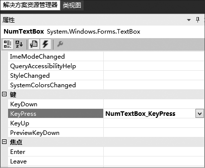
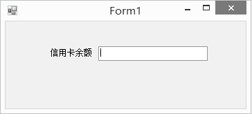

### 23.3.2　扩展控件

扩展控件（Extended Controls）就是在现有的控件基础上派生出一个新的控件，增加新的功能或者修改原有功能，来满足用户需求。

扩展控件保留了原来控件的界面、属性、方法，同时还可以扩展原有控件功能，实现新的功能，满足用户需求。

扩展控件可以在以下两方面进行扩展。

（1）扩展用户界面，界面上有所变化，使界面更好看。

界面上要有所变化，就要重载OnPaint方法，对原有控件的界面进行重新绘制。

（2）扩展功能，功能上有所加强。

功能上有所加强就是指增加新的功能，满足用户需求。

#### 1．扩展控件的创建

下面创建一个扩展TextBox的文本框控件，该控件有一个最大值和最小值属性，在文本框中只能输入数值，且只能有一个小数点，负号只能在最前面，数值要在最大值和最小值之间。

第一步，新建一个Windows窗体控件库项目，并命名为DigitalTextBox，单击“确定”完成项目创建工作，此时产生了一个UserControl界面，当我们从已有的控件中继承的时候，实际上这个界面是不需要的。

第二步，将该控件的name属性改变为NumTextBox ，同时其文件名称也改变为NumTextBox cs，这样一来，原来的用户控件界面就不存在了，也不需要了。

第三步，为了限制输入的内容，我们应该处理键盘的按键事件，在属性窗口中找到事件列表中的keyPress项并双击，自动添加事件处理方法的模板，如下图所示。


程序代码如下。

```c
01  public partial class NumTextBox: System.Windows.Forms.TextBox
02  {
03          public NumTextBox()
04          {
05          InitializeComponent();
06          }
07          private decimal maxNum;
08          [Description("文本框可以输入的最大值"), Category("自定义")]
09          public decimal MaxNum
10          {
11          get { return maxNum; }
12          set { maxNum = value; }
13          }
14          private decimal minNum;
15          [Description("文本框可以输入的最小值"), Category("自定义")]
16          public decimal MinNum
17          {
18                  get { return minNum; }
19                  set { minNum = value; }
20          }
21          private void NumTextBox_KeyPress(object sender, KeyPressEventArgs e)
22          {
23          string userInputString = this.Text;
24          Boolean canInput = false;
25          char keyChar;
26          keyChar = e.KeyChar;
27          if ((keyChar >= '0') && (keyChar <= '9'))
28          canInput=true;
29          //退格也可以运行
30          if (keyChar == '\b')
31          canInput = true;
32          if (keyChar == '-')
33                  {
34                  //如果“-”已经存在
35                  if (userInputString.IndexOf('-') == -1)
36                  canInput = true;
37                  //如果“-”不在起始位置
38                  if (this.SelectionStart != 0)
39                  canInput = false;
40          }
41          if (keyChar == '.')
42          {
43                  if (userInputStringIndexOf('.') == -1)
44                  canInput = true;
45                  else
46                  canInput = false;
47          }
48          if (canInput == true && keyChar == '\b')
49          {
50                  decimal num = Decimal.Parse(userInputString + keyChar);
51                  if (num > maxNum || num < minNum)
52          {
53                  canInput = false;
54          }
55  }
56  }
57  //Handled 是个布尔值。获取或设置事件是否已被处理
58  //如果您不希望出现默认操作，则设置为真
59  if (canInput)
60  e.Handled = false;
61  else
62  e.Handled = true;
63  }
64  }
```

第四步，单击“生成”菜单，选择其中的“生成解决方案”菜单项，或单击“生成DigitalTextBox”就可以生成扩展控件的.dll文件。

第五步，为控件添加图标。在解决方案资源管理器中右击该控件的项目名称，单击“添加新项”，在“模板”窗格中选择“位图文件”，将 Name 更改为 NumTextBoxbmp。位图文件的名字必须要和类的名字一致。然后单击“打开”，新位图文件出现在解决方案资源管理器中并在设计器中打开。

在“属性”窗口中，将位图的 Height 和 Width 属性更改为 16。图标的大小必须为 16×16 像素，并设计该图标，最后保存并关闭位图文件。也可以拷贝一个图标文件，将其通过文件改名的方式来快速产生。在解决方案资源管理器中选择 NumTextBoxbmp，在“属性”窗口中将“生成操作” 属性更改为 “嵌入的资源”。

重新编译该控件的项目并生成新的*.dll文件。

#### 2．扩展控件的使用

对于扩展控件，一般都是从需要扩展的那一类控件继承的，就像我们上面讲到的NumTextBox扩展控件是从TextBox类继承的，我们如果要在Windows应用程序中使用扩展控件，同样需要把扩展控件先添加到工具箱中，这个过程与复合控件一样，就不再赘述了。

下面是一个使用NumTextBox控件的例子，我们使用这个控件来表示信用卡的余额。界面如下图所示，通过属性窗口中的MaxNum和MinNum属性可以设置文本框允许输入的最大值和最小值。


