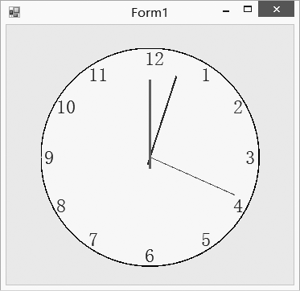

### 23.3.3　自定义控件

自定义控件（Custom Controls）直接从System.Windows.Forms.Control类派生，也就是完全由自己来设计、从头开始创建一个全新的控件。

要实现一个自定义控件，可以使用Control类提供的最基本的功能。Control类提供了创建一个控件所需要的基本功能，包括鼠标和键盘处理事件等，但是，要注意的是，Control类没有提供创建一个控件所需要的图形界面和特定的功能。因此，要创建一个自定义控件，必须自己来绘制控件的界面和特定的功能。

要绘制自定义控件的界面，必须在OnPaint事件中编写代码，在OnPaint事件中实现自定义控件的绘制工作，同时还可能重写Control类的WndProc方法，来处理底层的Windows消息。

所以说，要实现一个自定义控件，对开发者的要求较高，要求开发者必须了解GDI+和Windows API的知识。

创建自定义控件是开发自己的控件三种方法中最复杂的，下面讲述自定义控件的创建过程。

#### 1．创建自定义控件

下面的例子实现创建一个自定义的时钟，时钟的背景颜色可以通过属性进行设置。

第一步，新建一个类库项目，项目名为“ClockControl”，要设计自定义控件的外观，还需要引入SystemWindows.Forms程序集。

第二步，重写OnPaint事件，绘制用户界面，向自定义控件添加clock的背景颜色属性，程序源代码如下。

```c
01  public partial class UserClock:Control
02  {
03          private Color clockColor;      
04          Timer timer;
05          float i = 270, j = 270, k = 270;
06          public Color ClockColor
07          {
08                  get { return clockColor; }
09                  set { clockColor = value; }
10  }
11          public UserClock()
12          {
13                  InitializeComponent();        
14                  this.SetStyle(ControlStyles.AllPaintingInWmPaint, true);
15                  this.SetStyle(ControlStyles.DoubleBuffer, true);
16                  this.SetStyle(ControlStyles.ResizeRedraw, true);
17                  this.SetStyle(ControlStyles.Selectable, true);
18                  this.SetStyle(ControlStyles.SupportsTransparentBackColor, true);
19                  this.SetStyle(ControlStyles.UserPaint, true);
20                  timer = new Timer();
21                  timer.Interval = 1000;
22                  timer.Enabled = true;
23                  timer.Tick += new EventHandler(timer_Tick);       
24          }
25          private void timer_Tick(object sender, EventArgs e)
26          {
27          this.Invalidate();
28          }
29                  private void UserClock_Paint(object sender, PaintEventArgs e)
30          {
31                  Graphics gra = eGraphics;//创建一个画板
32                  using (SolidBrush sb = new SolidBrush(Color.Blue))        
33          {
34                  Font f = new Font("宋体", 18);
35                  gra.DrawString("1", f, sb, 195, 20);
36                  gra.DrawString("2", f, sb, 235, 60);
37                  gra.DrawString("3", f, sb, 250, 123);
38                  gra.DrawString("4", f, sb, 235, 183);
39                  gra.DrawString("5", f, sb, 195, 225);
40                  gra.DrawString("6", f, sb, 125, 245);
41                  gra.DrawString("7", f, sb, 55, 225);
42                  gra.DrawString("8", f, sb, 15, 183);
43                  gra.DrawString("9", f, sb, 0, 123);
44                  gra.DrawString("10", f, sb, 15, 60);
45                  gra.DrawString("11", f, sb, 55, 20);
46                  gra.DrawString("12", f, sb, 125, 0);
47          }
48  //表盘的框架为黑色，宽度是3
49          using (Pen p = new Pen(ColorBlack, 3))
50          {
51                  p.DashStyle = DashStyle.Solid;
52                  SolidBrush brush = new SolidBrush(clockColor);
53                  gra.DrawEllipse(p, 0, 0, 270, 270);
54                  gra.FillEllipse(brush, 0, 0, 270, 270);            }
55                  //表盘上的三个指针：i,j,k
56                  using (Pen p1 = new Pen(Colo.rRed,3))
57                  {
58                          using (Pen p2 = new Pen(Color.Blue,2))
59                          {
60                                  using (Pen p3 = new Pen(Color.Green,1))
61                          {
62                                          gra.DrawPie(p3, 20, 20, 230, 230, k, 01f);// 小时          
63                                          gra.DrawPie(p2, 30, 30, 210, 210, j, 01f);//分
64                                          gra.DrawPie(p1, 40, 40, 190, 190, i, 01f);// 秒
65                          }
66                  }
67          }
68  //指针旋转的代码
69          if (i < 360)
70          {
71          i += 6;
72          if (i == 270)
73                  {
74                          if (j <= 360)
75                  {
76          j += 6;
77                  if (j == 270)
78                  {
79                          if (k <= 360)
80                          {
81                                  k += 30;
82                          }
83                          else
84                          {
85                                  k = 30;
86                          }
87                  }
88          }
89          else
90          {
91                  j = 6;
92          }
93          }
94          }
95          else
96          {
97          i = 6;
98                  }
99          }
100  }
```

第三步，单击“生成”菜单，选择其中的“生成解决方案”菜单项，或单击“生成ClockControl”就可以生成自定义控件的dll文件。

#### 2．自定义控件的使用

自定义控件的使用与其他用户控件的使用方式基本是一样的，我们如果要在Windows应用程序中使用自定义控件，首先需要把扩展控件添加到工具箱中，然后就可以在工具箱中看到引入的自定义控件，下面例子使用我们自定义的钟表控件，只需要把控件从工具箱中拖放到窗口中，修改控件中钟表背景颜色的属性，界面如下图所示。


