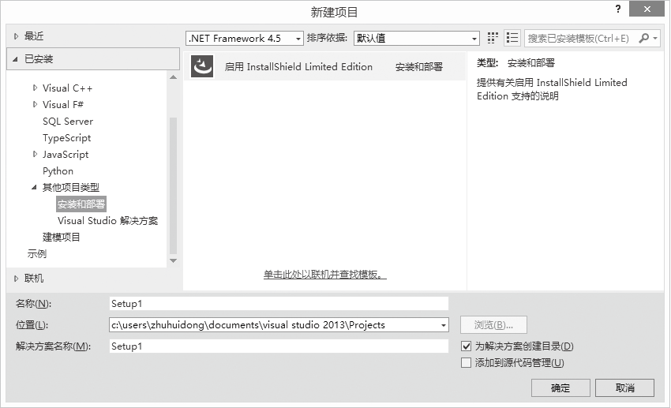
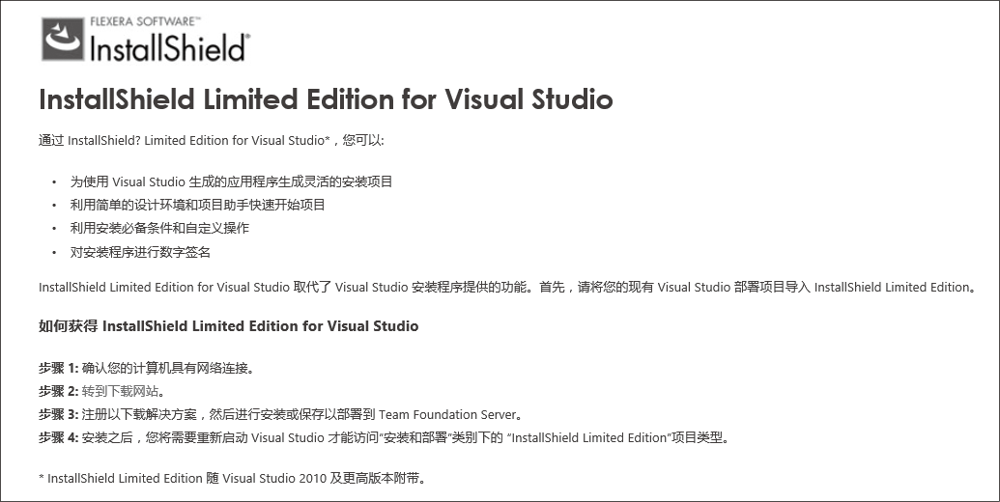
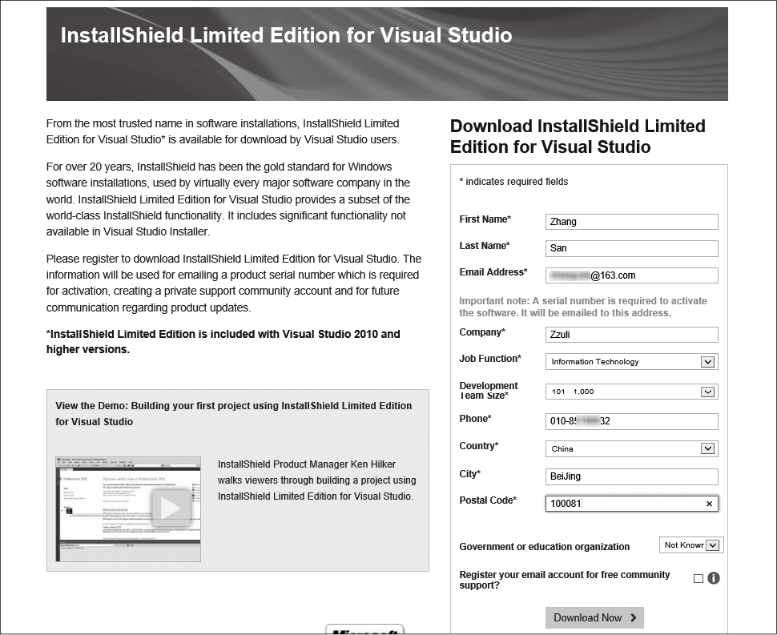
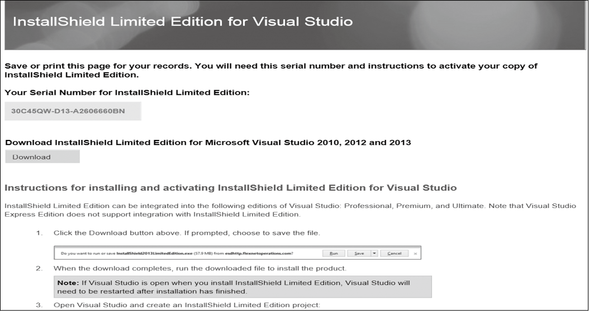
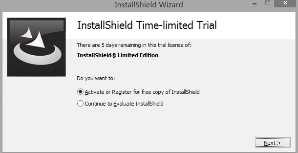
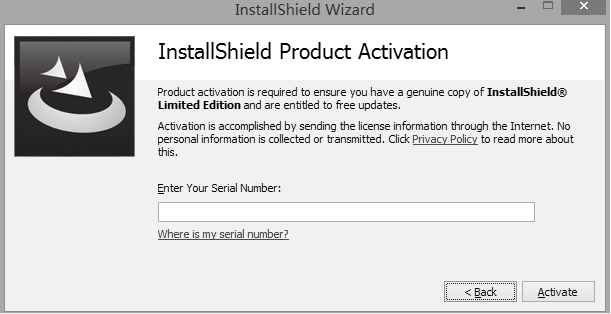
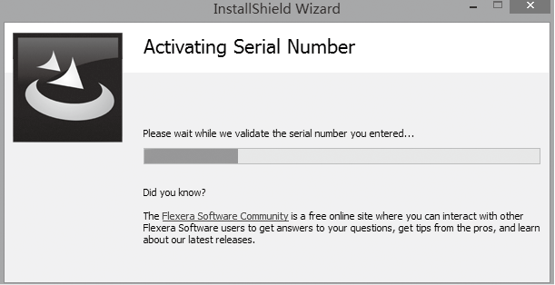
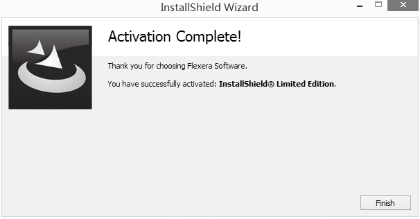

### 24.1　InstallShield Limited的下载与安装

**本节视频教学录像：5分钟**

在Visual Studio 2012之前的版本中，大部分人一直采用Windows Installer打包工具来打包应用程序。从Visual Studio 2012开始，微软就把Windows Installer打包部署工具从集成开发环境中去掉了，只留下第三方的打包工具“InstallShield Limited Edition for Visual Studio”，但是这个打包工具需要在线安装才能使用，下面就来介绍InstallShield Limited的下载与安装。

InstallShield Limited 有多个版本，其中“InstallShield Limited Edition for Visual Studio”版本是免费的，只需要注册下，就会收到注册码。

第一步，打开Visual Studio 2013，选择【文件】
【新建】
【项目】
【已安装】
【其他项目类型】 
【安装和部署】，打开如下的对话框。

第二步，如果还没有下载和安装InstallShield Limited Edition for Visual Studio，选中“启用InstallShield Limited Edition”，单击“确定”按钮，将进入下载提示说明页面，如下图所示。

第三步，单击上图中的转到下载网站，此时要确认你的计算机是连接互联网的，打开如下的注册页面，在注册页面中输入必要的信息项，单击“Download Now”按钮。

第四步，如果注册信息没有错误，则打开如下的注册成功页面。在这个页面中，你可以看到打包工具要用到的序列号，可以把它保存起来，这个序列号同时也会发到你注册的邮箱里，所以，注册时的邮箱尽量不要乱写。单击页面中的“Download”按钮，下载“InstallShield Limited Edition for Visual Studio”软件。

第五步，下载完成后，安装下载的软件，采用默认操作即可。

第六步，如果此时Visual Studio处于运行状态，应关闭后再重新打开，执行【文件】
【新建】
【项目】
【已安装】
【其他项目类型】
【安装和部署】”操作，选中“InstallShield Limited Edition Project”，单击确定按钮，将进入如下的激活和试用的选择窗口，选择第一项，单击“Next”按钮打开输入序号窗口，输入官方网站生成的序列号后，单击“Activate”按钮完成激活操作。

此时，“InstallShield Limited Edition for Visual Studio”打包工具已经安装成功并进行了激活。激活完成后将进入安装部署界面。

