### 24.2　制作Windows安装程序

**本节视频教学录像：8分钟**

下面我们以第23章编写的时钟程序为例来介绍Windows安装程序的制作过程。

创建安装与部署项目后，进入如下的主窗口，在这个窗口中包含了打包部署过程中的主要操作。下面我们详细说明安装程序的制作流程。

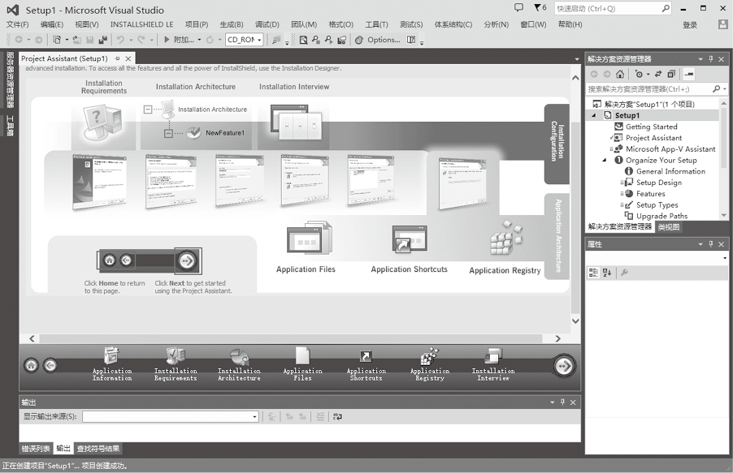
第一步，单击Application Information按钮进行应用程序基本信息的配置。在打开的如下窗口中根据实际情况输入内容。

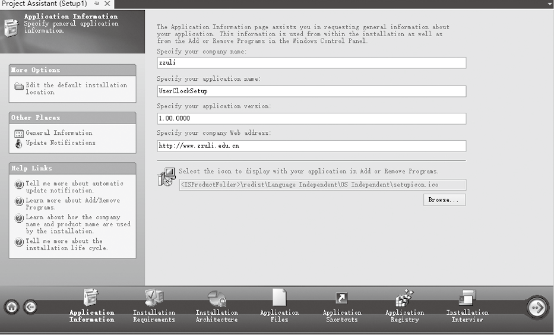
第二步，在上图的窗口中单击“General Information”设置安装时的界面信息，打开如下的窗口，在这个窗口中，你应该把“Setup Language”项的值设置为简体中文，否则，在安装的时候，如果路径中有中文将会发生错误。还可以根据需要设置“INSTALLDIR”项的值设定默认的安装路径，修改Default Font的值设定默认字体。

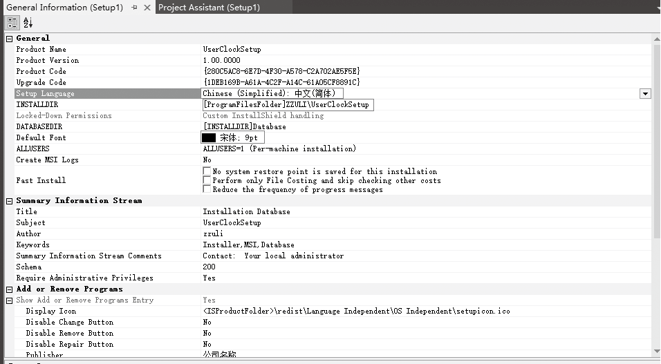
第三步，回到主界面，单击“Installation Requirements”用来设定安装的要求。打开如下的界面，在这里我们不对操作系统作特殊的要求，但应用程序要运行需要.NET Framework 4.5的支持。

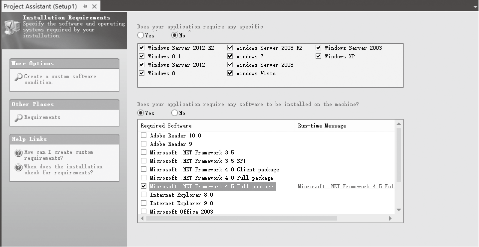
第四步，单击“Application Files”用来添加要打包的文件。打开如下的界面，单击“Add Files”按钮，选择要打包的项目的release目录下所有的文件，单击“确定”引入release目录下所有的文件，我们也可以在安装目录下添加目录，如果要把图片文件放在images目录下，可以右键单击安装目录文件夹创建新的文件夹。

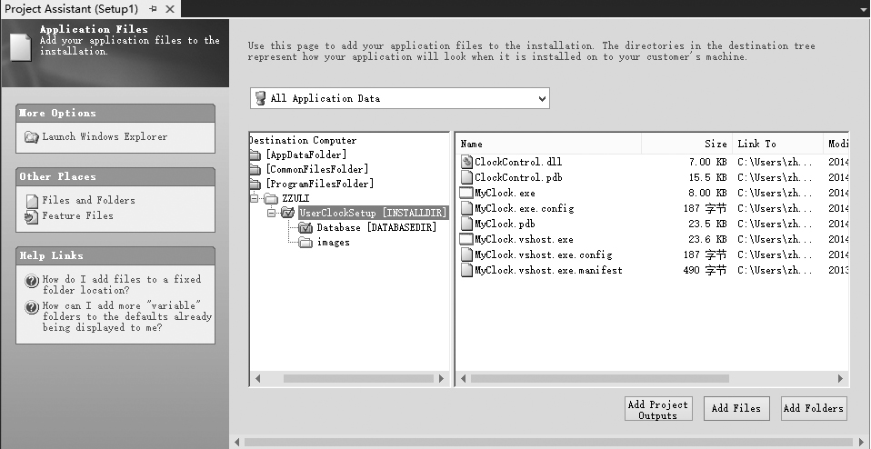
第五步，添加要打包的文件和程序，在上面的窗口中选择要打包的文件，单击鼠标右键，选择【属性】命令，打开属性窗口，如果是DLL或EXE程序这里不需要修改，如果是ActiveX或COM组件需要做相应的设定。

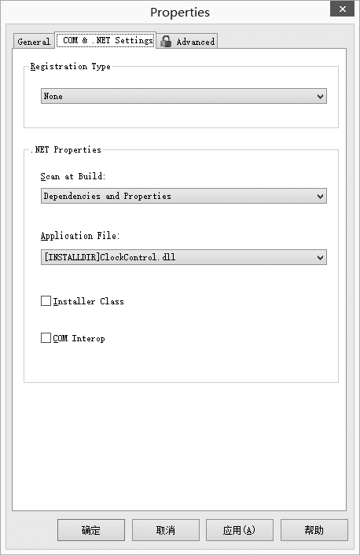
第六步，设置应用程序快捷方式，单击“Application ShortCut”，打开如下的窗口，选中开始菜单快捷方式和桌面快捷方式选项。单击“Create an uninstallation shortcut”链接，创建卸载程序的快捷方式。我们也可以选中“use alternate shortcut icon”来设置快捷方式的图标。

第七步，注册表项配置，单击“Application Registry”，打开如下的注册表项配置窗口，一般的应用程序在安装时不需要修改注册表项，此步骤可以不用设置。如果添加注册表项，首先选中“Yes”单选按钮，然后选中注册表中的目录，单击鼠标右键，添加注册表项。

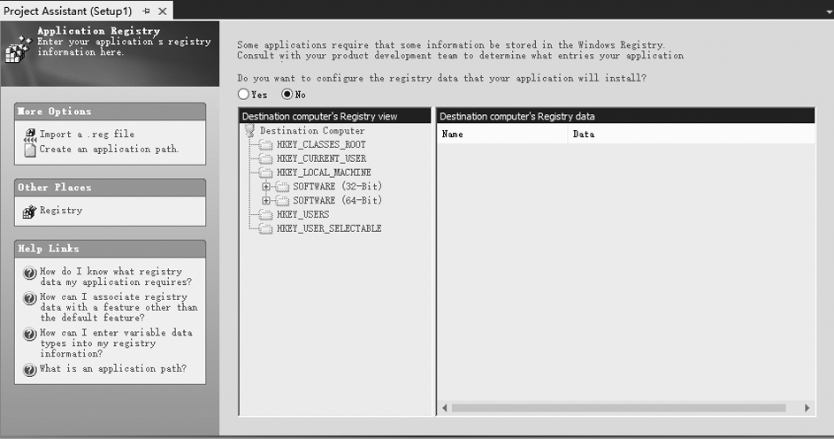
第八步，安装视图设置，单击“Installation Interview”，打开如下的安装视图设置窗口，所谓安装视图，就是安装过程中的交互对话框的设置。单击“Dialogs”链接，打开对话框选择窗口，在该窗口中可以设定安装过程中要显示的对话框有哪些。

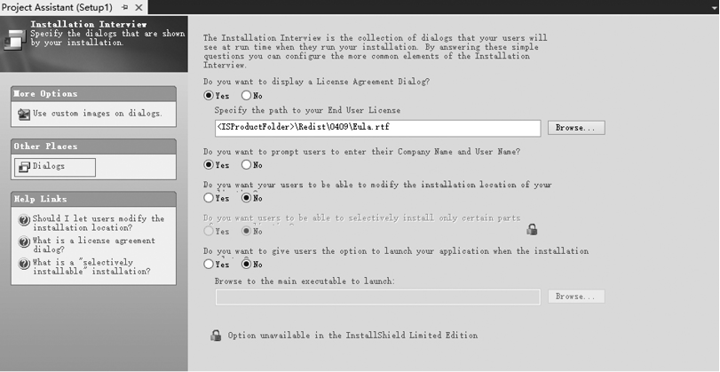
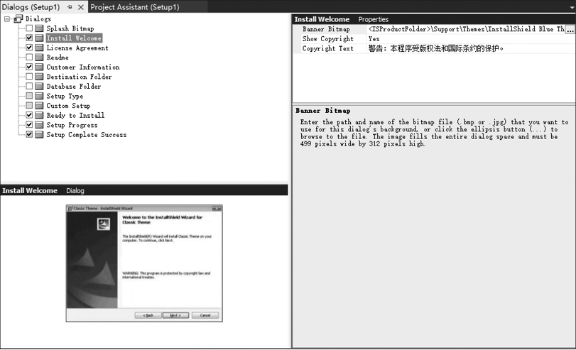
第九步，打包前的最后设置，到目前为止，打包设定基本完成，在这里需要再进行一些打包.net环境或者其他程序运行所需要的Windows环境的设定。在解决方案资源管理器中展开“Specify Application Data” ，双击“Redistributables”，然后在左边的窗格中选择安装程序所依赖的组件，如果程序中没有该组件，将会出现安装提示。

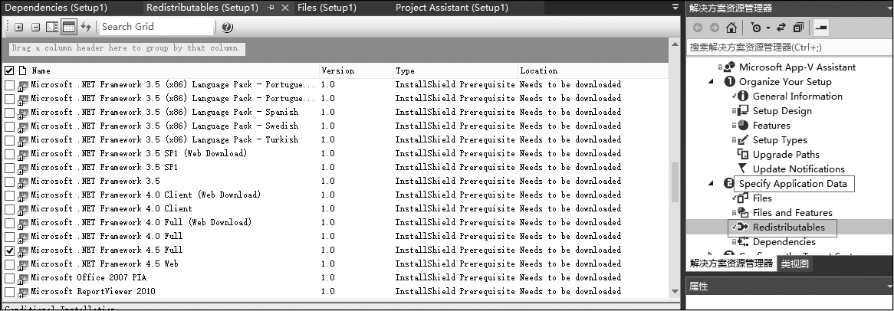
第十步，程序打包，上面所有的步骤设置完后就可以生成解决方案，但是生成的文件会放在CD-ROM文件夹内，需要拷贝整个文件夹给用户，安装过程才不会出错，我们能不能只生成一个安装文件呢，答案一定是“可以”。右键单击解决方案，选择“属性”，打开如下图所示的属性窗口，在配置项中选择SingleImage，选择“生成”菜单下的“生成解决方案”菜单项，完成安装包的生成工作。这时会将所有文件集成到一个Setup.exe中。

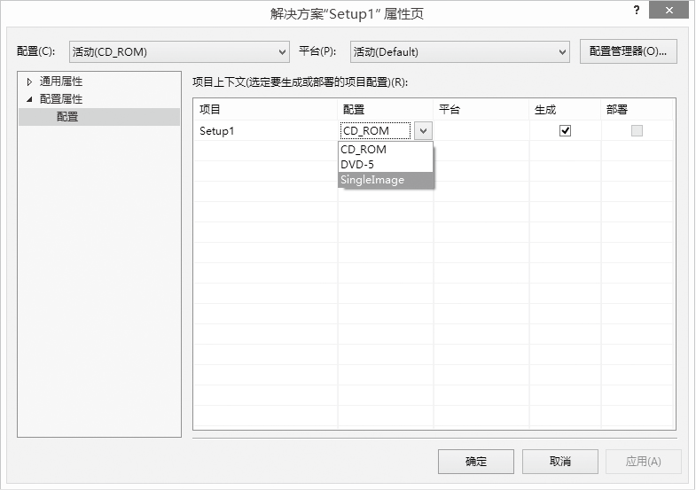
