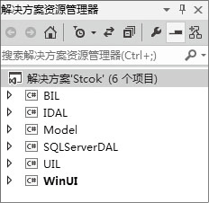

### 26.2　需求及功能分析

**本节视频教学录像：3分钟**

本系统是一个简单版本的“超市采购管理系统”，采用三层架构，利用ADO.NET数据库访问技术开发。经过调研，“超市采购管理系统”的功能如下。

（1）商品管理。包含对商品信息及商品供应的管理，实现商品类型的添加、修改和删除功能。

（2）供应商管理。实现对供应商的名称、类型、联系人、联系方式和地址等信息进行增加、删除、修改及查找的功能。

（3）订单管理。实现对订单信息的增加、删除、修改、查找及对提交订单的审核等功能。

（4）库存管理。实现对商品库存信息的查看，对库存量少的商品进行预警报告。

（5）系统管理。实现对用户信息进行添加、修改和删除及设置用户权限的功能。

本系统采用三层架构模型，表示层、业务逻辑层、数据访问层分别用Model、WinUI、SQL Server DAL等3个项目实现，实体层利用Model项目组织系统中的实体类，利用ADO.NET实现对数据库的操作。本系统三层架构和项目结构如下图所示。

