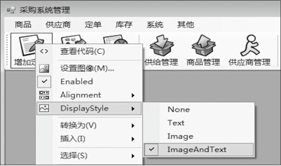
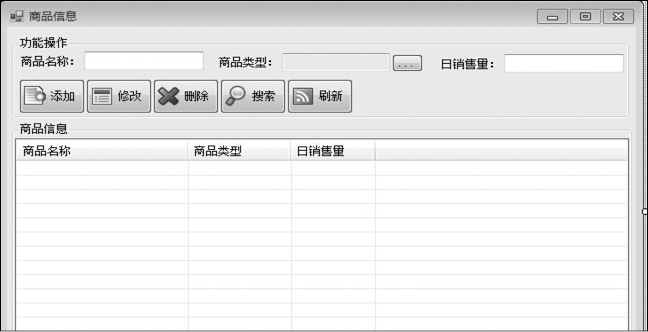
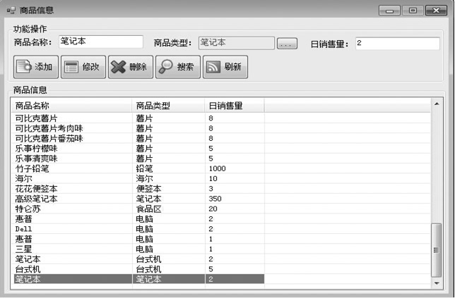
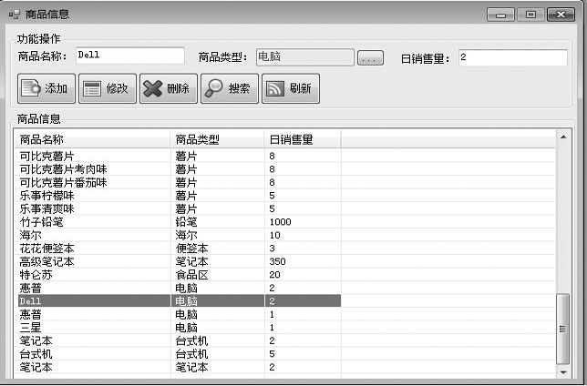
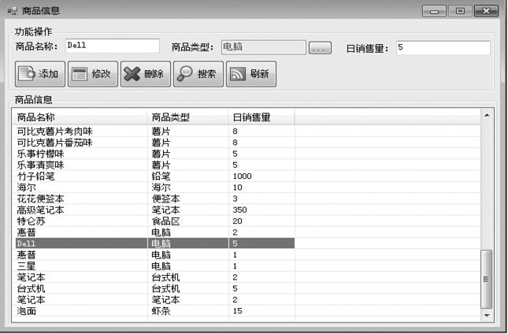
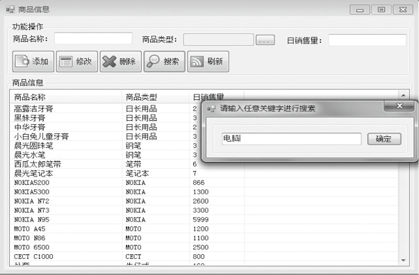
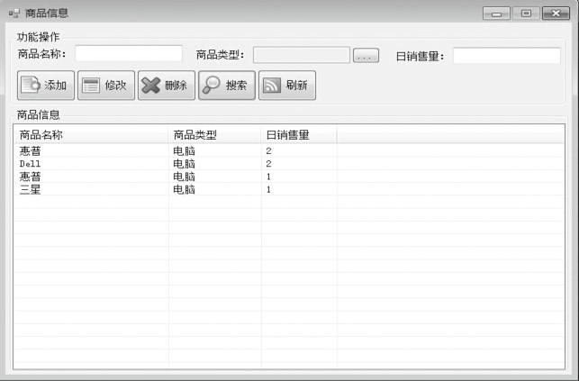

### 26.7　表示层设计


**本节视频教学录像：6分钟**

建立表示层Windows窗体应用程序项目，项目名称为“Stcok”。表示层采用MDI多文档界面，下面介绍各个窗体的设计。

#### 1．主窗体设计

本系统是一个便于入门的系统，是复杂的“超市采购管理系统”的一个简化版本，主界面设计如下图所示。

在主界面Stcok窗体中添加一个toolStrip控件，用于进行操作的导航。在toolStrip上添加8个toolStripButton，分别设置每个toolStripButton的DisplayStyle为ImageAndText，然后输入相应的文字，如“增加订单”、“订单管理”、“库存管理”、“商品管理”等。


分别为每个toolStripButton添加单击事件处理程序，实现单击相应的按钮后，执行对应的功能。下面以“商品管理”按钮为例进行介绍，代码如下（代码26-7-1.txt）。

```c
01  private void 商品信息管理ToolStripMenuItem_Click(object sender, EventArgs e)
02  {
03      if (Set.User.Purview == Set.Ordinarily) //判断用户权限，如果是一般则不能操作
04      {
05          MessageBox.Show("您的权限不够！");
06          return;
07      }
08      foreach (Form f in this.MdiChildren)  //判断窗体是否打开
09      {
10        if (f is frmMInfo)                  //如果打开，则激活打开的窗体
11        {
12            f.Activate();
13            return;
14        }
15    }
16    frmMInfo frm = new frmMInfo();         //如果没打开，则创建一个新窗体  
17    frm.MdiParent = this;
18    frm.Show();
19  }
```

#### 2．商品管理等子窗体设计

商品信息管理frmMInfo子窗体实现显示商品信息，以及添加、修改、删除、搜索和刷新商品信息。界面如下图所示。


在商品信息窗体中直接输入商品名称，选择商品类型，输入日销售量。单击【添加】按钮，输入的商品信息就会添加到下面的列表中，代码如下（代码26-7-2.txt）。

```c
01  /// <summary>
02  /// 添加商品信息
03  /// </summary>
04  /// <param name="sender"></param>
05  /// <param name="e"></param>
06  private void buttobtnAccessionn2_Click(object sender, EventArgs e)
07  {
08    try
09    {
10       checkText(); //检测用户输入
11       MerchandiseInfoData mid = new MerchandiseInfoData();//创建商品实体
12       mid.Name = this.txtName.Text; //商品名字        
13       mid.TypeID = ((MerchandiseTypeData)this.txtGenre.Tag).ID; //商品类型
14       mid.Quantity = Convert.ToInt32(this.txtQuantity.Text); //日销售量
15       mid.ID = MInfoCortrol.addMnfo(mid); //保存创建的商品实体，并获取自增的商品ID
16       addMIinfo(mid); //把新增商品放入商品列表中
17       clear();//清空输入内容
18     }
19     catch (MessageException ex) //异常处理
20     {
21        MessageBox.Show(ex.Message); //显示异常信息
22     }
23  }
```

```c
01  /// <summary>
02  /// 在窗体下端商品列表中添加商品信息
03  /// </summary>
04  /// <param name="mid">商品实体</param>
05  private void addMIinfo(MerchandiseInfoData mid) //将添加的商品信息对应放入商品列表中
06  {
07    try
08    {
09       ListViewItem lvi = new ListViewItem(mid.Name); //将商品名字放入新增行的第一列
10       lvi.Tag = mid;
11       ListViewItem.ListViewSubItem lvs = new ListViewItem.ListViewSubItem();
12       MerchandiseTypeData mtd = MTypeCortrol.getMTypeOfID(mid.TypeID);
13       lvs.Text = mtd.Name; //将商品类型放入新增行的第二列
14       lvs.Tag = mtd;
15       lvi.SubItems.Add(lvs);
16       lvi.SubItems.Add(mid.Quantity.ToString());//将日销售量放入新增行的第三列
17       this.lvMType.Items.Add(lvi); //将新增行放入列表中
18    }
19    catch (MessageException ex)//异常处理
20    {   
21       MessageBox.Show(ex.Message);//显示异常信息
22    }
23  }
```

例如，添加商品“笔记本”。输入相关的信息，然后单击【添加】按钮，即可完成商品信息添加操作，如下图所示。


选中商品信息列表里面的一种商品，单击【修改】按钮，对应的商品名称、类型、销售量就会显示在列表上方的对应的空格中，代码如下（代码26-7-3.txt）。

```c
01  private void btnAmend_Click(object sender, EventArgs e)
02  {
03    try
04    {
05       if (this.lvMType.SelectedItems.Count == 0)//判断是否有选中要修改的商品
06          throw new MessageException("请选择要修改的项目！");
07       checkText();//检测已经修改过的商品信息
08       MerchandiseInfoData mid = getMInfo();//获取修改后的商品信息
09       mid.ID = ((MerchandiseInfoData)this.lvMType.SelectedItems[0].Tag).ID; //获取修改商品的ID
10       MInfoCortrol.updMInfo(mid); //更新商品信息到数据库
11       ListViewItem lvi = new ListViewItem(mid.Name); //商品名字
12       lvi.Tag = mid; //商品ID        
13       ListViewItem.ListViewSubItem lvs = new ListViewItem.ListViewSubItem();
14       MerchandiseTypeData ptd = MTypeCortrol.getMTypeOfID(mid.TypeID);
15       lvs.Text = ptd.Name; //商品类型
16       lvs.Tag = ptd;
17       lvi.SubItems.Add(lvs);
18       lvi.SubItems.Add(mid.Quantity.ToString());//日销售量
19       this.lvMType.Items[this.lvMType.SelectedIndices[0]] = lvi; //更新商品信息列表中的内容
20       clear();
21    }
22    catch (MessageException ex)
23       {
24          MessageBox.Show(ex.Message);
25       }
26  }
```

例如，我们选中商品列表中的Dell电脑，可以对该商品的名称、类型、日销售量进行修改。修改完成之后，单击【修改】按钮，列表中的信息就会更新。


将商品信息列表中的Dell电脑的日销售量改为“5”。修改之后如下图所示。


在frmMInfo子窗体上单击【删除】按钮，实现删除选择商品信息的功能，代码如下（26-7-4.txt）。

```c
01  private void btnDelete_Click(object sender, EventArgs e)
02  {
03    try
04    {
05      if (this.lvPureves.SelectedItems.Count == 0)      //选择要删除的商品信息
06      throw new MessageException("请选择要删除的项目！");
07      DialogResult dr=MessageBox.Show("您确定要删除该项目吗？", "询问",MessageBoxButtons.YesNo, MessageBoxIcon.Question);       //确认要删除的商品信息
08      if (dr != DialogResult.No)
09      {
10         PInfoCortrol.delPurveyInfo((PurveyInfoData)this.lvPureves.SelectedItems[0].Tag); 
                        //删除选定的商品信息
11         this.lvPureves.Items.RemoveAt(this.lvPureves.SelectedIndices[0]); //将列表中的商品信息删除
12         clear();
13       }
14    }
15    catch (MessageException ex)
16    {
17       MessageBox.Show(ex.Message);
18    }
19    catch (SqlException)
20    {
21       MessageBox.Show("该项目正在被使用，无法删除！");
22    }
23    catch (Exception ex)
24    {
25       MessageBox.Show(ex.Message);
26    }
27  }
```

接下来对frmMInfo子窗体上的【搜索】功能按钮进行介绍，代码如下（26-7-5.txt）。

```c
01  private void button2_Click(object sender, EventArgs e)
02  {
03     try
04     {
05        frmInput fipt = new frmInput("请输入任意关键字进行搜索");
06        string str = fipt.ShowInput();
07        foreach (ListViewItem lvi in this.lvMType.Items)//遍历商品信息列表中的每一行
08        {
09             bool ok = false;
10             foreach (ListViewItem.ListViewSubItem lvs in lvi.SubItems) //遍历商品信息列表中每一行的每一列
11             {
12                  if (lvs.Text.IndexOf(str) != -1) //如果该行任意列包含关键字就保留该行
13                      {
14                           ok = true;
15                           break; ;
16                     }
17            }
18            if (ok == false) //如果该行所有列都不包含关键字就移除该行
19            this.lvMType.Items.Remove(lvi);
20         }
21         clear();
22     }
23     catch (MessageException ex)
24     {
25           if (ex.Message != "")
26           MessageBox.Show(ex.Message);
27     }
28  }
```

例如，要搜索关键字“电脑“，单击【搜索】按钮，在弹出的对话框中输入关键字“电脑”，如下图所示。


列表中就会显示商品信息中含有关键字“电脑”的所有商品，如下图所示。


其他功能模块和商品管理模块类似，详见源程序。

