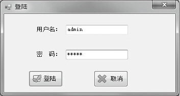
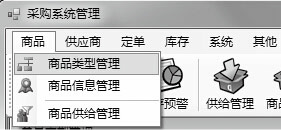
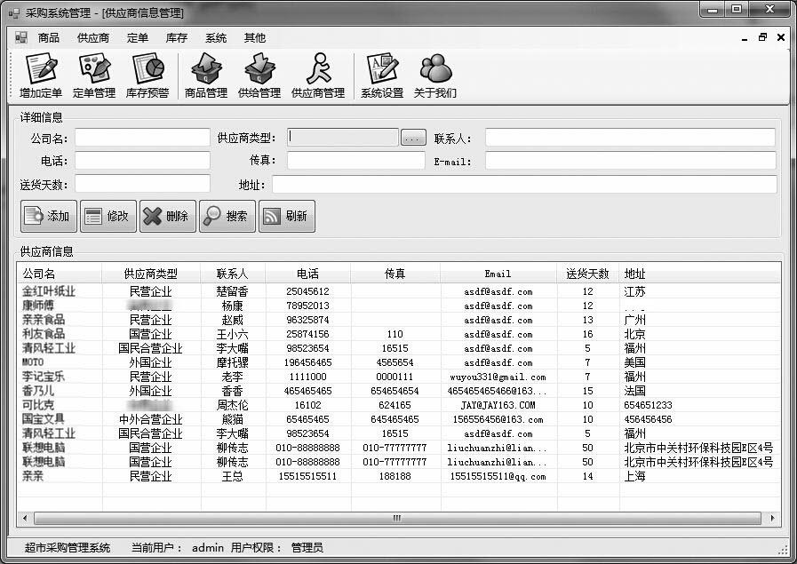
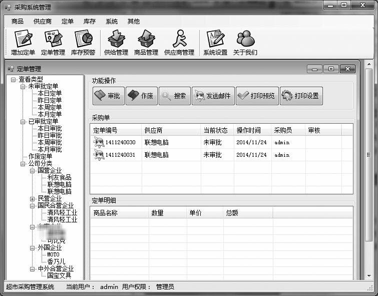
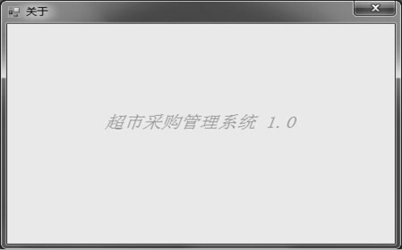

### 26.8　运行系统

**本节视频教学录像：1分钟**

运行系统，首先出现登录界面，提示输入用户名、密码。

输入正确的用户名和密码之后，进入主界面，单击相应的按钮即可实现相应的功能。主界面如下图所示。本系统主要有【商品】、【供应商】、【订单】、【库存】、【系统】和【其他】六个菜单，单击相应的菜单可以进行不同的操作。下面将对菜单进行逐一介绍。

单击菜单【商品】，会有三个子菜单，如下图所示。

单击【商品类型管理】菜单项，可以看到如下内容。例如，要添加商品“可乐”，“可乐”属于“食品区-饮料”类，选中相应的类型区域，单击“添加”，在弹出的对话框中输入商品的名字，单击“确定”按钮即可。

第二个子菜单项是【商品信息管理】，单击出现如下图所示的内容，在这个菜单里可以添加商品的日销售数量。输入商品名称、类型、日销售量，然后单击“添加”，或者选中列表中的某个商品对其日销售量进行修改，想删除的话直接删除即可。

最后一个子菜单是【商品供给管理】，打开菜单，单击相应的商品，可以看到对应商品的日销售量，以及该商品供应商的详细信息。

由于本书的篇幅有限，下面将只介绍重要功能的菜单。在【供应商】的菜单中只介绍子菜单中的【供应商信息管理】，打开菜单，界面如下图所示。在相应的空格中输入对应的信息后，单击“添加”按钮，对应的商品供货商信息就会出现在下面的列表中，或者选中列表中的某一商品对供货商的信息进行修改或删除操作。

在【订单】菜单中单击子菜单中的【订单管理】，界面如下图所示。订单分为已审、未审和作废。单击相应的选项，可以对订单进行审核以及查看已审核的订单信息，同时还可以查看每个供应商的订单信息。

在【库存】菜单中只有一个子菜单，单击打开如下图所示的界面。选中某一商品可以查看该商品的库存容量。右边的是所有商品的预警信息，商品的库存容量低于预警限度时，就会出现在预警信息的列表里面。

在【系统】菜单中主要就是设置系统的管理员，打开如下图所示的界面。在用户管理中输入用户名和密码，选择用户的权限就可以为系统添加一个新的管理员，或者在右边已有的管理员名单中选中某个进行修改或者删除。

最后的【其他】菜单包括两个子菜单，一个是【帮助】，就是打开系统的帮助文档；另一个是【其他】，是系统版本信息。打开子菜单之后如下图所示。

