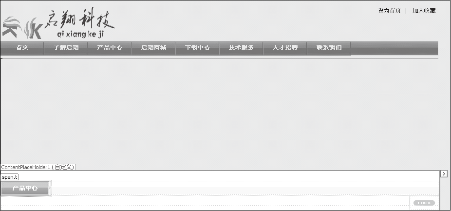
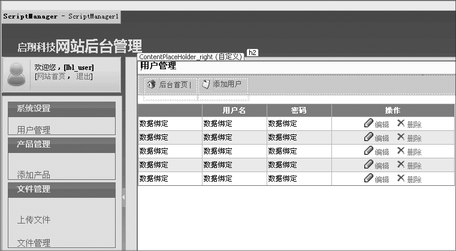
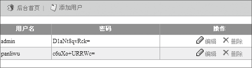
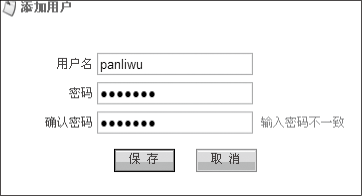

### 27.1.2　系统实现

本系统采用两层结构进行设计，Admin文件夹用来存放后台管理的操作页面，Login文件夹用来存放后台登录的页面，MasterPage文件夹用来存放系统中用到的母版页，User文件夹用来存放前台的各个页面，UserControl文件夹主要存放自定义的用户控件。

#### 1．网站首页页面设计

网站首页Index.aspx位于User文件夹中，利用母版页和网站导航控件进行首页设计，设计界面如下图所示。


运行后的首页如下图所示。


#### 2．后台登录页面设计

后台登录页面login.aspx位于login文件夹中，通过后台登录页面可以进入后台进行网站的管理。主要的考虑是密码加密功能和限制非登录用户打开非授权页面，以及登录系统后就可以在前台和后台切换。主要实现代码如下（代码27-1-1.txt）。

```c
01  //登录按钮执行的代码
02   protected void BtnLogin_Click(object sender, ImageClickEventArgs e)
03    {
04        string loginName = this.TB_UName.Text;  //获得输入的用户名
05        string pwd = Encode.EncryptDES(this.TB_UPwd.Text);  //对用户密码加密
06        Login(loginName, pwd);  //调用登录方法
07   }
08         //登录方法Login
09    private void Login(string UName, string Upwd)
10    {
11        int isUser = QueryClass.getUserByLoginName(UName);  //查看登录用户是否存在
12        if (isUser > 0)   //如果登录用户存在，执行如下代码
13        {
14            Users user = new Users(UName);   //创建Users对象
15            if (user.UPwd == pwd)     //如果登录密码和数据库中存储的密码一致，执行如下代码
16            {
17                Session["username"] = user.UserName;        //将用户名写入Session
18                //返回正确，跳转到后台主页
19                Response.redirect(“Main.aspx”);
20            }
21            else
22            {             //如果密码错误，显示提示信息返回到登录页面
23                NormalMethod.showTip("密码错误！", "Login.aspx");        //返回到登录页面
24            }
25        }
26        else
27        {                 //如果用户名错误，显示提示信息返回到登录页面
28               NormalMethod.showTip("用户名错误！", "Login.aspx");        //提示密码错误返回
29        }
30    }
```

#### 3．后台用户管理页面

后台用户管理页面MgnUsers.aspx位于Admin文件夹中，主要实现对用户的添加、编辑、删除，以及密码的解密操作，采用Ajax技术提高用户的使用体验。界面设计如下图所示。


编辑和添加用户功能的主要代码如下(代码27-1-2.txt)。

```c
01  protected void SaveButton_Click(object sender, EventArgs e)
02    {    //保存编辑和添加后的信息更改
03        string UName = this.TB_UName.Text.Trim();     //用户名
04        string UPwd = this.TB_UPwd.Text.Trim();       //密码
05        Users user = new Users();                     //创建用户对象
06        user.UName = UName;
07        user.UPwd = EncryptionDecryption.EncryptDES(UPwd);   //加密
08        if (添加用户)
09        {        //判断是否为添加操作
10            try
11            {
12                if (user.AddUser())   //调用addUser方法进行添加用户操作
13                {
14                    BindToGrid();
15                          //异步刷新
16                    ScriptManager.RegisterStartupScript(this.Page, this.GetType(), "addUser", "alert('添加用户成功！');$get('Add').style.display='none';$get('DialogMask').style.display='none';", true);
17                }
18            }
19            catch (Exception ex)
20            {
21                ScriptManager.RegisterStartupScript(this.Page, this.GetType(), "", "alert('" + ex.Message.Replace("\n", "").Replace("\r", "") + "');", true);
22            }
23        }
24        if (编辑用户)
25        {
26            try
27            {
28                if (user.EditUser())
29                {
30                    BindToGrid();
31                    ScriptManager.RegisterStartupScript(this.Page, this.GetType(), "", "alert('修改用户成功！');$get('Add').style.display='none';$get('DialogMask').style.display='none';", true);
32                }
33            }
34            catch (Exception ex)         //捕获异常
35            {
36                ScriptManager.RegisterStartupScript(this.Page, this.GetType(), "", "alert('" + ex.Message.Replace("\n", "").Replace("\r", "") + "');", true);
37            }
38        }
39    }
```

添加用户操作画面如下图所示，能通过Ajax技术检查出不一致的密码输入。限于篇幅，其他代码详见源程序。



