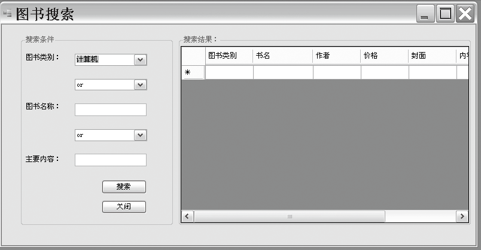

### 27.2.2　系统实现

#### 1．主界面设计——FrmMain窗体设计

系统采用MDI窗体进行主界面设计，主窗体的最上边是菜单栏，实现系统所有的功能，下面是工具栏，常用菜单的操作一般放在工具栏上，主窗体FrmMain是所有子窗体的父窗体。普通用户只能查询图书信息、借阅图书，管理员拥有窗体中的所有功能。部分代码如下。


图书查询按钮Click事件处理代码如下（代码27-2-1.txt）。

```c
01  private void tsbtnSearch_Click(object sender, EventArgs e)
02   {         //判断图书查询子窗体是否存在
03            if (this.checkchildfrm("frmSearchBook") == true)  return;
04             //创建图书查询子窗体
05            frmSearchBook book = new frmSearchBook();
06            book.MdiParent = this;        //设置为当前窗体的子窗体
07            book.Show();        //显示图书查询子窗体            
08   }
```

图书检索菜单Click事件处理代码如下（代码27-2-2.txt）。

```c
01  private void 图书检索ToolStripMenuItem_Click(object sender, EventArgs e)
02        {        //判断图书检索子窗体是否存在
03            if (this.checkchildfrm("frmSearchBook") == true)  return;
04            frmSearchBook book = new frmSearchBook();
05            book.MdiParent = this;        //设置为当前窗体的子窗体
06            book.Show();
07    }
```

图书入库菜单Click事件处理代码如下（代码27-2-3.txt）。

```c
01  private void 图书入库ToolStripMenuItem1_Click(object sender, EventArgs e)
02     {        //判断图书入库子窗体是否存在
03            if (this.checkchildfrm("frmAddBook") == true)     return;
04            frmAddBook objbook = new frmAddBook();
05            objbook.MdiParent= this;        //设置为当前窗体的子窗体
06            objbook.Show();
07     }
```

图书更新按钮Click事件处理代码如下（代码27-2-4.txt）。

```c
01        private void tsbtnAddBook_Click(object sender, EventArgs e)
02        {       //判断图书更新子窗体是否存在
03            if (this.checkchildfrm("frmUpdateBook") == true)       return;
04            frmUpdateBook objbook = new frmUpdateBook();
05            objbook.MdiParent = this;         //设置为当前窗体的子窗体
06            objbook.Show();
07   }
```

图书更新菜单Click事件处理代码如下（代码27-2-5.txt）。

```c
01  private void 图书修改ToolStripMenuItem_Click(object sender, EventArgs e)
02        {      //判断图书更新子窗体是否存在
03            if (this.checkchildfrm("frmUpdateBook") == true)       return;            
04            frmUpdateBook objbook = new frmUpdateBook();
05            objbook.MdiParent= this;         //设置为当前窗体的子窗体
06            objbook.Show();
07  }
```

图书借阅按钮事件处理代码如下（代码27-2-6.txt）。

```c
01  private void tsbtnIssue_Click(object sender, EventArgs e)
02    {          //判断图书借阅子窗体是否存在
03            if (this.checkchildfrm("frmIssueBook") == true)
04                return;
05            frmIssueBook issuebook = new frmIssueBook();
06            issuebook.MdiParent= this;        //设置为当前窗体的子窗体
07            issuebook.Show();
08   }
```

#### 2．图书查询frmSearchBook窗体界面和实现代码


单击搜索按钮执行的代码如下（代码27-2-7.txt），其他代码见源程序。

```c
01  private void btnSerch_Click(object sender, EventArgs e)
02  {        //单击搜索按钮进行图书查询操作
03  string cbo1 = this.cboOR.Text;                //获取条件组合是or还是and
04  string cbo2 = this.cboAnd.Text;
05  string booktype = cboType.Text;               //获取图书类别
06  string bookname = this.txtName.Text;          //获取图书名称
07  string bookcontent = this.txtContent.Text;    //获取图书内容简介
08               //定义Sql语句，实现在数据库中查询
09  string sql = "select * from bookInfo where BookType='" + booktype + "' " + cbo1 + " BookName like '%" + bookname + "%' " + cbo2 + " BookContent like '%" + bookcontent + "%'";
10           //调用DataAccess.GetDataSetBySql方法
11            DataSet Myds = DataAccess.GetDataSetBySql(sql);
12            DataTable table = Myds.Tables[0];
13           //指定数据源
14            this.dgvSearchBook.DataSource = table;
15   }
```

#### 3．数据库通用类设计

本系统的主要操作都需要和数据库发生交互，操作数据库是必不可少的。为了减少重复代码，提高代码的重用性和规范性，设计一个数据通用类把与数据库交互的功能单独地放在一块，在该类中实现数据库的增、删、改、查等通用功能（代码27-2-8.txt）。

```c
01  class DataAccess
02    {        //定义数据库连接字符串
03        private static string ConnectString = "server=.;database=Book;Integrated Security=true";
04        public static DataTable GetDataSetByTableName(string table)
05        {   // 根据表名获取数据集的表
06        using (SqlConnection con = new SqlConnection(ConnectString))        //创建连接对象
07            {
08                string sql = "select * from " + table + "";    //查询sql语句
09                try
10                {        //创建适配器对象
11                  SqlDataAdapter adapter = new SqlDataAdapter(sql, con);
12                  DataSet ds = new DataSet();      //创建数据集对象
13                  adapter.Fill(ds, "table");       //填充数据集
14                  return ds.Tables[0];             //返回数据表
15                }
16                catch (SqlException ex)
17                {         //异常处理
18                    throw new Exception(ex.Message); ;
19                }
20            }
21        }
……
22           SqlDataAdapter adapter = new SqlDataAdapter(sql, con); 
23           //根据适配器自动生成表单
24           SqlCommandBuilder builder = new SqlCommandBuilder(adapter);adapter.Update(ds, "table");     //更新数据库
25                }
26                catch (SqlException ex)
27                {
28                    throw new Exception(ex.Message);
29                }
30            }        
31        }
32    }
```

在通用类中我们已经实现了和数据库的交互，对界面中功能的实现不需要直接访问数据库，只需要调用通用类中的相关方法即可。限于篇幅，其他代码见源程序。

