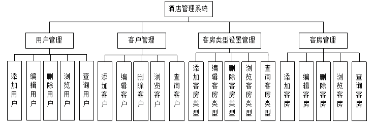

### 27.3.1　需求分析

“酒店管理系统”用于管理和维护酒店的基本信息，酒店工作人员登录系统后可以拥有该系统的所有功能，便于进行酒店内部管理。根据分析，可将系统功能分为基础设置、业务管理和用户管理3个模块。系统的功能设计如下图所示。

具体功能如下。

+ 用户管理：用户信息浏览，增加、修改和删除用户信息。只有数据库中记录的人员才能登录系统。
+ 客户管理：对客户信息进行查找，对客户住宿情况进行管理。
+ 客房管理：实现客房使用情况管理。
+ 客房类型设置管理：实现对客房类型的管理。
+ 数据库包括客户信息表（Guest）、客房信息表(Room)、客房类型表、用户表、客户类型表5张表。表的名称和结构分别说明如下。
+ 客户信息表（Guest）用于存放入住酒店的客户信息。通过这个表可以记录入住酒店客户的详细信息，以及客户到达和离开酒店的时间。

| 字段名称 | 数据类型 | 字段描述 |
| :-----  | :-----  | :-----  | :-----  | :-----  |
| GuestID | int | 客户ID，主键，自动增长 |
| Name | nvarchar(50) | 客户名称，不能为空 |
| CategoryID | int | 客户类型ID，不能为空 |
| Sex | nvarchar(10) | 客户性别，不能为空 |
| Mobile | nvarchar(50) | 客户电话，不能为空 |
| RoomID | int | 房间编号，不能为空 |
| ArriveTime | datetime | 客户入住时间，不能为空 |
| LeaveTime | datetime | 客户离开时间，不能为空 |

客户类型表（GuestCategory）用于存放客户类型信息，能针对不同的客户提供不同的服务。

| 字段名称 | 数据类型 | 字段描述 |
| :-----  | :-----  | :-----  | :-----  | :-----  |
| CategoryID | int | 客户类型ID，主键，自动增长 |
| CategoryName | nvarchar(50) | 客户类型名，不能为空 |

用户表（HotelUser）用于存放系统使用人员的用户名和密码。

| 字段名称 | 数据类型 | 字段描述 |
| :-----  | :-----  | :-----  | :-----  | :-----  |
| UserID | int | 用户ID，主键，自动增长 |
| UserName | nvarchar(50) | 用户名，不能为空 |
| Password | nvarchar(50) | 用户密码，不能为空 |

客房信息表（Room）用于记录客房的详细信息。

| 字段名称 | 数据类型 | 字段描述 |
| :-----  | :-----  | :-----  | :-----  | :-----  |
| RoomID | int | 客房ID，主键，自动增长 |
| Number | nvarchar(50) | 房间号，不能为空 |
| TypeID | int | 客房类型，不能为空 |
| BedNumber | int | 床位数，不能为空 |
| Description | nvarchar(255) | 客房介绍，不能为空 |
| State | int | 客房状态，不能为空 |
| GuestNumber | int | 入住人数，不能为空 |

客房类型表（RoomType）用于存放客房的类型信息。

| 字段名称 | 数据类型 | 字段描述 |
| :-----  | :-----  | :-----  | :-----  | :-----  |
| TypeID | int | 客房类型ID，主键，自动增长 |
| TypeName | nvarchar(50) | 客房类型名，不能为空 |
| TypePrice | money | 客房类型价格，不能为空 |
| AddBedPrice | money | 加床价格，不能为空 |
| IsAddBed | Nchar(10) | 能否加床，不能为空 |

