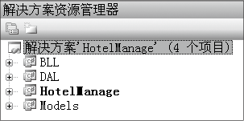
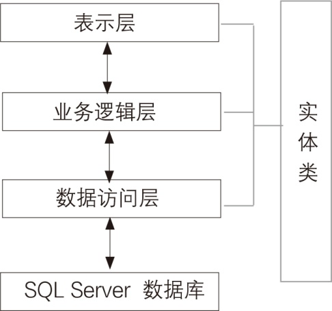
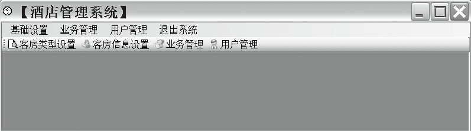

### 27.3.2　系统实现

本系统的总体架构采用三层架构模型，分为表示层、业务逻辑层和数据访问层，其中表示层负责界面的显示，用于显示数据和接收用户输入的数据，为用户提供交互式操作界面；业务逻辑层是表示层和数据访问层之间通信的桥梁，主要负责数据的传递和处理；数据访问层主要实现对数据的保存和读取操作。该系统比较简单，3层之间使用对象进行通信。在系统中，表示层、业务逻辑层、数据访问层分别用HotelManage、BLL、DAL 3个项目实现，Models项目用来组织系统中的实体类。本系统三层架构如下图所示。



#### 1．实体类设计

实体类具有面向对象的基本特征，是业务对象的基础。在3层之间通过实体类传递数据具有很大的灵活性，有助于项目的维护、扩展，更能体现三层架构的优势。本系统中，新建类库项目Models，创建数据库Hotel的5张表对应的5个实体类。下面以Guest实体类为例进行介绍（代码27-3-1.txt），其他实体类见源代码。

```c
01  using System;
02  using System.Collections.Generic;
03  using System.Linq;
04  using System.Text;
05 
06  namespace HotelManager.Models
07  {
08    [Serializable]                  //序列化 
09    public class Guest              //实体类名称Guest
10    {
11        private int guestId;        //客户ID
12        public int GuestId
13        {
14            get { return guestId; }
15            set { guestId = value; }
16        }
17        private string name;       //客户名称
18        public string Name
19        {
20            get { return name; }
21            set { name = value; }
22        }
23        private int categoryId;    //客户类型
24        public int CategoryId
25        {
26            get { return categoryId; }
27            set { categoryId = value; }
28        }
29        private string sex;       //客户性别
30        public string Sex
31        {
32            get { return sex; }
33            set { sex = value; }
34        }
35        private string mobile;    //客户电话
36        public string Mobile
37        {
38            get { return mobile; }
39            set { mobile = value; }
40        }
41        private int roomId;       //客户入住房间号
42        public int RoomId
43        {
44            get { return roomId; }
45            set { roomId = value; }
46        }
47          private DateTime arriveTime;     //客户入住时间
48        public DateTime ArriveTime
49        {
50            get { return arriveTime; }
51            set { arriveTime = value; }
52        }
53        private DateTime leaveTime;        //客户离开时间
54        public DateTime LeaveTime
55        {
56            get { return leaveTime; }
57            set { leaveTime = value; }
58        }
59    }
60  }
```

#### 2．数据访问层

由于数据库的访问包含增、删、改、查等多种操作，所以新建类库项目DAL实现数据访问层对数据库的操作。为了使调用方法简单化，在数据访问层中所有的类和方法均为静态类和静态方法。

由于在系统中对数据库都需要进行处理连接字符串、创建连接、执行查询和更新等通用操作，为了提高代码的复用性，需要创建DBHelper.cs类完成数据库的通用操作。

下面以客房信息数据访问的数据访问层为例进行介绍（代码27-3-2.txt）。

```c
01  namespace HotelManager.DAL
02  {        // 功能描述：提供客房信息数据访问
03    public static class RoomService
04    { 
05        static string sql = string.Empty;       //定义静态变量sql用来存放SQL语句字符串
06        public static IList<Room> GetAllRooms()
07        {        // 得到客房信息集合方法
08       IList<Room> rooms = new List<Room>();    //定义泛型接口变量room，存放查询的客房信息
09         sql = "select * from Room";
10         using (SqlDataReader dataReader = DBHelper.GetReader(sql))
11            {        //利用SqlDataReade进行读取数据库操作
12                while (dataReader.Read())
13                {        //循环读取查询的所有客房信息到room中
14                    Room room = new Room();        //将查询的信息赋给room对象
15                    room.RoomId = Convert.ToInt32(dataReader["RoomId"]);
16                    room.TypeID = Convert.ToInt32(dataReader["TypeID"]);
17                    room.Number = Convert.ToString(dataReader["Number"]);
18                    room.State = Convert.ToString(dataReader["State"]);
19                    room.Description = Convert.ToString(dataReader["Description"]);
20                    room.BedNumber = Convert.ToInt32(dataReader["BedNumber"]);
21                    room.GuestNumber = Convert.ToInt32(dataReader["GuestNumber"]);
22                    rooms.Add(room);
23                }
24            }
25            return rooms;
26        }
27         
28    public static Room GetRoomByRoomId(int roomId)
29        {         //根据客房ID得到客房信息实体对象
30            Room room = new Room();
31            sql = "select * from Room where RoomId ="+ roomId.ToString();
32            using (SqlDataReader dataReader = DBHelper.GetReader(sql))
33            {
34                if (dataReader.Read())
35                {
36                    room.Number = Convert.ToString(dataReader["Number"]);
37                    room.TypeID = Convert.ToInt32(dataReader["TypeID"]);
38                    room.State = Convert.ToString(dataReader["State"]);
39                    room.Description = Convert.ToString(dataReader["Description"]);
40                    room.BedNumber = Convert.ToInt32(dataReader["BedNumber"]);
41                    room.GuestNumber = Convert.ToInt32(dataReader["GuestNumber"]);
42                }
43            }
44            return room;
45        }                       
46        public static void DeleteRoomByRoomId(int roomId)
47        {        //根据客房ID删除客房信息
48            sql = "delete from Room where RoomID=" + Convert.ToString(roomId);
49            DBHelper.ExecuteCommand(sql);
50        }             
51        public static void ModifyRoom(Room room)
52        {         //修改客房信息
53            StringBuilder updateString = new StringBuilder();
54            updateString.Append("update Room set ");        //构造更新客房信息的SQL语句
55            updateString.Append("Number="+"'"+room.Number+"'");
56            updateString.Append(",TypeID=" + room.TypeID);
57            updateString.Append(",BedNumber=" + room.BedNumber);
58            updateString.Append(",GuestNumber=" + room.GuestNumber);
59            updateString.Append(",State=" + "'" + room.State + "'");
60            updateString.Append(",Description=" + "'" + room.Description + "'");
61            updateString.Append(" where RoomId=" + room.RoomId );
62            sql = updateString.ToString();
63            DBHelper.ExecuteCommand(sql);        //执行更新
64        }
65         public static IList<Room> GetRoomListByRoomNumber(string roomNumber)
66        {        //根据客房类型名称得到客房类型列表
67            IList<Room> room = new List<Room>();
68            sql = "select * from Room where Number='" + roomNumber + "'";
69            using (SqlDataReader dataReader = DBHelper.GetReader(sql))
70            {
71                while (dataReader.Read())
72                {
73                    Room objroom = new Room();
74                    objroom.RoomId = Convert.ToInt32(dataReader["RoomId"]);
75                    objroom.TypeID = Convert.ToInt32(dataReader["TypeID"]);
76                    objroom.Number = Convert.ToString(dataReader["Number"]);
77                    objroom.State = Convert.ToString(dataReader["State"]);
78                  objroom.Description = Convert.ToString(dataReader["Description"]);
79                   objroom.BedNumber = Convert.ToInt32(dataReader["BedNumber"]);
80                   objroom.GuestNumber = Convert.ToInt32(dataReader["GuestNumber"]);
81                    room.Add(objroom);
82                }
83            }
84            return room;
85        }        
86        public static int GetRoomIdByRoomNo(string roomNo)
87        {        //根据房间号得到客房ID
88            int roomId=0;
89            sql = "select RoomID from Room where Number=" + "'" + roomNo + "'";
90            using (SqlDataReader dataReader = DBHelper.GetReader(sql))
91            {
92                if (dataReader.Read())
93                {
94                    roomId = Convert.ToInt32(dataReader["RoomID"]);
95                }
96            }
97            return roomId;
98        }        
99        public static int AddRoom(Room room)
100         {        //新增客房信息
101            int roomId = 0;
102             StringBuilder addString = new StringBuilder();
103             addString.Append("insert into Room ( Number,TypeID,BedNumber,GuestNumber,State,Description) values(");
104             addString.Append(" '" + room.Number + "'");
105             addString.Append("," + room.TypeID);
106             addString.Append("," + room.BedNumber);
107             addString.Append("," + room.GuestNumber);
108             addString.Append(",'" + room.State + "'");
109             addString.Append(",'" + room.Description + "') select @@IDENTITY");
110             sql = addString.ToString();
111             roomId =DBHelper.GetScalar(sql);
112             return roomId;
113         }        
114     }
115   }
```

#### 3．业务逻辑层

业务逻辑层负责数据的传递。在实现业务逻辑层之前先概括一下实现的步骤：首先在业务逻辑处理类中引用数据访问层、实体层的命名空间，然后实例化实体对象，再调用数据访问功能，最后实现业务逻辑。

下面以客房信息管理业务逻辑（RoomManager.cs）为例进行介绍。客房信息管理业务逻辑负责在客房信息管理数据访问和客房信息界面之间进行数据传递，通过调用Dal层的RoomService.cs中的方法实现。代码如下（代码27-3-3.txt）。

```c
01  namespace HotelManager.BLL
02  {        //提供客房信息业务逻辑
03    public static class RoomManager
04    { 
05        public static IList<Room> GetAllRooms()
06        {        // 调用数据访问层方法，得到客房信息集合
07            return RoomService.GetAllRooms();
08        }        
09        public static Room GetRoomByRoomId(int roomId)
10        {        // 根据客房ID得到客房实体对象
11         return RoomService.GetRoomByRoomId(roomId); 
12        }
13        public static bool DeleteRoomByRoomId(int roomId)
14        {        //根据客房ID删除客房信息
15            IList<Guest> list = GuestService.GetAllGuests();
16                    //linq查询
17            var objroom = from p in list where p.RoomId == roomId select p;
18            if (objroom!=null)
19            {
20                return false;
21            }
22            else
23            {
24                RoomService.DeleteRoomByRoomId(roomId);
25                return true;
26            }
27          
28        }        
29        public static void ModifyRoom(Room room)
30        {        //修改客房信息 
31           RoomService.ModifyRoom(room);
32        }        
33        public static int GetRoomIdByRoomNo(string roomNo)
34        {        //根据房间号得到客房ID
35            int roomId;
36            roomId = RoomService.GetRoomIdByRoomNo(roomNo);
37            return roomId;
38        }        
39        public static int AddRoom(Room room)
40        {        //新增客房信息
41            try
42            {
43                return RoomService.AddRoom(room);
44            }
45            catch (Exception ex)
46            {
47                throw new Exception(ex.ToString());
48            }
49        }
50        public static IList<Room> GetRoomListByRoomNumber(string roomNumber)
51        {        //根据客房号获取客房列表 
52          return RoomService.GetRoomListByRoomNumber(roomNumber); 
53        }
54    }
55  }
```

#### 4．表示层设计

主界面是子界面的容器，通过单击主界面上的菜单或按钮，打开相应的子窗体，实现程序退出功能。主界面中的各个功能都是通过给事件编写代码实现的。主界面采用MDI窗体，设计界面如下图所示。其他界面详见源代码。


