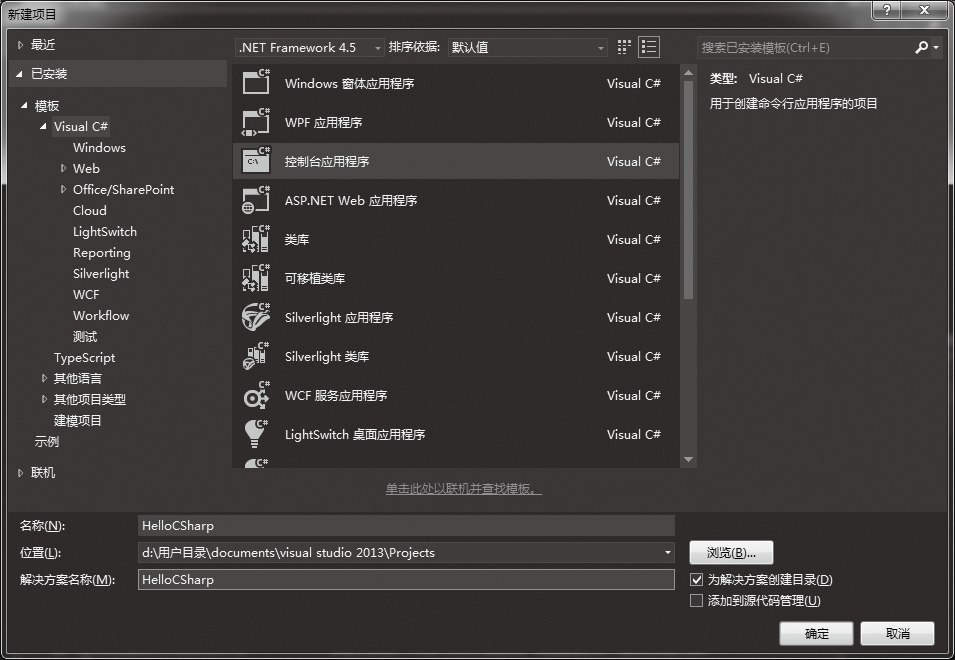
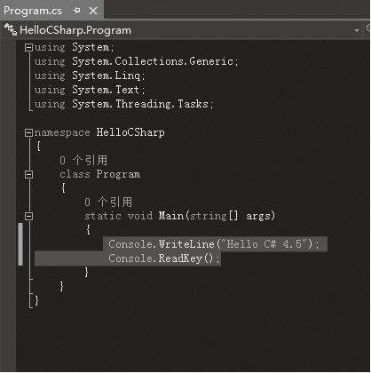
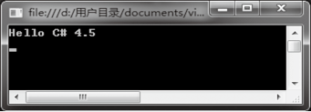
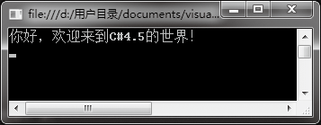

### 2.1.1　创建第1个控制台应用程序

**【范例2-1】 使用Visual Studio 2013创建第1个控制台应用程序。**

（1）单击【开始】
【程序】
【Microsoft Visual Studio 2013】
【Microsoft Visual Studio 2013】命令，启动Visual Studio 2013。如果是第1次使用Visual Studio 2013，会提示用什么语言编写程序，选择C#即可。在Visual Studio 2013窗口中选择【新建】
【项目】，在弹出的【新建项目】窗口中的【模板】中选择【Visual C#】，然后选择【控制台应用程序】，在【名称】文本框中输入项目名称“HelloCSharp”，并选择项目保存的【位置】（如D:\用户目录\documents\visual studio 2013\Projects）。


（2）单击【确定】按钮，直接打开“Program.cs”的代码窗口，并且会自动产生如下的代码。

```c
01  using System;
02  using System.Collections.Generic;
03  using System.Linq;
04  using System.Text;
05  using System.Threading.Tasks；
06  namespace HelloCSharp
07  {
08         class Program
09         {
10                  static void Main(string[] args)
11                  {
12                  }
13         }
14  }
```

（3）在Program.cs 中的Main方法中输入以下代码（代码1-1.txt），如下图所示。

```c
01  Console.WriteLine("Hello C# 4.5");
02  Console.ReadKey();
```


> 
> **技巧**
> C#是一种对大小写特别敏感的编程语言，在拼写Main时，首字母必须大写。另外，程序中的Main函数必须为static类型。

（4）选择【生成】
【生成解决方案】菜单命令，开始编译，如没有编译错误，输出窗口将显示生成成功的字样；如有错误，错误将在错误窗口中列出。

**【代码详解】**

Program.cs中的第1~5行代码是导入的命名空间，这是创建控制台应用程序时自动生成的，不用管它，最好不要动。第6行中namespace的后面是本项目命名空间，默认和项目名称一样。系统自动生成一个包含Main方法的Program类，自己想运行的代码一般都写在Main方法中。第12行代码是用户自己输入的，能在控制台输出“Hello C# 4.5”。第13行代码表示等待用户输入任意键。

**【运行结果】**

选择【调试】
【启动调试】菜单命令或单击按钮，即可在控制台中输出结果，如下图所示。


> 
> **提示**
> 运行此程序时，这个控制台窗口会一闪而过。如果按【Ctrl+F5】组合键不调试直接运行，窗口就会停住。添加Console.ReadKey()或Console.Read()语句可以使运行暂停，按任意键继续，这样就能看清楚运行结果了。

**【范例分析】**

在这个程序中为什么会输出“Hello C# 4.5”呢？全靠步骤（3）中的Console.WriteLine方法。该方法是CLR库中“Console”类的输出方法之一，这个类就包含在命名空间System中，所以说系统自动生成的代码也是不可或缺的，如果去掉了“using System;”这行代码，就会提示当前上下文中不存在名称“Console”。另一方面，自动生成可以省去很多操作。

从这个程序中可以看出C#程序的以下几个典型特点。

（1）可以使用系统内的命名空间，如“using System;”，也可以自定义命名空间，如“namespace HelloWorld”。

（2）方法的定义，如第10行代码定义的是Main方法，程序是从这里开始执行的。

（3）类的声明，如“class Program”，声明以后就可以直接调用了。

在解决方案资源管理器中可以看到控制台应用程序的组成如下。

.AssemblyInfo.cs文件：存放程序集信息的文件。

.Program.cs文件：提供控制台应用程序运行入口的类文件，可以编写程序要执行的代码。

.引用：表示项目中用到的命名空间或组件，该项目中引用的都是系统自动提供的，也可以手动添加引用。

**【拓展训练】**

在控制台输出中文信息“你好，欢迎来到C# 4.5的世界！”。

既然能输出“Hello C# 4.5”，那么想输出“你好，欢迎来到C# 4.5的世界！”怎么办呢？只需要将步骤（3）的关键语句中的引号里面的内容改为你想要输出的内容即可（拓展代码1-1.txt）。

```c
System.Console.WriteLine("你好，欢迎来到C#4.5的世界!");
```

> 
> **提示**
> 引号和括号需要使用英文形式的，Console前面的System.可以省略，因为使用了using System，否则不能省略。

运行后的输出如下图所示。


