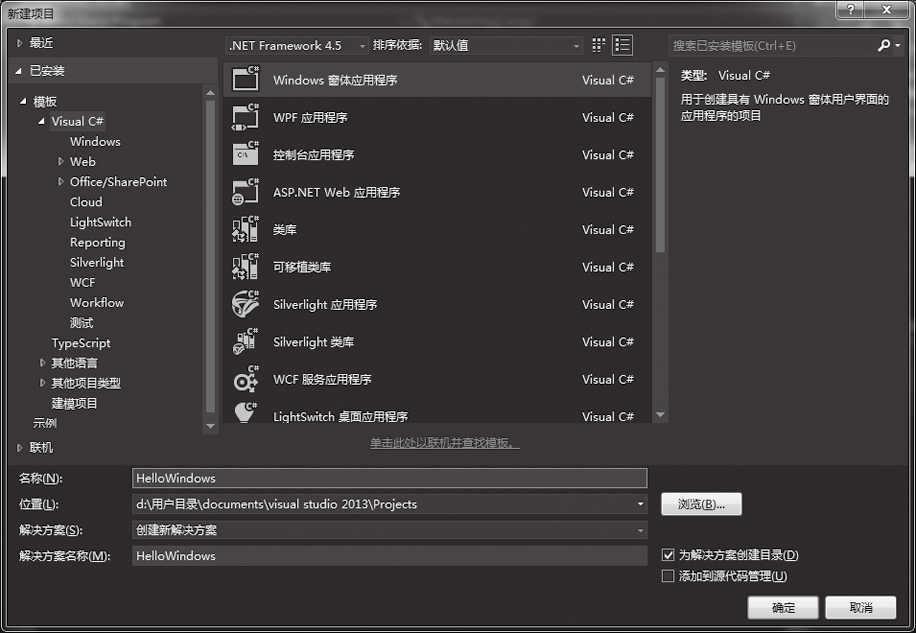
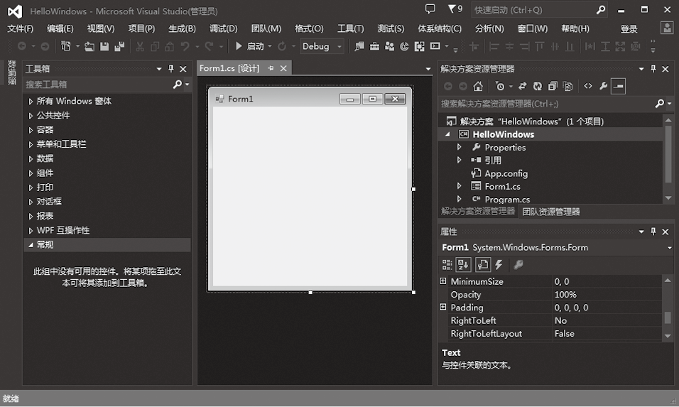
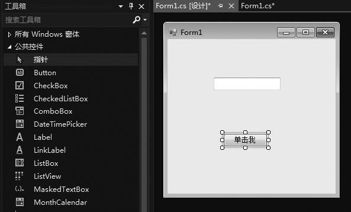
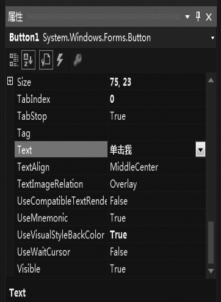
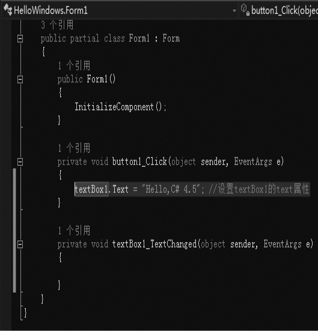
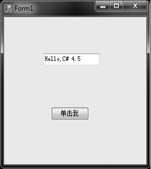
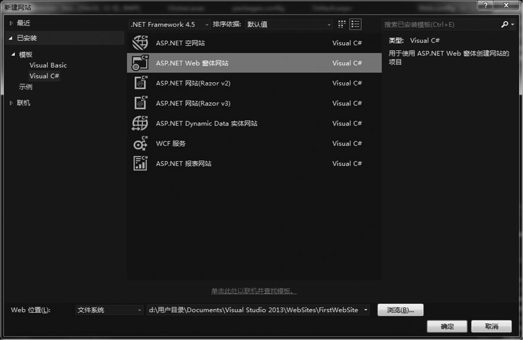
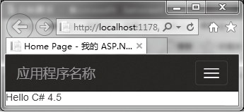

### 2.1.2　创建第1个Windows窗体应用程序

**【范例2-2】 使用Visual Studio 2013创建第1个Windows应用程序。**

（1）启动Visual Studio 2013，在Visual Studio 2013窗口中选择【新建】
【项目】，弹出【新建项目】窗口，在【模板】中选择【Visual C#】，然后选择【Windows窗体应用程序】，在【名称】文本框中输入项目名称“HelloWindows”，然后单击【确定】按钮，打开一个带窗体的Windows应用程序。



（2）在【工具箱】窗口中可以把所需的控件添加到窗体上来进行界面设计（双击工具箱中的控件或直接把控件从工具箱拖放到窗体上），如分别添加一个文本框Textbox控件和一个按钮Button控件，如下图所示。


（3）在右下部分属性设置里面，设置按钮Button1的Text属性为“单击我”。


（4）双击窗体上的Button1按钮，自动打开代码视图窗口并生成button1_Click方法，然后添加代码如下（代码1-2.txt）。

```c
textBox1.Text = ＂Hello,C# 4.5＂; //设置textBox1的text属性
```

完整的代码如下。

```c
01  using System;
02  using System.Collections.Generic;
03  using System.ComponentModel;
04  using System.Data;
05  using System.Drawing;
06  using System.Linq;
07  using System.Text;
08  using System.Windows.Forms;
09    
10  namespace HelloWindows
11  {
12     public partial class Form1 : Form
13     {
14           public Form1()
15        {
16                InitializeComponent();
17        }
18
19        private void button1_Click(object sender, EventArgs e)
20        {
21            textBox1.Text = "Hello,C# 4.5 "; //设置textBox1的text属性
22        }
23    }
24  }
```


**【代码详解】**

Windows窗体应用程序生成的窗体名默认为Form1.cs，Form1.cs中的1～8行是导入的命名空间，这是创建Windows窗体应用程序自动生成的。第10行中namespace的后面是本项目命名空间，默认和项目名称一样。第12行是Form1类的定义，第14～17行是自动生成的构造函数。第19～22行是单击按钮Button1时要执行的代码。第21行是自己输入的，用来在文本框中显示“Hello C# 4.5”信息。

**【运行结果】**

单击工具栏中的【启动调试】按钮
，在出现的窗体中单击按钮，运行结果如下图所示。


**【范例分析】**

在这个Windows窗体应用程序中，代码比较简单。我们在窗体上添加TextBox和Button控件并设置其相应属性，编写按钮的单击事件处理程序方法代码“textBox1.Text = "Hello,C# 4.5";”；实现在文本框中输出信息。Windows窗体应用程序结构和控制台应用程序类似，除了有一个Form1.cs窗体文件外，也有一个Program.cs文件作为应用程序运行的主入口点。自动生成的代码如下。

```c
01  using System;
02  using System.Collections.Generic;
03  using System.Linq;
04  using System.Windows.Forms;
05 
06  namespace HelloWindows
07  {
08    static class Program
09    {
10      /// <summary>
11      /// 应用程序的主入口点
12      /// </summary>
13      [STAThread]
14      static void Main()
15      {
16        Application.EnableVisualStyles();
17        Application.SetCompatibleTextRenderingDefault(false);
18        Application.Run(new Form1());
19      }
20    }
21  }
```

**【拓展训练】 使用Visual Studio 2013创建第1个网站。**

（1）启动Visual Studio 2013，选择【新建】
【网站】，在弹出窗口中的【项目类型】中选择【Visual C#】，在【模板】中选择【ASP.NET Web窗体网站】，在【Web位置】后面输入网站名称“FirstWebSite”，【语言】选择“C#”，然后单击【确定】按钮，打开一个带Web窗体的网站项目。


（2）切换到自动生成的Default.aspx页面的设计视图，在Default.aspx页面上双击自动出现代码视图窗体，并生成Page_Load方法框架。在Page_Load方法中输入以下代码。

```c
Response.Write("Hello C# 4.5"); //
```

完整代码如下。

```c
01  using System;
02  using System.Configuration;
03  using System.Data;
04  using System.Linq;
05  using System.Web;
06  using System.Web.Security;
07  using System.Web.UI;
08  using System.Web.UI.HtmlControls;
09  using System.Web.UI.WebControls;
10  using System.Web.UI.WebControls.WebParts;
11  using System.Xml.Linq;
12 
13  public partial class _Default : System.Web.UI.Page
14  {
15    protected void Page_Load(object sender, EventArgs e)
16      {
17           Response.Write("Hello C# 4.5");//在页面上显示"Hello C#4.5"
18      }
19  }
```

Response.Write将信息输出到Web页面中，运行后的输出如下图所示。


