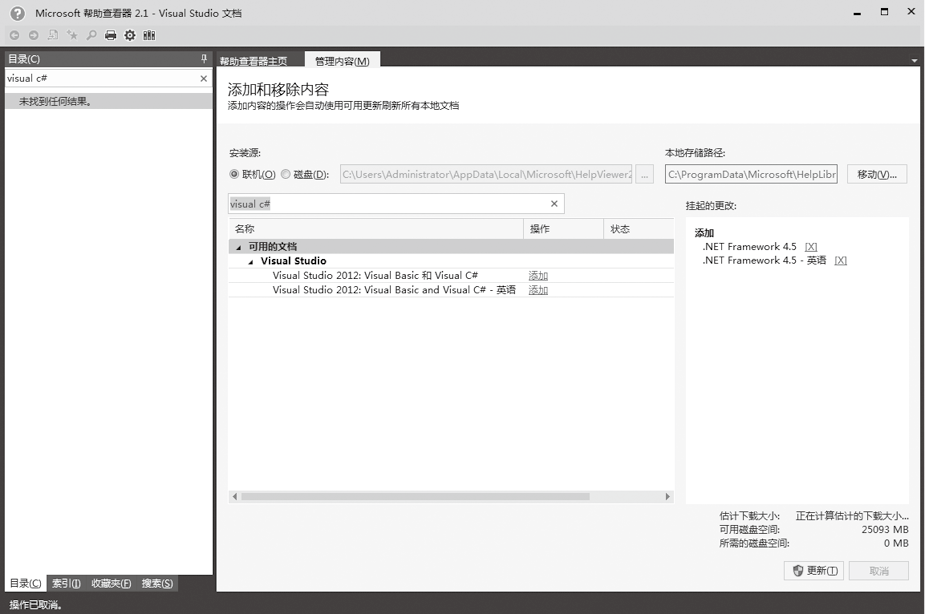
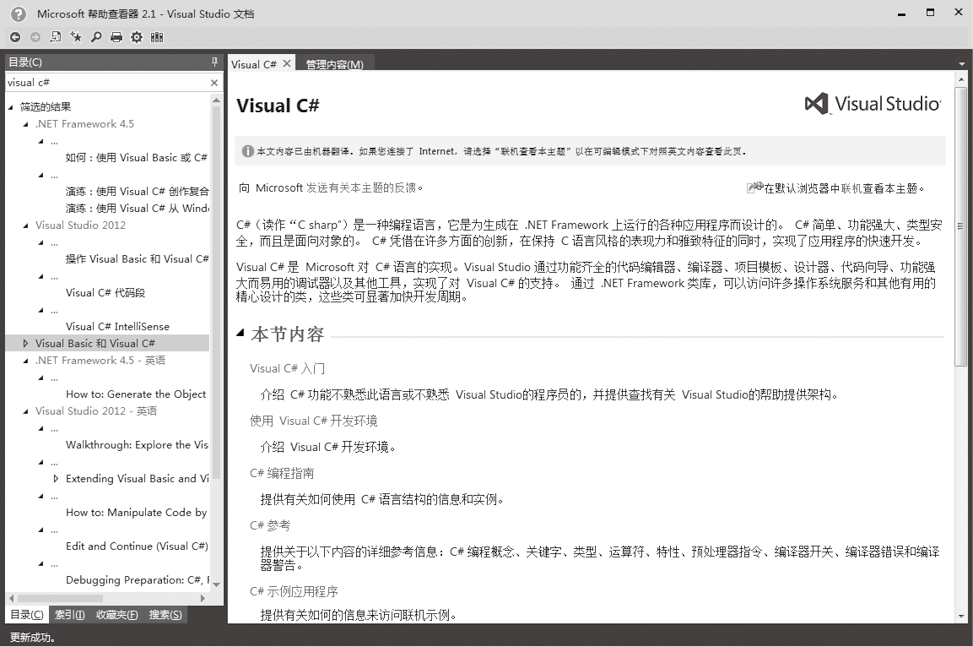
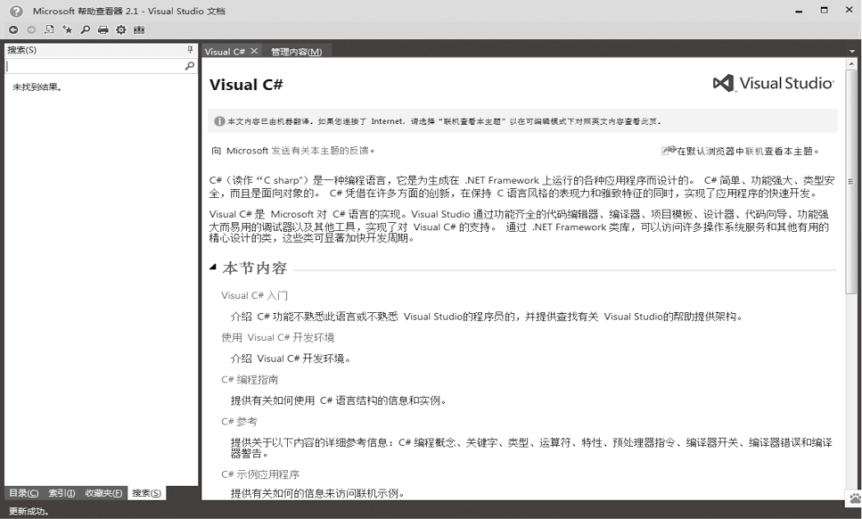

### 2.2.1　使用MSDN

MSDN是开发人员必备的开发文档，安装Visual Studio 2013之后单击菜单栏中的【帮助】
【添加和移除帮助内容】。在【添加和移除内容】中的搜索栏中输入Visual C#，搜索和Visual相关的帮助文档，然后在所搜索到的可用文档中单击【添加】，最后单击右下角的【更新】，等更新完成，相关内容就添加到了我们本地的电脑中。

MSDN的使用很简单，常用的使用方式有以下4种。

目录：以大纲的方式显示帮助信息，比如可以按照“Visual C#入门”主题学习C#。

索引：以关键字的方式显示帮助信息。

收藏夹：可以收藏某个主题的帮助文档。

除此之外，使用MSDN的搜索功能，可以按照关键字搜索帮助文档。假如用目录和索引方式没有找到需要的知识，还可以利用搜索功能来查找。可以同时搜索本地MSDN和网上社区，从而找到更多关于搜索关键字的文章。为了使搜索更准确，在搜索界面还可以设置需要搜索的编程语言和技术主题，从而缩小搜索的范围，以使搜索更精确。

