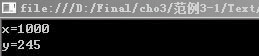
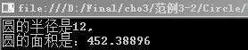
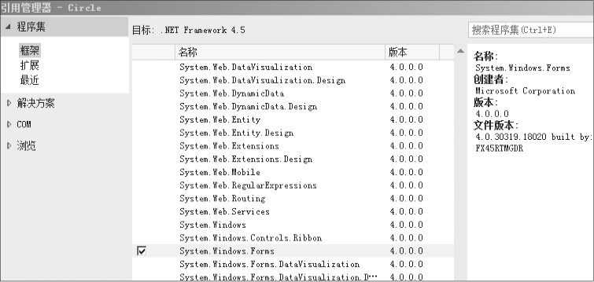
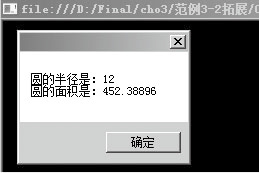

### 3.2　值类型


**本节视频教学录像：23分钟**

C#语言的值类型包括整数类型、浮点数类型、布尔类型、字符类型等简单类型及枚举类型和结构类型。本小节介绍简单类型，枚举类型和结构类型将在后面章节中介绍。

#### 1．整数类型

整数类型的变量值为整数。计算机语言提供的整数类型的值总是在一定的范围之内。根据数据在计算机内存中所占的位数来划分，C#有8种整数类型的数据，这些数据及其在计算机中表示的整数的范围如下表所示。

| 数据类型 | 含义 | 取值范围 |
| :-----  | :-----  | :-----  | :-----  | :-----  |
| sbyte | 有符号8位整数 | -128～127（-2<sup class="my_markdown">7</sup>～2<sup class="my_markdown">7</sup>-1） |
| byte | 无符号8位整数 | 0～255（0～2<sup class="my_markdown">8</sup>-1） |
| short | 有符号16位整数 | -32768～32767（-2<sup class="my_markdown">15</sup>～2<sup class="my_markdown">15</sup>-1） |
| ushort | 无符号16位整数 | 0～65535（0～2<sup class="my_markdown">16</sup>-1） |
| int | 有符号32位整数 | -2147483648～2147483647（-2<sup class="my_markdown">31</sup>～2<sup class="my_markdown">31</sup>-1） |
| uint | 无符号32位整数 | 0～4294967295（0～2<sup class="my_markdown">32</sup>-1） |
| long | 有符号64位整数 | -9223372036854775808～9223372036854775807 （-2<sup class="my_markdown">63</sup>～2<sup class="my_markdown">63</sup>-1） |
| ulong | 无符号64位整数 | 0～18446744073709551615（0～2<sup class="my_markdown">64</sup>-1） |

例如，定义整型变量如下。

```c
01  int s;   //定义int类型的变量s
02  s=50;    //将50的值赋给s
```

上述两行代码也可合并为：

```c
int s=50；   //定义int类型的变量s，将50的值赋给s
```

如果是同类型的多个变量，也可将其声明语句简写入同一行代码中，例如，

```c
int a = 10, b = 20，c；    //c还未被赋值
```

对于一个整数没有进行任何明确的声明，则该变量默认为int类型，一般情况下，应根据程序的需要选择合适的数据类型。为了把键入的值指定为其他的数据类型，可以在数字后面加上如下字符。

```c
01  uint ui = 20  U;      //uint类型可以在数字后加上字符U
02  long l = 20  L ;      //long类型可以在数字后加上字符L
03  ulong ul = 20  UL；   //ulong类型可以在数字后加上字符UL
```

> 
> **提示**
> 这些大写字符也可以用相应的小写字符代替，但字符“l”易与整数“1”混淆，所以推荐使用大写字符。

**【范例3-1】 创建一个控制台程序，声明一个int类型的变量x并初始化为1000，一个byte类型的变量y并初始化为245，最后输出。**

（1）在Visual Studio 2013中新建C#控制台程序，项目名为“Text”。

（2）在Program.cs的Main 方法中输入以下代码（代码3-1.txt）。

```c
01  int x = 1000;                            //声明一个int类型的变量x并初始化值        
02  byte y = 245;                            //声明一个int类型的变量y并初始化值
03  Console.WriteLine("x={0}", x);           //在控制台输出x结果
04  Console.WriteLine("y={0}", y);           //在控制台输出y结果
05  Console.ReadLine();
```

**【运行结果】**

单击工具栏中的
按钮，即可在控制台中输出如下图所示的结果。


此时,如果将byte类型的变量y赋值为260,重新编译程序,则会出现错误。主要原因是byte类型的变量是8位无符号整数,它的范围是0~255，260超过了byte类型的范围,因此编译程序时会出现错误。

#### 2．浮点数类型

浮点数类型又称为实数类型，是指带有小数部分的数值。C#支持两种浮点数类型：单精度（float）和双精度（double）。它们的差别在于取值范围和精度不同。浮点数类型数据的特征如下表所示。

| 数据类型 | 含义 | 取值范围 | 有效数字位数 |
| :-----  | :-----  | :-----  | :-----  | :-----  | :-----  |
| float | 32位浮点数 | ±1.5×10<sup class="my_markdown">-45</sup>~3.4×10<sup>38</sup> | 7 |
| double | 64位浮点数 | ±5.0×10<sup class="my_markdown">-324</sup>~1.7×10<sup>308</sup> | 15~16 |

若对于浮点数没有进行任何明确的声明，则该变量默认为double类型。如果想强制将其指定为float类型，则在其后面加上字符“F”或者“f”。

```c
float f = 10.5  F;   //float类型在数字后加上字符F
```

如果想将数值强制指定为double类型，则在其后面加上字符“D”或者“d”。

```c
double d= 112  D;   //double类型在数字后加上字符D
```

> 
> **技巧**
> 浮点数有一定的取值范围和有效数字限制，超出规定范围的数据是无法表示的。float类型精度为7位有效数字，因此float的值经常会有些误差。例如，10减去9.90得到的结果不是0.10，而是一个接近0.099999999的值。

#### 3．字符类型

除了数字外，计算机处理的信息主要是字符。C#字符类型采用Unicode字符集，一个Unicode标准字符长度为16位，允许用单个编码方案表示世界上所有的字符。计算机中对字符型数据的存储并不是把该字符本身放到内存单元中去，而是将该字符相应的Unicode代码放到存储单元中，即一个字符占两个字节的存储单元，存储单元存放的是该字符相应的Unicode码值。

在C#中，字符常量是用单引号（即撇号）括起来的一个字符，如'a'、'x'、'D'、'?'、'$'等都是字符常量。将字符放在双引号中，编译器会把它看做字符串，从而产生错误。注意，'a'和'A'是不同的字符常量。如下所示。

```c
  char  c1= 'X';    //将字符X赋给字符型变量c1
```

除了以上形式的字符常量外，C#还允许使用一种特殊形式的字符常量，即以“\”开头的字符序列。它们一般用来实现一定的控制功能，并没有一定的字型，这种非显示字符难以用一般形式的字符表示，故规定用这种特殊的形式来表示，这种形式的字符也称为“转义字符”。在C#中，转义字符及其含义如下表所示。

| 转义符 | 含义 | 转义符 | 含义 |
| :-----  | :-----  | :-----  | :-----  | :-----  | :-----  |
| \' | 单引号 | \e | 取消（Esc） |
| \'' | 双引号 | \f | 换页 |
| \\ | 反斜杠 | \n | 换行 |
| \0 | 空字符 | \r | 回车 |
| \a | 感叹号（Alert） | \t | 水平制表符 |
| \b | 退格（Backspace） | \v | 垂直制表符 |

转义字符的使用如下所示。

```c
  char  c2  = "\";       // c2表示单引号
  char  c3  = "\0";      // c3表示空字符
```

C#中用string类型表示字符串，所以不需要使用char数组表示字符串。

#### 4．decimal类型

为了适应高精度的财务和货币计算的需要，C#提供了十进制decimal类型。decimal类型数据的特征如下表所示。

| 数据类型 | 含义 | 取值范围 | 有效数字位数 |
| :-----  | :-----  | :-----  | :-----  | :-----  | :-----  |
| decimal | 128位高精度十进制数表示法 | ±1.0×10<sup class="my_markdown">-28</sup>~±7.9×10<sup>28</sup> | 7 |

要把数字指定为decimal类型，而不是double、float或者整型，可以在数字后面加上字符“M”或者“m”，例如，

```c
  decimal d = 2.718 M;   //定义decimal类型的变量d，将2.718的值赋给d
```

> 
> **提示**
> 如果计算的结果对精度要求非常高，如财务金融计算，就应该使用decimal类型，而不是浮点数类型。这是因为decimal类型有比浮点数类型数据较高的精度和较小的值域，decimal类型不受舍入错误的影响。

**【范例3-2】 已知圆的半径为12cm，编程计算圆的面积。**

（1）在Visual Studio 2013中新建C#控制台程序，项目名为“Circle”。

（2）在Program.cs的Main 方法中输入以下代码（代码3-2.txt）。

```c
01  decimal pi = 3.14159M;   //字母M表示数据是decimal类型
02  int r = 12;              //定义int型变量r 表示圆的半径
03  decimal  s = 0;          //用来存放圆的面积
04  s = pi * r * r;          //计算圆的面积
05  Console.WriteLine("圆的半径是{0},\n圆的面积是：{1}",r, s);   //在控制台输出结果
06  Console.ReadKey();       //暂停运行，按任意键继续
07  Console.ReadLine();
```

**【运行结果】**

单击工具栏中的
按钮，即可在控制台中输出如下图所示的结果。


**【范例分析】**

在这个实例中定义了decimal类型的变量pi和s来代表圆周率和圆的面积，int型的变量r表示圆的半径。第1行代码中数据的后面加M表示数据是Decimal类型；第4行是计算圆的面积；第5行是在控制台输出结果，“\n”是转义字符，起换行作用，{0}和{1}中的0和1是占位符号，分别将r和s的结果显示在{0}和{1}所在的位置；第6行是暂停程序的运行，以便能看清运行的结果。

**【拓展训练】**

把【范例3-2】的输出结果以消息框的形式显示（拓展代码3-2.txt）。

（1）在【范例3-2】中添加对“System.Windows.Forms”的引用。在【解决方案资源管理器】中的【引用】上单击鼠标右键，单击弹出的【添加引用】项，在出现的【添加引用】窗口中选择【.NET】选项卡，找到“System.Windows.Forms”，然后单击【确定】按钮即可。


（2）在Program.cs中添加如下的导入命名空间语句。

```c
using System.Windows.Forms;   //使用创建基于 Windows 的应用程序的类
```

（3）将【范例3-2】步骤（2）中的第5行语句改为使用MessageBox.Show输出运行结果。

```c
MessageBox.Show ("圆的半径是："+r+"\n圆的面积是："+s);   //以消息框输出圆的面积
```

**【运行结果】**

运行结果如下图所示。


MessageBox.Show能以消息框的形式显示结果，要求以字符串形式表示输出的结果。“\n”是转义字符，起换行作用。

#### 5．布尔类型

布尔类型（bool）是一种用来表示“真”或“假”的逻辑数据类型，布尔类型占用一个字节的内存。在C#中，布尔类型变量只有两种取值：true（代表“真”）和false（代表“假”）。并且true值不能被其他任何非0值所代替。如下所示。

```c
01  bool flag=true;   //正确
02  bool flag=1;      //错误，不能将一个整型数据赋给布尔类型的变量
```

