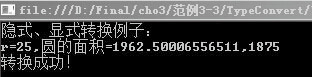
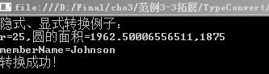

### 3.4.3　使用Convert类转换

.Net Framework提供了很多类库，其中System.Convert类就是专门进行类型转换的类，通过Convert类提供的方法可以实现各种基本数据类型间的转换。Convert类的常用方法如下表所示。

| 方法 | 说明 |
| :-----  | :-----  | :-----  | :-----  |
| ToBoolean | 将指定的值转换为等效的布尔值 |
| ToChar | 将指定的值转换为 Unicode 字符 |
| ToDateTime | 将指定的值转换为 DateTime |
| ToDecimal | 将指定值转换为 Decimal 数字 |
| ToDouble | 将指定的值转换为双精度浮点数 |
| ToInt16 | 将指定的值转换为 16 位有符号整数 |
| ToInt32 | 将指定的值转换为 32 位有符号整数 |
| ToString | 将指定值转换为其等效的 String 表示形式 |

例如，

```c
01  String MyString="true";
02  Bool MyBool=Convert.ToBoolean(MyString);     //将String转换为Boolean型，MyBool=true
03  String newString="123456789";
04  Int MyInt=Convert.ToInt32(newString);        //将字符串转换为数字值，MyInt=123456789
```

**【范例3-3】 隐式转换、显式转换使用举例。**

（1）在Visual Studio 2013中新建C#控制台程序，项目名为“TypeConvert”。

（2）在Program.cs的Main 方法中输入以下代码（代码3-3.txt）。

```c
01  Console.WriteLine("隐式、显式转换例子：");
02  short r = 25;        //表示圆的半径
03  int i = r;           //将短整型r隐式转换成整型 
04  float pi=3.14f;      //定义一个单精度的实数
05  double s1=pi*i*i;    //s1为double型，表示圆的面积
06  int s2;
07  s2  = (int)pi * i * i;      //s2为int型，表示圆的面积
08  var Name="Johnson";
09  string strName = Name;     //var型变量Name隐式转换为string型
10  Console.WriteLine("r=25,圆的面积={0},{1}", s1, s2);
11  Console.WriteLine("转换成功！");
12  Console.ReadLine();
```

**【代码详解】**

第3行表示将short类型隐式转换为int；第5行表示将int和float类型隐式转换为double类型；第7行表示显式把float转换为int；第8~9行表示var类型隐式转换为string类型。

**【运行结果】**

单击工具栏中的
按钮，即可在控制台中输出如下图所示的结果。


> 
> **技巧**
> 第7行代码如果写成s2=pi*i*i，隐式转换将失败，因为float不能隐式转换为int类型。

**【范例分析】**

这个范例主要演示了类型的转换。从运行结果看，强制转换存在信息丢失的现象，如第7行将pi强制转换为int，原来是3.14，转换后变成了3。隐式类型转换要遵循前面给出的规则，否则转换就会失败。

**【拓展训练】**

扩展【范例3-3】，使用Convert类的方法来实现类型的转换。代码如下（拓展代码3-3.txt）。

```c
01  Console.WriteLine("隐式、显式转换例子：");
02  short r = 25;                   //r表示圆的半径
03  int i = Convert.ToInt32( r);    //将短整型r隐式转换成整型 
04  float pi = 3.14f;               //定义一个单精度的实数
05  double s1  = pi * i * i;        //s1为double型，表示圆的面积
06  int s2;
07  s2  =  Convert.ToInt32(pi) * i * i;                //s2为int型，表示圆的面积
08  var memberName = "Johnson";
09  string  strName =  Convert.ToString (memberName);  //var型变量隐式转换为string型
10  Console.WriteLine("r=25,圆的面积={0},{1}", s1, s2);
11  Console.WriteLine("memberName={0}",memberName);
12  Console.WriteLine("转换成功！");
13  Console.ReadLine();
```

#### 【运行结果】

运行结果如下图所示。


