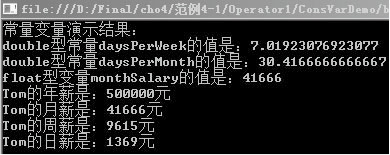
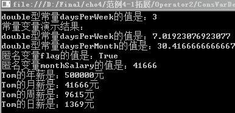

### 4.2　常量


**本节视频教学录像：12分钟**

常量就是在程序运行过程中值保持不变的量，即在程序执行期间，常量的值不会发生改变。可以在代码的任何位置用常量代替实际值。如定义const　PI=3.14159265，这里使用PI来代替数值3.14159265。常量声明时需要包含常量的名称和常量的值，其格式如下。

```c
[访问修饰符号]  const  类型  常量表达式；
```

其中“访问修饰符号”可以省略。常量的修饰符可以是new、public、protected、internal、private等。常量的表达式表示常量的名字。如下所示。

```c
public  const  int  x=3,  y=8;  //定义int型常量x和y，其值分别是3和8
```

可以在一行声明多个常量。不过如果每行只声明一个常量，代码会更具有可读性。

**【范例4-1】　定义常量和变量，熟悉常量、变量的使用。**

（1）在VisualStudio 2013中新建C#控制台程序，项目名为“ConsVarDemo”。

（2）在Program.cs的Main方法中输入以下代码（代码4-1.txt）。

```c
01  const  int  months=12;   //定义常量months
02  const  int  weeks=52;    //定义常量weeks
03  const  int  days=365;    //定义常量days
04  //可以使用定义过的常量声明新的常量
05  const  double  daysPerWeek=(double)days/(double)weeks;     //定义常量daysPerWeek
06  const  double  daysPerMonth=(double)days/(double)months;   //定义常量daysPerMonth
07  string  name="Tom";                       //定义变量name
08  int  annualSalary=500000;                 //定义变量annualSalary
09  loat  monthSalary=annualSalary/months;    //定义变量monthSalary
10  float  weekSalary=annualSalary/weeks;     //定义变量weekSalary
11  float  daySalary=annualSalary/days;       //定义变量daySalary
12  Console.WriteLine("常量变量演示结果：");    //输出常量和变量的值
13  Console.WriteLine("double型常量daysPerWeek的值是：{0}",daysPerWeek);
14  Console.WriteLine("double型常量daysPerMonth的值是：{0}",daysPerMonth);
15  Console.WriteLine("float型变量monthSalary的值是：{0}",monthSalary);
16  Console.WriteLine("{0}的年薪是：{1}元",name,annualSalary);
17  Console.WriteLine("{0}的月薪是：{1}元",name,monthSalary);
18  Console.WriteLine("{0}的周薪是：{1}元",name,weekSalary);
19  Console.WriteLine("{0}的日薪是：{1}元",name,daySalary);
20  Console.ReadKey();            //暂停程序的运行直到输入任意键
21  Console.ReadLine();
```

**【代码详解】**

代码1~3行定义了3个常量；第5~6行，利用声明过的常量定义两个新常量；第7~11行声明了5个3种不同类型的变量；第13~19行，采用Console的WriteLine方法输出格式字符串来进行信息输出，其中采用输出格式字符串的方式在C#中经常使用，这种方式包含两个参数：格式字符串和变量列表，{0}和{1}作为占位符出现在字符串中，代表后面依次排列的变量的值出现的位置。

**【运行结果】**

单击工具栏中的
按钮，即可在控制台中输出如下图所示的结果。


**【范例分析】**

在这个实例中定义了常量months、weeks和days，使用定义过的常量声明新的常量daysPerWeek、daysPerMonth，并强制进行了类型转换，把int转为double类型；定义了多个变量，并采用格式字符串的形式输出。在这里需注意，计算monthSalary等变量没有进行类型转换，故monthSalary等变量的赋值结果最终是int类型。

**【拓展训练】**

把【范例4-1】改成隐式类型的局部变量重新运行。

分别声明多个常量和多个变量，变量类型根据赋的值自动确定。代码如下（拓展代码4-1.txt）。

```c
01  const  int  months=12;                                     //定义常量
02  const  int  weeks=52;                                      //定义常量
03  const  int  days=365;                                      //定义常量
04  //可以使用定义过的常量声明新的常量
05  const  double  daysPerWeek=(double)days/(double)weeks;     //定义常量
06  const  double  daysPerMonth=(double)days/(double)months;   //定义常量
07  var  flag=true;                         //定义var变量，赋值为布尔型数据
08  var  name="Tom";                        //定义var变量，赋值为字符串
09  var  annualSalary=500000;               //定义var变量，赋值为整型
10  var  monthSalary=annualSalary/months;   //定义var变量，根据表达式的值确定类型
11  var  weekSalary=annualSalary/weeks;     //定义var变量，根据表达式的值确定类型
12  var  daySalary=annualSalary/days;       //定义var变量，根据表达式的值确定类型
13  var  x=Math.Exp(2);                     //定义var变量，根据表达式的值确定类型
14  var  y=name.Length;                     //定义var变量，赋值为整型
15  Console.WriteLine("double型常量daysPerWeek的值是：{0}",  y);
16  Console.WriteLine("常量变量演示结果：");  //以下语句用来输出结果
17  Console.WriteLine("double型常量daysPerWeek的值是：{0}",  daysPerWeek);
18  Console.WriteLine("double型常量daysPerMonth的值是：{0}",  daysPerMonth);
19  Console.WriteLine("匿名变量flag的值是：{0}",  flag);
20  Console.WriteLine("匿名变量monthSalary的值是：{0}",  monthSalary);
21  Console.WriteLine("{0}的年薪是：{1}元",  name,  annualSalary);
22  Console.WriteLine("{0}的月薪是：{1}元",  name,  monthSalary);
23  Console.WriteLine("{0}的周薪是：{1}元",  name,  weekSalary);
24  Console.WriteLine("{0}的日薪是：{1}元",  name,  daySalary);
25  Console.ReadKey();
26  Console.ReadLine();
```

> 
> **技巧**
> 匿名变量声明的同时必须赋值，声明一个匿名变量后不能给它赋另一类型的值；匿名变量初始化不能为null(空值)，匿名变量仅限于声明局部变量。

**【运行结果】**

运行结果如下图所示。


