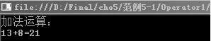
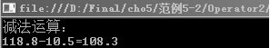
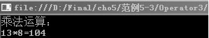
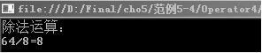
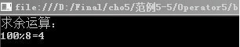
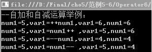

### 5.1.1　算术运算符

算术运算符用于对数值进行计算，其结果仍是一个数值。算术运算符有“+”、“-”、“*”、“/”、“%”、“++”和“--”。其中“+”、“-”运算符既可作为一元运算符，也可作为二元运算符。“*”、 “/”和“%”只能作为二元运算符。自加运算符“++”、自减运算符“--”属于一元运算符。下面将对这几种算术运算符进行详细讲解。

#### 1．加法运算符

加法运算符（+）是通过两个操作数相加来执行加法运算。

**【范例5-1】 加法运算符的使用。**

（1）在Visual Studio 2013中新建C#控制台程序，项目名为“Operator1”。

（2）在Program.cs的Main方法中输入以下代码（代码5-1.txt）。

```c
01  int opr1=13;        //声明操作数变量并赋值
02  int opr2 = 8;       //声明操作数变量并赋值
03  int x; ;            //声明int变量
04  x = opr1 + opr2;    //两个操作数相加
05  Console.WriteLine("加法运算：");
06  Console.WriteLine("{0}+{1}={2}", opr1, opr2, x); //输出加法运算结果
07  Console.ReadLine();
```

**【运行结果】**

单击工具栏中的
按钮，即可在控制台中输出如下图所示的结果。


#### 2．减法运算符

减法运算符（-）是通过操作数相减来执行减法运算。

**【范例5-2】 减法运算符的使用。**

（1）在Visual Studio 2013中新建C#控制台程序，项目名为“Operator2”。

（2）在Program.cs的Main 方法中输入以下代码（代码5-2.txt）。

```c
01  double d1 = 118.8;                            //声明操作数变量并赋值
02  double d2= 10.5;                              //声明操作数变量并赋值
03  double x ;                                    //声明double变量
04  x = d1-d2;                                    //两个操作数相减
05  Console.WriteLine("减法运算：");
06  Console.WriteLine("{0}-{1}={2}", d1, d2, x);  //输出减法运算结果
07  Console.ReadLine();
```

**【运行结果】**

单击工具栏中的
按钮，即可在控制台中输出如下图所示的结果。


#### 3．乘法运算符

乘法运算符（*）是通过两个操作数相乘来执行乘法运算并返回它们的乘积。

**【范例5-3】 乘法运算符的使用。**

（1）在Visual Studio 2013中新建C#控制台程序，项目名为“Operator3”。

（2）在Program.cs的Main 方法中输入以下代码（代码5-3.txt）。

```c
01  int opr3=25;                                       //声明操作数变量并赋值
02  int opr4= 8;                                       //声明操作数变量并赋值
03  int x;                                             //声明int变量
04  x = opr3 * opr4;                                   //两个操作数相乘
05  Console.WriteLine("乘法运算：");
06  Console.WriteLine("{0}*{1}={2}", opr3, opr4, x);   //输出乘法运算结果
07  Console.ReadLine();
```

**【运行结果】**

单击工具栏中的
按钮，即可在控制台中输出如下图所示的结果。


#### 4．除法运算符

除法运算符（/）是用被除数除以除数执行除法运算取商。

**【范例5-4】 除法运算的使用。**

（1）在Visual Studio 2013中新建C#控制台程序，项目名为“Operator4”。

（2）在Program.cs的Main 方法中输入以下代码（代码5-4.txt）。

```c
01  int opr5=64;                                        //声明操作数变量并赋值
02  int opr6= 8;                                        //声明操作数变量并赋值
03  int x;                                              //声明int变量
04  x = opr5 / opr6;                                    //两个操作数相乘
05  Console.WriteLine("除法运算：");
06  Console.WriteLine("{0}/{1}={2}", opr5, opr6, x);    //输出除法运算结果
07  Console.ReadLine();
```

**【运行结果】**

单击工具栏中的
按钮，即可在控制台中输出如下图所示的结果。


#### 5．求余运算符

求余运算符（%）是用来执行除法运算操作，得到余数的值。

**【范例5-5】 求余运算符的使用。**

（1）在Visual Studio 2013中新建C#控制台程序，项目名为“Operator5”。

（2）在Program.cs的Main 方法中输入以下代码（代码5-5.txt）。

```c
01  int opr7=100;                //声明操作数变量并赋值
02  int opr8= 8;                 //声明操作数变量并赋值
03  int x;                       //声明int变量
04  x = opr7 % opr8;             //两个操作数进行求余运算
05  Console.WriteLine("求余运算：");
06  Console.WriteLine("{0}%{1}={2}", opr7, opr8, x);    //输出求余运算结果
07  Console.ReadLine();
```

**【运行结果】**

单击工具栏中的
按钮，即可在控制台中输出如下图所示的结果。


#### 6．自增、自减运算符

自增运算符“++”可将操作数加1，自减运算符“--”可将操作数减1，自加、自减运算符在操作数之前和操作数之后的结果是不一样的。

**【范例5-6】 自增、自减运算符的使用。**

（1）在Visual Studio 2013中新建C#控制台程序，项目名为“Operator6”。

（2）在Program.cs的Main 方法中输入以下代码（代码5-6.txt）。

```c
01  Console.WriteLine("--自加和自减运算举例：");
02  int num1 = 5, var1;    //定义变量num1和var1，num1的初值为5
03  var1 = ++num1;         //num1加1后赋给var1
04  Console.WriteLine("num1=5,var1=++num1,var1={0},num1={1}", var1, num1);    //输出结果
05  num1 = 5;              //设置num1的值为5，便于对比运算结果
06  var1 = num1++;         //num1赋给var1后加1
07  Console.WriteLine("num1=5,var1=num1++ ,var1={0},num1={1}", var1, num1);
08  num1 = 5;              //设置num1的值为5，便于对比运算结果
09  var1 = --num1;         //num1减1后赋给var1
10  Console.WriteLine("num1=5,var1=--num1,var1={0},num1={1}", var1, num1);
11  num1 = 5;              //设置num1的值为5，便于对比运算结果
12  var1 = num1--;         //num1赋给var1后减1
13  Console.WriteLine("num1=5,var1=num1-- ,var1={0},num1={1}", var1, num1);
14  Console.ReadLine();
```

**【运行结果】**

单击工具栏中的
按钮，即可在控制台中输出如下图所示的结果。


