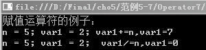

### 5.1.2　赋值运算符

赋值运算符对运算符右边的操作式求值，并用该值设置运算符左边的变量操作式。赋值运算符主要有简单赋值（=）及复合赋值（+=、-=、*=、/=、%=、&=、|=、>>=、<<=、^=）运算符。可以放在赋值运算符左边的对象类型是变量、属性、索引和事件。如果赋值运算符两边的操作数类型不一致，就需要首先进行类型转换，然后再赋值。二元运算符就是需要两个操作数参与的运算符，赋值运算符是二元运算符。

**【范例5-7】 赋值运算符的使用。**

（1）在Visual Studio 2013中新建C#控制台程序，项目名为“Operator7”。

（2）在Program.cs的Main 方法中输入以下代码（代码5-7.txt）。

```c
01  Console.WriteLine("赋值运算符的例子：");
02  int n=5 ,var1=2;   //定义变量n和var1，n的初值为5
03  var1 += n;         //相当于var1=var1+n
04  Console.WriteLine("n = 5; var1 = 2; var1+=n,var1={0}", var1);  //输出结果
05  n = 5;             //设置n的值为5，便于对比运算结果
06  var1 = 2;
07  var1 /= n;         //相当于var1=var1/n
08  Console.WriteLine("n = 5; var1 = 2;  var1/=n,var1={0}", var1);  //输出结果 
09  Console.ReadLine();
```

**【运行结果】**

运行结果如下图所示。


