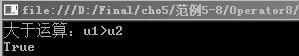
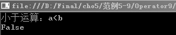
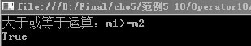
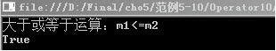
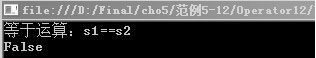
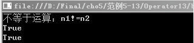

### 5.1.3　比较运算符

比较运算符又称关系运算符，我们可以把它理解为一种“判断”，判断的结果是“真”或者“假”，关系表达式的返回值总是布尔型。也就是说比较运算符主要用于比较两个操作数并得到一个布尔类型的值。关系运算符有>、<、>=、<=、!=、==运算符，它们都属于二元运算符。下面对这几种关系运算符进行详细讲解。

#### 1．大于运算符

大于运算符（>）用于比较一个操作数是否大于另外一个操作数，如果大于，返回true，否则返回false。

**【范例5-8】 大于运算符的使用。**

（1）在Visual Studio 2013中新建C#控制台程序，项目名为“Operator8”。

（2）在Program.cs的Main 方法中输入以下代码（代码5-8.txt）。

```c
01  int u1=13;       　//声明操作数变量并赋值
02  int  u2= 8;        //声明操作数变量并赋值
03  bool result;       //声明int变量
04  result = u1>u2;        
05  Console.WriteLine("大于运算：u1>u2");
06  Console.WriteLine(result);      //输出比较结果
07  Console.ReadLine();
```

**【运行结果】**

单击工具栏中的
按钮，即可在控制台中输出如下图所示的结果。


#### 2．小于运算符

小于运算符（<）用于比较一个操作数是否小于另外一个操作数，如果小于，该运算符返回true，否则返回false。

**【范例5-9】 小于运算符的使用。**

（1）在Visual Studio 2013中新建C#控制台程序，项目名为“Operator9”。

（2）在Program.cs的Main 方法中输入以下代码（代码5-9.txt）。

```c
01  decimal a =2001.00m;                //声明操作数变量并赋值
02  decimal b =2000.00m;                //声明操作数变量并赋值
03  bool  result;                       //声明bool 型变量
04  result = a<b;        
05  Console.WriteLine("小于运算：a<b ");
06  Console.WriteLine(result);          //输出比较结果
07  Console.ReadLine();
```

**【运行结果】**

单击工具栏中的
按钮，即可在控制台中输出如下图所示的结果。


#### 3．大于或等于运算符

大于或等于运算符（>=）用于比较一个操作数是否大于或等于另外一个操作数，如果大于或等于，该运算符返回true，否则返回false。

**【范例5-10】 大于或等于运算符的使用。**

（1）在Visual Studio 2013中新建C#控制台程序，项目名为“Operator10”。

（2）在Program.cs的Main 方法中输入以下代码（代码5-10.txt）。

```c
01  int m1=13;            //声明操作数变量并赋值
02  int m2 = 8;           //声明操作数变量并赋值
03  bool result;          //声明bool变量
04  result =m1>=m2;         
05  Console.WriteLine("大于或等于运算：m1>=m2");
06  Console.WriteLine(result);                //输出比较结果
07  Console.ReadLine();
```

**【运行结果】**

单击工具栏中的
按钮，即可在控制台中输出如下图所示的结果。


#### 4．小于或等于运算符

小于或等于运算符（<=）用于比较一个操作数是否小于或等于另外一个操作数，如果小于或等于，该运算符返回true，否则返回false。

**【范例5-11】 小于或等于运算符的使用。**

（1）在Visual Studio 2013中新建C#控制台程序，项目名为“Operator11”。

（2）在Program.cs的Main 方法中输入以下代码（代码5-11.txt）。

```c
01  int m1=13;                        //声明操作数变量并赋值
02  int m2 = 8;                       //声明操作数变量并赋值
03  bool result;                      //声明bool变量
04  result =m1<=m2;         
05  Console.WriteLine("小于或等于运算：m1<=m2");
06  Console.WriteLine(result);        //输出比较结果
07  Console.ReadLine();
```

**【运行结果】**

单击工具栏中的
按钮，即可在控制台中输出如下图所示的结果。


#### 5．等于运算符

等于运算符（==）用于比较一个操作数是否等于另外一个操作数，如果等于，该运算符返回true，否则返回false。

**【范例5-12】 等于运算符的使用。**

（1）在Visual Studio 2013中新建C#控制台程序，项目名为“Operator12”。

（2）在Program.cs的Main 方法中输入以下代码（代码5-12.txt）。

```c
01  int s1=13;                      //声明操作数变量并赋值
02  int s2 = 8;                     //声明操作数变量并赋值
03  bool result;                    //声明bool变量
04  result =s1==s2;         
05  Console.WriteLine("等于运算：s1==s2");
06  Console.WriteLine(result);      //输出比较结果
07  Console.ReadLine();
```

**【运行结果】**

单击工具栏中的
按钮，即可在控制台中输出如下图所示的结果。


#### 6．不等于运算符

不等于运算符（!=）是与等于运算符相反的运算符，用于比较一个操作数是否不等于另外一个操作数，如果不等于，该运算符返回true，否则返回false。它有两种表达式，一种是普通的不等运算符（!=），另一种是相等运算符的否定!（a==b）。这两种格式可以计算出相同的值。

**【范例5-13】 不等于运算符的使用。**

（1）在Visual Studio 2013中新建C#控制台程序，项目名为“Operator13”。

（2）在Program.cs的Main 方法中输入以下代码（代码5-13.txt）。

```c
01  int n1=13;                                //声明操作数变量并赋值
02  int n2 = 8;                               //声明操作数变量并赋值
03  bool result1;                             //声明bool变量
04  bool result2; 
05  result1 =n1!=n2; 
06  result2 =!(n1==n2);
07  Console.WriteLine("不等于运算：n1!=n2");
08  Console.WriteLine(result1);               //输出比较结果
09  Console.WriteLine(result2);               //输出比较结果
10  Console.ReadLine();
```

**【运行结果】**

单击工具栏中的
按钮，即可在控制台中输出如下图所示的结果。


