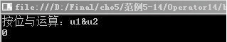
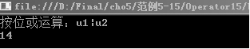
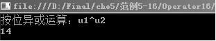
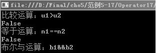
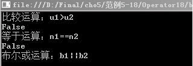
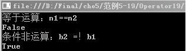

### 5.1.4　逻辑运算符

逻辑运算符用于连接一个或多个条件，判断这些条件是否成立。C#中的逻辑运算符有“&”、“|”、“^”、“&&”、“||”、“!”，可分为两类，“&”、“|”、“^”称为整体逻辑运算符，它们允许在两个数值上进行布尔运算；“&&”、“||”、“!”称为条件逻辑运算符，运算符两边的操作数的值必须是布尔类型，操作数常为条件表达式。

这些运算符，除了条件运算符（“!”）以外，都是二元运算符，条件运算符是一元运算符。下面对这几种逻辑运算符进行详细讲解。

#### 1．按位“与”运算符

按位“与”运算符（&）产生两个操作数按位与后的值。当两个操作数的对应位都是1时，返回的对应的结果位是1；当两个整数的对应位都是0或者其中一个位是0时，返回相应的结果位是0。

**【范例5-14】 按位“与”运算符的使用。**

（1）在Visual Studio 2013中新建C#控制台程序，项目名为“Operator14”。

（2）在Program.cs的Main 方法中输入以下代码（代码5-14.txt）。

```c
01  int  u1=6 ,u2= 8,u3;        //声明操作数变量并赋值
02  u3 = u1 & u2;               //对变量u1、u2进行与运算
03  Console.WriteLine("按位与运算：u1&u2");
04  Console.WriteLine(u3);      //输出比较结果
05  Console.ReadLine();
```

**【运行结果】**

单击工具栏中的
按钮，即可在控制台中输出如下图所示的结果。


#### 2．按位“或”运算符

按位“或”运算符（|）产生两个操作数按位或后的值。当两个操作数的对应位有一个是1时，返回的对应的结果位是1；当两个操作数的对应位都是0时，返回相应的结果位是0。

**【范例5-15】 按位“或”运算符的使用。**

（1）在Visual Studio 2013中新建C#控制台程序，项目名为“Operator15”。

（2）在Program.cs的Main 方法中输入以下代码（代码5-15.txt）。

```c
01  int  u1=6,u2= 8,u3;        //声明操作数变量并赋值
02  u3=u1|u2;                  //对变量u1、u2进行或运算
03  Console.WriteLine("按位或运算：u1|u2");
04  Console.WriteLine(u3);     //输出比较结果
05   Console.ReadLine();
```

**【运行结果】**

单击工具栏中的
按钮，即可在控制台中输出如下图所示的结果。


#### 3．按位“异或”运算符

按位“异或”运算符（^）产生两个操作数按位异或后的值。当两个操作数的对应位一个是1，另外一个是0时，返回的对应的结果位是1；当两个操作数的对应位都是1或者都是0时，返回相应的结果位是0。

**【范例5-16】 按位“异或”运算符的使用。**

（1）在Visual Studio 2013中新建C#控制台程序，项目名为“Operator16”。

（2）在Program.cs的Main 方法中输入以下代码（代码5-16.txt）。

```c
01  int  u1=6 ,u2= 8,u3;        //声明操作数变量并赋值
02  u3=u1^u2;                   //对变量u1、u2进行异或运算
03  Console.WriteLine("按位异或运算：u1^u2");
04  Console.WriteLine(u3);      //输出比较结果
05  Console.ReadLine();
```

**【运行结果】**

单击工具栏中的
按钮，即可在控制台中输出如下图所示的结果。


#### 4．布尔“与”运算符

布尔“与”运算符（&&）用于比较两个布尔操作数。当两个布尔操作数的结果都为真时，结果为“真”，其余情况结果为“假”。

**【范例5-17】 布尔“与”运算符的使用。**

（1）在Visual Studio 2013中新建C#控制台程序，项目名为“Operator17”。

（2）在Program.cs的Main 方法中输入以下代码（代码5-17.txt）。

```c
01  int  u1=6, u2= 8;                      //声明整型变量并赋值
02  String n1="Ada",n2="Alice";            //声明字符变量并赋值
03  bool  b1, b2, b3;                      //声明布尔变量
04  b1=u1>u2;                              //比较u1、u2，结果放入b1
05  b2 = n1==n2;                           //比较n1、n2，结果放入b2
06  b3 = b1&&b2                            //比较b1、b2，结果放入b3
07  Console.WriteLine("比较运算：u1>u2");
08  Console.WriteLine(b1);                 //输出比较结果
09  Console.WriteLine("等于运算：n1==n2");
10  Console.WriteLine(b2);
11  Console.WriteLine("布尔与运算：b1&&b2");
12  Console.ReadLine();
```

**【运行结果】**

单击工具栏中的
按钮，即可在控制台中输出如下图所示的结果。


#### 5．布尔“或”运算符

布尔“或”运算符（||）用于比较两个布尔操作数。只要一个布尔操作数的结果为真，则结果为“真”，如果两个布尔操作数的值都是假，则结果为假。

**【范例5-18】 布尔“或”运算符的使用。**

（1）在Visual Studio 2013中新建C#控制台程序，项目名为“Operator18”。

（2）在Program.cs的Main 方法中输入以下代码（代码5-18.txt）。

```c
01  int  u1=6, u2= 8;                     //声明整型变量并赋值
02  String n1="Ada",n2="Alice";           //声明字符变量并赋值
03  bool  b1, b2, b3;                     //声明布尔变量
04  b1=u1>u2                              //比较u1、u2，结果放入b1
05  b2 = n1==n2;                          //比较n1、n2，结果放入b2
06  b3 = b1||b2;                          //比较b1、b2，结果放入b3
07  Console.WriteLine("比较运算：u1>u2");
08  Console.WriteLine(b1);                //输出比较结果
09  Console.WriteLine("等于运算：n1==n2");
10  Console.WriteLine(b2);
11  Console.WriteLine("布尔或运算：b1||b2");
12  Console.ReadLine();
```

**【运行结果】**

单击工具栏中的
按钮，即可在控制台中输出如下图所示的结果。


#### 6．条件“非”运算符

条件“非”运算符（！）用于对布尔操作数结果取反。

**【范例5-19】 条件“非”运算符的使用。**

（1）在Visual Studio 2013中新建C#控制台程序，项目名为“Operator19”。

（2）在Program.cs的Main 方法中输入以下代码（代码5-19.txt）。

```c
01  String n1="Ada",n2="Alice";           //声明字符变量并赋值
02  bool  b1, b2;                         //声明布尔变量
03  b1 = n1==n2;                          //比较n1、n2，结果放入b1
04  b2 = !b1;                             //比较n1、n2，结果放入b2
05  Console.WriteLine("等于运算：n1==n2");
06  Console.WriteLine(b1);                //输出比较结果
07  Console.WriteLine("条件非运算：b2 =！b1");
08  Console.WriteLine(b2);
09  Console.ReadLine();
```

**【运行结果】**

单击工具栏中的
按钮，即可在控制台中输出如下图所示的结果。


