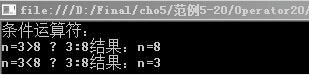
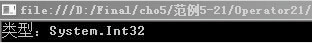
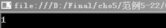

### 5.1.5　其他运算符

C#中还有一些运算符不能简单归结到某个类型，下面对这些特殊的运算符进行讲解。

#### 1．条件运算符

条件运算符（?:）是if…else的简化格式，它是三元运算符。三元运算符要求有三个操作数参与运算。格式为：

```c
操作数1？操作数2：操作数3；
```

其中操作数可以为变量或者表达式。输出结果为：如果操作数1为“真”，输出操作数2；如果操作数1为“假”，输出操作数3。三元运算符的输出结果取决于“?”前面的操作数1。

**【范例5-20】 条件运算符的使用。**

（1）在Visual Studio 2013中新建C#控制台程序，项目名为“Operator20”。

（2）在Program.cs的Main 方法中输入以下代码（代码5-20.txt）。

```c
01  int n;                                     //定义变量n
02  Console.WriteLine("条件运算符：");
03  Console.WriteLine("n=3>8 ? 3:8结果：n={0}", n = 3 > 8 ? 3 : 8);
04  Console.WriteLine("n=3<8 ? 3:8结果：n={0}", n = 3 < 8 ? 3 : 8);
05  Console.ReadLine();
```

**【运行结果】**

单击工具栏中的
按钮，即可在控制台中输出如下图所示的结果。


#### 2．()运算符

()运算符用于指定操作数中的运算顺序和指定强制转换或类型转换。()运算符的使用范围非常广泛。如下所示。

```c
01  int n;                //声明整型变量
02  double m=(1.6+1)*3;        
03  n=(int)m;             //()用于类型转换
```

#### 3．点运算符

点运算符(.)用于访问数据结构的成员。前面列举的实例程序几乎都有应用。格式为：

```c
数据结构.成员
```

如下所示。

```c
01  System.Console.WriteLine("hello");
02  System.Console.ReadLine();
```

#### 4．索引运算符

索引运算符（[]）用于数组、索引器和属性，也可用于指针。如数组类型是一种后跟[]的类型，如下所示，创建一个有10个元素的数组，若要访问数组的一个元素，则用方括号括起所需元素的索引。

```c
01  int [] a = new int[10]; 
02  a[0] = a[1] = 1;
```

#### 5．new运算符

new运算符用于创建一个新的类型实例。它有以下三种形式。

① 对象创建表达式，用于创建一个类类型或值类型的实例。

② 数组创建表达式，用于创建一个数组类型实例。

③ 代表创建表达式，用于创建一个新的代表类型实例。

例如，下面三个式子分别创建了一个对象、数组和代表实例。

```c
01  class  N{}; N a=new N;
02  string [] M=new string[5];        
03  delegate  double L(int p);  L f=new L(2)；
```

#### 6．typeof运算符

typeof运算符用于获得系统原型对象的类型，也就是Type类型。Type类包含关于值类型和引用类型的信息。

**【范例5-21】 typeof运算符的使用。**

（1）在Visual Studio 2013中新建C#控制台程序，项目名为“Operator21”。

（2）在Program.cs的Main 方法中输入以下代码（代码5-21.txt）。

```c
01 Type T= typeof(int);                  //获取引用类型的信息
02  Console.WriteLine("类型：{0}",T);     //输出结果
03  Console.ReadLine();
```

**【运行结果】**

单击工具栏中的
按钮，即可在控制台中输出如下图所示的结果。


#### 7．checked和unchecked运算符

checked和unchecked运算符用于允许或者禁止对指定的运算进行检测，并指出相应的错误提示信息。

**【范例5-22】 checked和unchecked运算符的使用。**

（1）在Visual Studio 2013中新建C#控制台程序，项目名为“Operator22”。

（2）在Program.cs的Main 方法中输入以下代码（代码5-22.txt）。

```c
01  byte  s=255;                        //获取引用类型的信息
02  checked
03  {
04    s+=2
05  }
06  Console.WriteLine(s.ToString());    //输出结果
07  Console.ReadLine();
```

**【代码详解】**

代码2~5行执行checked操作。byte数据类型只能包含0～255的数，所以s值的增量会导致溢出，由于使用了checked运算符，所以在运行程序时编译器会检查溢出错误，并给出错误提示。

用checked运算符可以检查程序中所有未标记代码的溢出。如果要禁止溢出，可以用unchecked运算符，代码如下。

```c
01  short  s=255;                        //获取引用类型的信息
02  unchecked
03  {
04    s+=2;
05  }
06  Console.WriteLine(s.ToString());     //输出结果
07  Console.ReadLine();
```

**【运行结果】**

单击工具栏中的
按钮，即可在控制台中输出如下图所示的结果。


可以看出，程序运行时没有出现异常，但数据会丢失，因为byte数据类型最大为255，溢出的位会被丢掉，所以s变量得到的值是1。

