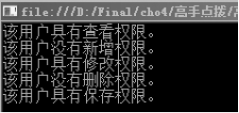

### 5.4　高手点拨


**本节视频教学录像：6分钟**

在5.1节我们对运算符进行了基础讲解，其中一些运算符蕴含着技巧性的用法，在这里进行详细说明。

#### 1．n++与++n

只要学习编程语言，学习运算符，都少不了学习自增、自减运算。++与--这两个运算符特殊的地方主要表现在，它们既可以用做前缀运算符（用在变量前面，如++n），也可以用做后缀运算符（用在变量后面，如n++）。不管作为前缀还是后缀，它作用的变量都会实现自增或者自减运算。

++与--的使用分为以下两种情况。

① 这种情况比较简单，没有歧义，就是纯粹的实现自增。被作用的变量不参与运算。

```c
01  int  n=0;
02  n++;                   //n的值为1
03  ++n;                   //n的值为2
```

② 被作用的变量参与运算。

有歧义就在这个情况下，++或--作为后缀运算符时，其作用的变量先参与运算，再自增；++或--作为前缀运算符时，其作用的变量先自增或自减，再参与运算。

```c
01  int x=0,y=0;
02  x=y++;                //x的值为0
03  y=0;
04  x=++y;                //x的值为1
```

当然，++与--也不是非使用不可，为了使程序没有歧义，增加可读性，对于参与运算的变量自增运算，我们可以分两步进行，代码如下。

```c
01  int x=0,y=0;
02  x=y;                 //x的值为0
03  y=y+1;
04  y=0;
05  y=y+1;
06  x=y;
```

这样就不用再纠结是先自增还是先运算了。

> 
> **提示**
> “+”与“--”运算符只能作用于变量，对于非变量是不适用的，如x=(y+1)++就是非法表达式。

#### 2．用圆括号来保证运算优先

① 算术运算。

计算x与y的和的5倍。

```c
01  int x,y,z;
02  z=(x+y)*5;
```

这是个比较简单的例子，却很能说明问题。当我们不知道“+”与“*”的优先级时，就可以使用括号来保证“+”的运算。

② 逻辑运算。

当x的值在[1,5]和[10,+∞）区间时，将y赋值为100，否则将y赋值为0。

```c
01  int x=6,y;
02  if(x>=1&&x<=5 || x>=10)//if( (x>=1&&x<=5) || (x>=10))
03  {
04     y=100;
05  }
06  else
07  y=0;
```

#### 3．使用&运算符实现状态控制

使用&运算符实现状态控制比较常见，它不仅运算速度快，而且非常节省空间，用一个int型就可以存储。这种方式的权限有查看、新增、修改、删除、保存权限，并给予用户查看、修改、保存的权限。以下代码判断该用户有什么权限，没有什么权限，然后输出判断结果。

```c
01  int None = 0;                        //无权限
02  int Scan = 1;                        //查看
03  int New = 2;                         //新增
04  int Modify = 4;                      //修改
05  int Delete = 8;                      //删除
06  int Save = 16;                       //保存
07  int userRight = None;                //默认没有权限
08  userRight = Scan | Modify | Save;    //给用户查看、修改、保存权限
09  //下面开始判断用户的权限
10  if ((userRight & Scan) == Scan)
11  {
12          Console.WriteLine("该用户具有查看权限。");
13  }
14  else
15  {
16          Console.WriteLine("该用户没有查看权限。");
17  }
18  if ((userRight & New) == New)
19  {
20          Console.WriteLine("该用户具有新增权限。");
21  }
22  else
23  {
24          Console.WriteLine("该用户没有新增权限。");
25  }
26  if ((userRight & Modify) == Modify)
27  {
28          Console.WriteLine("该用户具有修改权限。");
29  }
30  else
31  {
32          Console.WriteLine("该用户没有修改权限。");
33  }
34  if ((userRight & Delete) == Delete)
35  {
36          Console.WriteLine("该用户具有删除权限。");
37  }
38  else
39  {
40          Console.WriteLine("该用户没有删除权限。");
41  }
42  if ((userRight & Save) == Save)
43  {
44          Console.WriteLine("该用户具有保存权限。");
45  }
46  else
47  {
48          Console.WriteLine("该用户没有保存权限。");
49  }
50  Console.ReadKey();
```

**【运行结果】**

单击工具栏中的
按钮，即可在控制台中输出如下图所示的结果。


这只是状态控制的简单举例，实际运用中，一般把状态设置为枚举，枚举更容易使用，有兴趣的读者可以自己实现一下。

