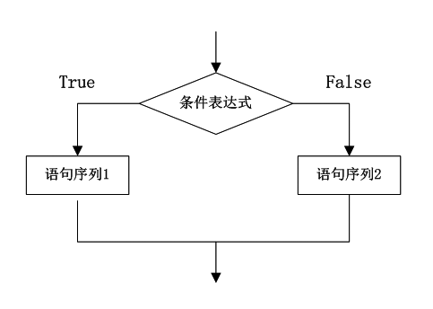
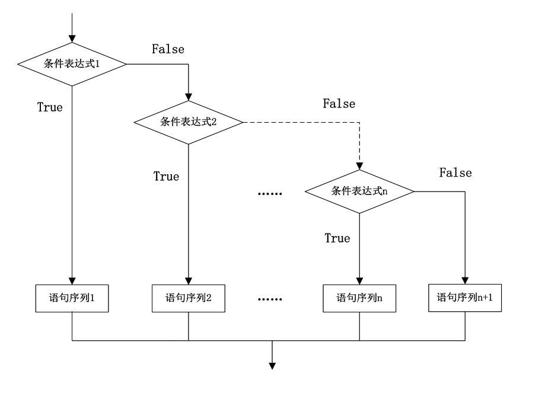

### 6.2.1　条件语句

条件语句就是对条件进行判断，根据判断结果选择执行不同的分支。C#中提供了多种形式的条件语句，包括if语句、if…else语句和switch语句。

（1）单分支结构的if 语句。

语法格式如下。

```c
if(条件表达式)
{语句序列}
```


如果条件成立（条件表达式的值为true），就执行条件表达式后面的语句序列中的语句。如果条件不成立（条件表达式的值为false），则跳过语句序列，继续执行if语句之后的语句。一般情况下，语句序列要用花括号括起来。例如，

```c
01  int score = int.Parse(Console.ReadLine());    //输入成绩，保存在变量score中
02  if (score >= 60)                              //条件为score大于等于60
03  {
04       Console.WriteLine("及格!");              //条件成立，则输出"及格!"
05  }
06  if (score < 60)                               //条件为score小于60
07  {
08        Console.WriteLine("不及格!");           //条件成立，则输出"不及格!"
09  }
```

使用ReadLine()方法从键盘输入成绩,调用int.Parse()方法将输入值转换为int类型，保存在变量score中。第一个if语句的条件表达式为“score >= 60”,当条件成立，输出“及格! ”；条件不成立则跳过第一个if语句，转去执行第二个if语句。第二个if语句的条件表达式为“score < 60”,当条件成立，输出“不及格! ”；条件不成立则跳过第二个if语句，程序结束。两个if语句的条件表达式是相互独立，互不影响的。

> 
> **提示**
> if语句中的条件表达式的值应为bool型，表达式的值为true则条件成立，表达式的值为false则条件不成立。

下面的例子进一步说明了if语句的使用。

**【范例6 -1】 输入学生成绩，输出学生的成绩等级。**

（1）在Visual Studio 2013中新建控制台应用程序，项目名称为“ScoreByIf”。

（2）在program.cs的main方法中输入以下代码。

```c
01  Console.WriteLine("请输入成绩（0-100）：");
02  int score = int.Parse(Console.ReadLine());
03  if (score >= 90)
04  {
05          Console.WriteLine("优秀！");
06  }
07  if (score >= 80 && score < 90)
08  {
09          Console.WriteLine("良好！");
10  }
11  if (score >= 70 && score < 80)
12  {
13          Console.WriteLine("中等！");
14  }
15  if (score >= 60 && score < 70)
16         {
17          Console.WriteLine("及格！");
18  }
19  if (score < 60)
20  {
21          Console.WriteLine("不及格！");
22  }
23  Console.ReadKey();
```

（3）双分支结构的if…else语句。

语法格式如下。

```c
if(条件表达式)
{语句序列1}
else
{语句序列2}
```

其作用是如果条件表达式值为true，执行if后面的语句序列1；如果条件表达式值为false，执行else后面的语句序列2。


```c
int score = int.Parse(Console.ReadLine());      //输入成绩，保存在变量score中
if (score >= 60)                                //条件为score大于等于60
{
        Console.WriteLine("及格！");            //条件成立，则输出"及格!"
}
else
{
        Console.WriteLine("不及格！");           //条件不成立，则输出"不及格!"
}
```

对比if语句的例子，可以看出，以上代码实现了使用一个if…else语句体现两个if语句的功能。思考一下，什么时候可以这样做？

（4）多分支结构。

if语句实现多分支结构的语法如下。

```c
if(表达式1)
{  语句序列1         //表达式1的值为true时执行的语句}
else if(表达式2)
{  语句序列2         //表达式2的值为true时执行的语句}
…
else if(表达式n)
{ 语句序列n          //表达式n的值为true时执行的语句}
else
{ 语句序列n+1        //表达式1到n的值都为false时执行的语句}
```


注意，当表达式1的值为true，执行语句序列1，然后if语句的执行结束。只有当表达式1的值为false时，才需要考虑表达式2的值，表达式2的值为true，则执行语句序列2，然后结束if语句。只有当表达式2的值为false，才需要考虑表达式3的值。依此类推，只有表达式1、2、3…n-1的值都为false时，才需要考虑表达式n的值，这时如果表达式n的值为true，则执行语句序列n，然后结束if语句，否则执行语句序列n+1。

**【范例6-2】 使用多分支结构实现成绩等级评定。**

（1）在Visual Studio 2013中新建控制台应用程序，项目名称为“ScoreByIfelse”。

（2）在program.cs的main方法中输入以下代码。

```c
01  Console.WriteLine("请输入成绩（0-100）：");
02  int score = int.Parse(Console.ReadLine());
03  if(score >= 90)
04  {
05          Console.WriteLine("优秀！");
06  }
07  else if(score >= 80)
08  
09          Console.WriteLine("良好！");
10  }
11  else if(score >= 70)
12  {
13          Console.WriteLine("中等！");
14  }
15  else if(score >= 60)
16  {
17          Console.WriteLine("及格！");
18  }
19  else 
20  {
21           Console.WriteLine("不及格！");
22  }
23  Console.ReadKey();
```

**【范例分析】**

使用多分支结构可以让程序看起来更加简洁，但是要注意多分支结构中多个条件表达式之间的关系。例如，上面的代码中要执行条件表达式“score >= 80”后的语句“Console.WriteLine("良好！");”的前提是条件表达式“score >= 90”为false，也就是说，当条件score >= 80 && score < 90成立时才执行语句“Console.WriteLine("良好！");”

