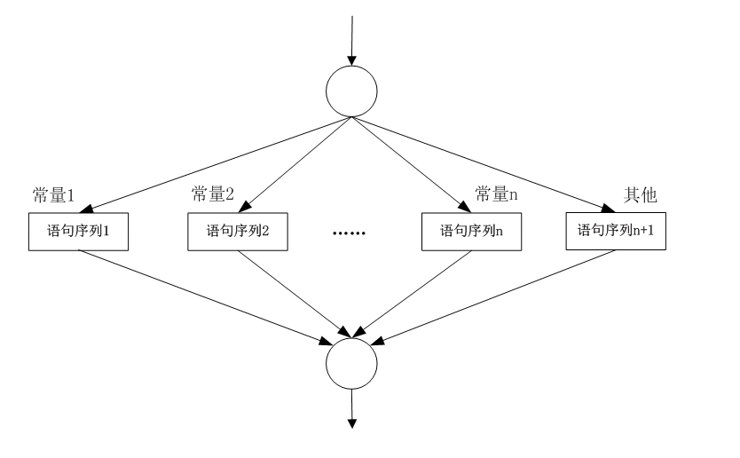

### 6.2.2　switch语句

分支结构也可以使用switch语句来实现，switch语句能够根据表达式的值来选择要执行的代码。if语句只能测试单个条件，如果需要测试多个条件，则需要书写冗长的代码。而switch语句能有效地避免冗长的代码，并能测试多个条件。switch语句的语法如下。

```c
switch (表达式)
{  
        case     常量表达式1:   语句序列1      
        break;
        case     常量表达式2:   语句序列2      
        break;
        …
        case     常量表达式n:   语句序列n      
        break;
        default:               语句序列n+1     
        break;
}
```

switch语句的执行过程是：计算switch语句中表达式的值，再依次与1～n个常量比较，当表达式的值与某个case后面的常量相等时，则执行该case后面的语句，然后执行break语句，跳出switch结构。程序执行时，从匹配常量的相应case处入口，一直执行到break语句或到达switch结构的末尾为止。如果几个常量都不等于switch中表达式的值，则执行default处的语句。


每个case后面的语句可以是单条语句或空语句，也可以是多条语句，而构成一个程序段。这里的语法上允许有多条语句，因此不必加花括号写成复合语句的形式。

**【范例6-3】 使用switch语句实现成绩等级评定。**

（1）在Visual Studio 2013中新建控制台应用程序，项目名称为“ScoreBySwitch”。

（2）在program.cs的main方法中输入以下代码。

```c
01   Console.WriteLine("请输入成绩（0-100）：");
02   int score = int.Parse(Console.ReadLine());
03   switch (score / 10)
04   {
05           case 10:
06           case 9:
07           Console.WriteLine("优秀！");
08           break;
09           case 8:
10           Console.WriteLine("良好！");
11           break;
12           case 7:
13           Console.WriteLine("中等！");
14           break;
15           case 6:
16           Console.WriteLine("及格！");
17           break;
18           default:
19           Console.WriteLine("不及格！");
20           break;
21   }
22   Console.ReadKey();
```

**【范例分析】**

在这个程序中，从键盘上输入学生成绩，存入变量score中，使用score/10作为switch语句的表达式，表达式的值为整型，与case后的常量表达式的值类型相同。当表达式score/10的值与某个case后的常量表达式的值相等时，跳转到该case结构后的语句序列开始执行，直到switch语句结束或者遇到break语句。可以多种情况共用一个语句序列，如score/10的值为9和10两种情况，学生成绩等级都是“优秀”，case 10后面为空，与case 9共用一个语句序列。这种特性的使用需要特别注意，需要在每个语句序列的最后加上break语句，保证被执行语句序列得到执行后跳转到switch语句的结束位置。

