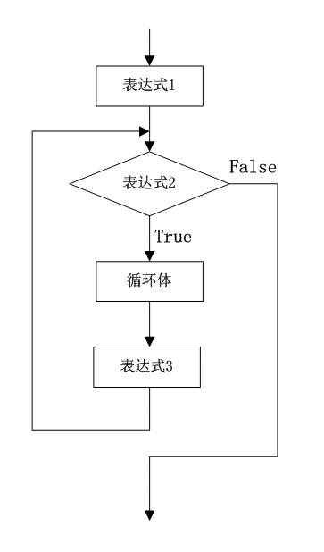

### 6.3.1　for循环

for循环语句语法为：

```c
for(表达式1；表达式2；表达式3)
{
循环体
}
```

for语句的执行过程如下。

① 计算表达式1，为循环变量赋初值。

② 计算表达式2，检查循环条件，若表达式2的值为true, 则执行一次循环体；若其为false，控制转出循环结构。

③ 执行完一次循环体后，计算表达式3，对控制变量进行增量或减量操作，再重复第（2）步操作。


> 
> **提示**
> for后面括号中的3个表达式之间用分号（“； ”）分开。表达式1和表达式3一般为赋值表达式，表达式1为循环控制变量赋初值，表达式3改变循环变量的值。表达式2一般为关系表达式或逻辑表达式，作为控制循环体结束条件，当表达式值为true时，循环继续；当表达式值为false时，循环停止。

**【范例6-4】 用for循环计算1+2+3+…+100的和。**

（1）在Visual Studio 2013中新建控制台应用程序，项目名称为“SumByFor”。

（2）在program.cs的main方法中输入以下代码。

```c
01  int sum;                         //定义累加变量sum
02  sum = 0;                         //累加变量赋初始值为0
03  Console.WriteLine("计算1+2+3+…+100的和：");
04  for (int i=1; i <= 100; i++)     //循环变量i从1开始到100变化循环，i每次增1
05   {                               //循环，累加求和
06        sum = sum + i;             //累加求和
07    }
08   Console.WriteLine("1+2+3+…+100={0}",sum);    
09   Console.ReadKey();
```

**【范例分析】**

在这个程序中，表达式1（int i=1）为循环变量i赋初值1，该表达式只在for循环开始时执行一次。表达式2（i<= 100）是循环条件，循环的每次执行都要先判断循环条件是否成立，成立则执行循环体，这里是把i的当前值累加到变量sum上。表达式3（i++）在循环的每一次执行结束后得到执行，保证每次循环i的值都比上一次加1，使得最终循环条件不成立，循环终止。

