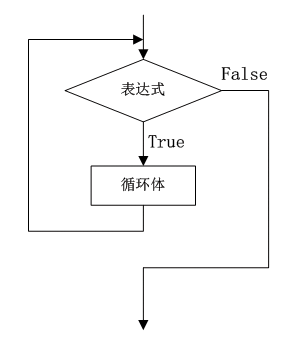

### 6.3.2　while循环

while循环的语法为：

```c
while (表达式)  
{
     循环体
}
```

while循环执行的过程是：先计算while后面圆括号内表达式的值，判断循环条件是否成立。当表达式值为true时，执行循环体，然后再次判断表达式的值；当表达式的值仍为“true”时，则再次执行循环体语句，重复上述执行过程；当表达式的值为false时则退出循环。


**【范例6-5】 用while循环计算1+2+3+…+100的和。**

（1）在Visual Studio 2013中新建控制台应用程序，项目名称为“SumByWhile”。

（2）在program.cs的main方法中输入以下代码。

```c
01  int i, sum;                //定义int变量i用于控制循环次数，sum用于累加求和
02  i = 1;                     //循环变量赋初始值为1
03  sum = 0;                   //累加器变量sum赋初值为0
04  while (i <= 100)           //while循环，当i小于等于100时循环
05  {                          //循环体，累加求和
06      sum = sum + i;         //累加求和
07      i++;                   //循环变量的值增1
08  }
09  Console.WriteLine("1+2+3+…+100={0}",sum);     //输出累加的结果5050
10  Console.ReadKey();
```

> 
> **提示**
> while循环中只有一个表达式，相当于for循环的表达式2，即循环条件。为循环变量赋初值需要在while循环之前进行，修改循环变量的值的语句通常放在循环体的最后。按照这一原则，我们可以很方便地实现for循环和while循环的相互转换。

