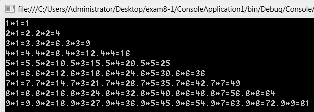

### 6.4　循环嵌套


**本节视频教学录像：6分钟**

循环嵌套是C#程序设计的一种高级技巧。循环嵌套就是在循环体中还可以使用循环语句，前面讲过的几种循环都可以互相嵌套。在程序设计过程中使用循环嵌套需要注意区分外层循环和内层循环，外层循环执行一次，内层循环执行一遍。外层循环和内层循环的循环控制要互相独立，互不影响。

**【范例6-7】 输出九九乘法表。**

（1）在Visual Studio 2013中新建控制台应用程序，项目名称为“MultiTable”。

（2）在program.cs的main方法中输入以下代码。

```c
01  for (int i = 1; i <= 9; i++)
02  {
03          for (int j = 1; j <= i; j++)
04          {
05                  Console.Write("{0}*{1}={2}", i, j, i * j);
06                  if (i != j) Console.Write(",");
07          }
08                  Console.WriteLine();
09  }         
10  Console.ReadKey();
```

程序输出结果如下图所示。


**【范例6-8】 输出小于100的素数。一个大于1的自然数，除了1和它本身外，不能被其他自然数整除（除0以外）的数称为素数。**

（1）在Visual Studio 2013中新建控制台应用程序，项目名称为“PrimeNumber”。

（2）在program.cs的main方法中输入以下代码。

```c
01  Console.WriteLine("小于100之中的素数有：");   //输出提示信息
02  for (int i = 2; i < 100; i++)             //外层循环，i从2到100循环分别判断i是否是素数
03  {
04          bool isPrime = true ;             //定义isPrime变量，标志某个数是否为素数
05          for (int j = 2; j <i-1; j++)      //内层循环，j从2到i-1循环，看j能否整除i
06          {
07                  if (i % j == 0)           //如果i能整除以j，说明i不是素数
08                  {
09                          isPrime = false;  //i不是素数，设置isPrime=false
10                          break;            //跳出内层循环，继续外层循环
11                  }
12          }                                 //内层循环结束
13          if (isPrime)                      //i如果是素数则输出
14          {
15                  Console.WriteLine(" {0}",i) ;    //输出素数i
16          }
17  }                                                //外层循环结束 
18  Console.ReadKey();
```

在上面的代码中出现了break语句，它的功能是跳出break语句所处的循环，转去执行循环结构后面的语句。类似的，C#中提供了continue语句，continue语句的功能是结束本次循环，通常配合if语句使用，当某个条件成立则终止本次循环，即忽略循环体中continue后面的语句，接着进入本循环结构的下一次循环。

