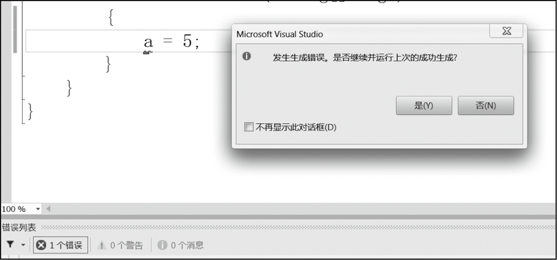
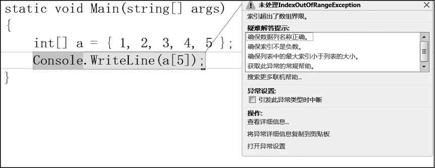

### 7.1　C#错误类型


**本节视频教学录像：4分钟**

编写C#程序的过程中不可避免地会出现各种各样的错误，如标点符号缺失、关键字写错，程序逻辑错误、运行时错误等。为了能够快速确定错误的原因，尽快排除程序错误，通常把程序错误划分为3种类型：语法错误、运行时错误和逻辑错误。通过程序调试可以发现并纠正这些错误。

#### 1．语法错误

语法错误是指代码不符合C#语言的语句。Visual Studio的编译系统能查出此类错误并报告错误的原因，有语法错误的代码不能通过编译，改正后才能通过编译。

如下图所示，在Visual Studio中运行包含语法错误的程序，则系统会提示“发生生成错误”，并在编辑窗口下方的错误列表中列出错误的数量且为每个错误给出具体说明。双击错误列表中某个错误行，系统自动将插入点跳转到代码窗口中该错误的对应位置。对于语法错误，根据错误提示信息修改，然后重新编译程序直到通过。


#### 2．运行时错误

运行时错误相对复杂一些，指的是在程序的运行过程中产生的错误，也就是异常。如数组下标越界、要打开的文件不存在等。

如下图所示，在Visual Studio中运行程序，如果产生运行时错误，则系统提示出现异常，并高亮显示引发异常的程序语句，方便程序设计者修改。


#### 3．逻辑错误

逻辑错误是指程序没有实现编程人员的设计意图和功能。有这类错误的程序可以运行，但是程序运行结果与预期不同。逻辑错误一般是因算法考虑不周引起的，也有些是因为编码时疏忽，如将“+”写成“*”等。

例如，下面的程序设计目标是求10的阶乘，由于保存结果的变量s的初值被赋值为0，导致最终输出结果为0，程序结果与设计目标不同，发生逻辑错误。

```c
static void Main(string[] args)
{
     int s=0;
     for (int i = 0; i <= 10; i++)
     s = s * i;
     Console.WriteLine(s);
}
```

逻辑错误是Visual Studio无法识别的，要解决逻辑错误，则必须通过设置断点，进行程序调试，跟踪程序的运行过程，分析错误原因，然后修改程序代码。

