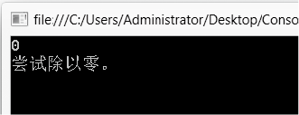

### 7.3.1　try-catch语句

try-catch语句是C#提供的异常处理语句，语法如下。

```c
try
{
     可能出现异常的语句序列；
}
catch(异常类型 异常对象)
{
     对可能出现的异常进行处理；
}
```

> 
> **提示**
> try块中的语句是程序员希望程序实现的功能部分，但语句的执行过程中可能遇到异常。catch块中包含的代码处理各种异常，这些异常是try 块中的语句执行时遇到的。如果try块中的代码正常执行，则catch块中的语句将不被执行。

**【范例7-1】 异常处理例子，实现如字符串为空，抛出ArgumentNullException异常。**

（1）启动Visual Studio 2013，新建一个控制台应用程序，项目名称为“TryCatchExam”。

（2）在Program.cs中的Main方法中添加如下代码。

```c
01  try
02  {
03          int x = int.Parse(Console.ReadLine());  //输入整型值
04          int y = 10;
05          int z = y / x;
06  }
07  catch(Exception e)                             //捕获异常，参数为异常类Exception的对象e
08  {
09          Console.WriteLine(e.Message);          //输出被捕获的异常对象e的Message属性值
10  }
11  Console.ReadKey();
```

输入aaaa，程序执行结果如下图所示 。


输入0，程序执行结果如下图所示 。


**【范例分析】**

使用try-catch语句进行异常处理后，Visual Studio 2013将不再提示异常，异常处理由catch块的语句接管。捕获异常的流程是：程序运行进入try块，执行try块中的语句，当程序流离开try块后，如没有异常发生，将执行try-catch之后的语句。如果在try块中某个语句执行时遇到错误，程序流就跳转到catch块进行处理，执行catch块中的语句，进行异常处理。

例7-1中的异常是由CLR抛出的系统异常，第一次执行输入aaaa，try块执行到第3行出现异常，跳转到catch块，输出异常信息“输入字符串的格式不正确”。第二次执行输入0，try块执行到第5行出现异常，跳转到catch块，输出异常信息“尝试除以零”。本例在try块中遇到异常后由系统自动抛出异常，我们只负责异常处理。程序执行过程中可能出现不止一种异常，程序员需要尽可能考虑到所有情况并做好相应处理。

