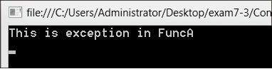

### 7.3.3　throw语句

在try-catch和try-catch-finally语句中的try块中，除了由系统自动抛出异常外，也可以使用throw语句抛出异常；使用throw语句既可以引发系统异常，也可以引发自定义异常。throw使用格式如下。

```c
throw 异常对象;
```

例如，

```c
throw new ArgumentNullException();        //抛出值不能为空的异常
```

throw new ArgumentNullException( ) 实例化了ArgumentNullException 类的一个异常对象，并抛出。只要在try块语句的执行过程中遇到一个throw语句，就会立即转到与这个try块对应的catch块以进行异常处理。

**【范例7-2】 异常处理例子，如果字符串为空，抛出ArgumentNullException异常。**

（1）启动Visual Studio 2013，新建一个控制台应用程序，项目名称为“ThrowExam”。

（2）在Program.cs中添加一个方法ProcessString，代码如下。

```c
01  static void ProcessString(string str)        
02  {
03          if (str == null)     //如果str参数为null，则抛出值不能为空的异常
04          {
05                  throw new ArgumentNullException();
06          }
07  }
```

（3）在Program.cs的Main方法中添加如下代码。

```c
01  Console.WriteLine("输出结果为：");    //提示输出结果
02  try                                  //try块用来放置可能有异常的代码
03  {
04          string str1 = null;          //声明一个字符串变量，赋值为空
05          ProcessString(str);          //调用方法ProcessString()
06  }
07  catch (ArgumentNullException e)      //捕获异常并输出异常信息
08  {        
09          Console.WriteLine("这是异常：{0} ", e.Message); 
10  }
11  finally
12  {                                    //finally块放置最后要执行的代码
13          Console.ReadKey();
14  }
```

**【范例分析】**

比较例7-1和例7-2中catch块的参数类型，例7-1中catch块的参数e是System.Exception类的对象，Exception类是所有异常类的基类，因此例7-1中的catch块可以接收所有类型的异常，输出异常信息。例7-1中catch块的参数e是System. ArgumentNullException类的对象，catch块只能接收ArgumentNullException类的异常，如果try块中抛出的是其他异常则不接收。如果需要接收其他类型的异常，那么需要定义一个新的参数为该类型异常的catch块。由此，例7-1的try-catch语句可以改为如下。

```c
try
{
…
}
catch(FormatException e)
{
     Console.WriteLine("这是FormatException，异常信息为：{0}", e.Message);
}
catch (DivideByZeroException e)
{
     Console.WriteLine("这是DivideByZeroException，异常信息为：{0}", e.Message);
}
```

在 catch 块中可以使用 throw 语句再次引发已由 catch 语句捕获的异常，这样做的意义是，可以将try-catch语句中处理不了的异常再次使用throw语句抛出到更高一级进行处理。

**【范例7-3】 多次throw例子。**

（1）启动Visual Studio 2013，新建一个控制台应用程序，项目名称为“ThrowExam2”。

（2）在Program.cs中添加方法FuncA和FuncB，代码如下。

```c
01  static void FuncA( )
02  {
03          throw new ArgumentException("This is exception in FuncA");
04  }
05  static void FuncB( )
06  {
07          try
08          {
09                  FuncA();
10          }
11          catch (Exception e)
12          {
13                  throw;                        //再次抛出捕获的异常
14          }
15  }
```

（3）在Program.cs的Main方法中添加如下代码。

```c
01  try
02  {
03          FuncB();
04  }
05  catch(Exception e)
06  {
07          Console.WriteLine(e.Message);        //输出异常消息
08  }
09  Console.ReadKey();
```

程序执行结果如下图所示。


**【范例分析】**

Main方法调用FuncB方法，FuncB方法调用FuncA方法。FuncA方法抛出异常，FuncB方法中的try-catch语句的catch块接收异常后再次抛出，Main方法接收FuncB中的catch块再次抛出的异常。这种情况通常发生在FuncB的try-catch语句接收到异常后，发现该异常无法处理或者该异常情况需要通知更高一级（即FuncB方法的调用者），再次将异常抛出给本方法的调用者，这里是Main方法去处理，当然，FuncB中的catch块也可以根据对异常的处理情况选择将收到的异常不加改变地再次抛出，或者修改异常的相关数据后再次抛出，甚至生成一个新的异常对象然后抛出，一切都取决于程序员设计程序的需要。此外，可以尝试一下，将FuncB中catch块的throw语句注释掉，看看Main方法是否还会接收到异常。

