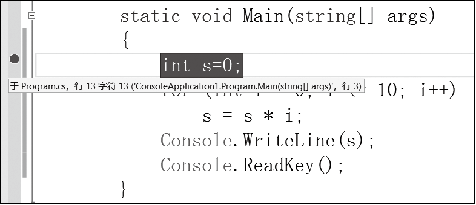

### 7.4.1　设置断点

程序的执行过程是连贯的，为了跟踪观察程序的运行状态，我们需要控制程序的运行过程，使得程序能够暂停在某些特定的位置，这种控制可以通过设置断点来实现。断点是程序暂停执行的地方，当程序运行到断点位置时，程序暂停执行，进入中断模式，程序设计者可以观察程序的运行状态，如某些变量的值，对程序进行分析。

在Visual Studio中打开需要调试的程序，在代码编辑窗口可以添加、删除断点。要在程序的某个语句所在位置添加或者删除断点，有以下几种方式。

单击代码窗口最左边灰色区域对应语句行的位置添加断点，再次单击删除断点，左侧的红色圆点即为断点。

单击语句所在行，然后按F9键添加断点，再次按【F9】键删除断点。

单击语句所在行，然后单击鼠标右键，在弹出的快捷菜单中选择【断点】
【插入断点】命令。

