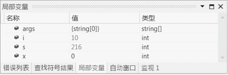
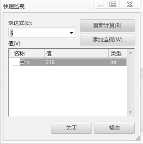

### 7.4.4　调试监控

在程序调试过程中，通常需要监测程序的运行状态，Visual Studio 提供了局部变量窗口、监视窗口、自动窗口和快速监视窗口等对程序的运行状态进行监控。

#### 1．局部变量窗口

选择菜单【调试】
【窗口】
【局部变量】，即可打开局部变量窗口。局部变量窗口允许查看在局部过程中声明的变量的当前值，但不能修改。

#### 2．自动窗口

选择菜单【调试】
【窗口】
【自动窗口】，即可打开自动窗口。自动窗口与局部变量窗口类似，但自动窗口显示当前语句和先前语句中使用的变量。此外，用户不能添加或删除自动窗口显示的项目，但可以修改某项的值。

#### 3．监视窗口

选择菜单【调试】
【窗口】
【监视】，有【监视1】、【监视2】、【监视3】和【监视4】4个监视窗口可用。可以从程序中选中变量或者表达式后拖动到监视窗口，用于判断程序的运行是否有错。

#### 4．快速监视窗口

选择菜单【调试】
【快速监视】即可打开快速监视对话框。快速监视窗口为查看和计算变量与表达式提供了一个快捷的途径。其中，【重新计算】可以计算表达式的最新值，【添加监视】可以将表达式加入到监视窗口中。需要注意的是，必须关闭快速监视窗口才能继续进行程序调试。

