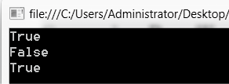
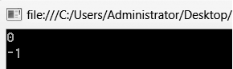
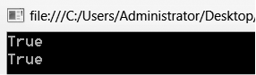
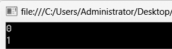
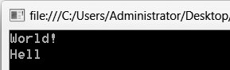
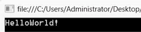
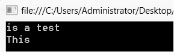
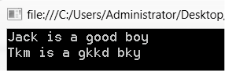
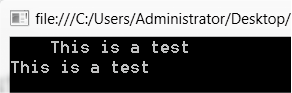

### 8.1.2　字符串的基本操作

输出结果如下图所示。

为了方便使用字符串，C#中String类的定义中包含了许多字符串函数，方便进行各种基本的字符串操作。下面列举了最基本的字符串函数，这些函数都是String类的成员方法。

#### 1．字符串判等

方法Equals( )用于判断两个字符串是否相等，若相等则返回True，否则返回False。语法格式如下。

```c
字符串变量1.Equals(字符串2)；
```

其中，字符串2可以是字符串常量也可以是字符串变量。字符串变量1调用成员函数Equals( )，比较字符串变量1对应的字符串（以下简称字符串变量1）与字符串2是否相等，相等则返回True，否则返回False。或者调用string类的静态方法Equals，比较字符串1和字符串2是否相等，相等则返回True，否则返回False。

也可以使用静态方法Equals( )，语法如下。

```c
string.Equals (字符串1，字符串2)；
```

例如，

```c
string s = "123";
string str = s;
Console.WriteLine(s.Equals(str));
Console.WriteLine(s.Equals("Hello"));
Console.WriteLine(string.Equals(s, str));
```

输出结果如下图所示。


> 
> **提示**
> 可以使用关系运算符“= =”判断两个字符串是否相等，上例中s.Equals(str)与s = = str的效果相同。

#### 2．字符串比较

方法CompareTo( )用于比较字符串变量与给定字符串的大小，返回值为0、1或者-1。语法格式如下。

```c
字符串变量.CompareTo(字符串2)；
```

字符串的比较方式是，找到两个字符串中第一个不相同的字符，该字符ASCII值小的字符串较小。若一直比较到字符串结束，每个对应字符都相同，那么若两个字符串长度相同，则两个字符串相等；若两个字符串长度不同，则短的字符串较小。若字符串变量小于字符串2，则返回-1，反之返回1;若字符串变量与字符串2相等，则返回0。

也可以使用静态方法Compare( )比较字符串1和字符串2的大小，相等则返回0，字符串1小则返回-1，字符串1大则返回1。语法如下。

```c
string.Compare (字符串1，字符串2)；
```

例如，

```c
string s = "123";
string str = s;
Console.WriteLine(s.CompareTo(str));
Console.WriteLine(string.Compare(str,"124"));
```

输出结果如下图所示。


#### 3．判断字符串变量是否包含指定字符或字符串

方法Contains( )用于判断字符串变量是否包含指定字符或字符串，是则返回True，否则返回False。语法格式如下。

```c
字符串变量.Contains(字符1)；
```

或者

```c
字符串变量.Contains(字符串2)；
```

例如，

```c
string s = "123";
string str = "123";
Console.WriteLine(str.Contains('1'));
Console.WriteLine(str.Contains('12'));
```

输出结果如下图所示。


#### 4．查找字符串变量中指定字符或字符串出现的位置

方法IndexOf( )用于查找给定字符或字符串在字符串变量中第一次出现的位置，返回字符或者字符串首字母在字符串变量中的位置数值。字符串第一个字符对应的位置编号是0，如果查找的字符或字符串在字符串变量中不存在，则返回-1。语法格式如下。

```c
字符串变量.IndexOf(字符1)；
```

例如，

```c
string str = "123123";
Console.WriteLine(str.IndexOf('1'));
Console.WriteLine(str.IndexOf('23'));
```


类似的方法还有LastIndexOf( )，用于查找给定字符或字符串在字符串变量中最后一次出现的位置数值。

#### 5．取子串

方法SubString( )用于从字符串变量中获取指定位置开始的指定长度的子字符串，如果未指定子字符串长度，则取至字符串变量结尾，返回值为该子字符串。语法格式如下。

```c
字符串变量.SubString(起始位置，子串长度)；//取给定长度子字符串
```

或者：

```c
字符串变量.SubString(起始位置)；      　 //取至字符串变量结尾
```

例如，

```c
string str = "Hello World!";
Console.WriteLine(str.Substring(6));
Console.WriteLine(str.Substring(0,4));
```

输出结果如下图所示。


> 
> **提示**
> 若起始位置或者子字符串长度超出字符串变量允许范围，则系统返回异常ArgumentOutOfRangeException。

#### 6．插入子串

方法Insert( )用于在字符串变量中指定位置插入给定子字符串，返回值为该子字符串。语法格式如下。

```c
字符串变量.Insert(起始位置，子字符串2)；
```

例如：

```c
string str = "World!";
Console.WriteLine(str.Insert(0,"Hello"));
```

输出结果如下图所示。


#### 7．删除子串

方法Remove( )用于在字符串变量中删除指定位置开始的指定长度的子字符串，返回值为删除指定子串后的字符串变量。语法格式如下。

```c
字符串变量.Remove(起始位置，子串长度)； //从起始位置开始删除指定长度的子串
```

或者：

```c
字符串变量.Remove(起始位置)；         //从起始位置到字符串变量结尾都删除
```

例如，

```c
string str = "This is a test";
Console.WriteLine(str.Remove(0,5));
Console.WriteLine(str.Remove(4));
```

输出结果如下图所示。


#### 8．替换子串

方法Replace( )用于替换字符串变量中的指定字符或子字符串，返回值为替换完毕后的字符串变量。语法格式如下。

```c
字符串变量.Replace(字符1，字符2)；　　   //用字符2替换字符1
```

或者：

```c
字符串变量.Replace(字符串1，字符串2)； 　//用字符串2替换字符串1
```

例如，

```c
string str = "Tom is a good boy";
Console.WriteLine(str.Replace("Tom","Jack"));
Console.WriteLine(str.Replace('o', 'k'));
```

输出结果如下图所示。


#### 9．去除字符串空格

方法Trim( )用于去除字符串变量中头部和尾部的空格，返回值为去除空格的字符串变量。语法格式如下。

```c
字符串变量.Trim( )；
```

例如，

```c
string str = "This is a test";
Console.WriteLine(str);
Console.WriteLine(str.Trim( ));
```

输出结果如下图所示。


类似的，方法TrimStart( )和方法TrimEnd( )可以去除字符串头部或尾部的空格。

